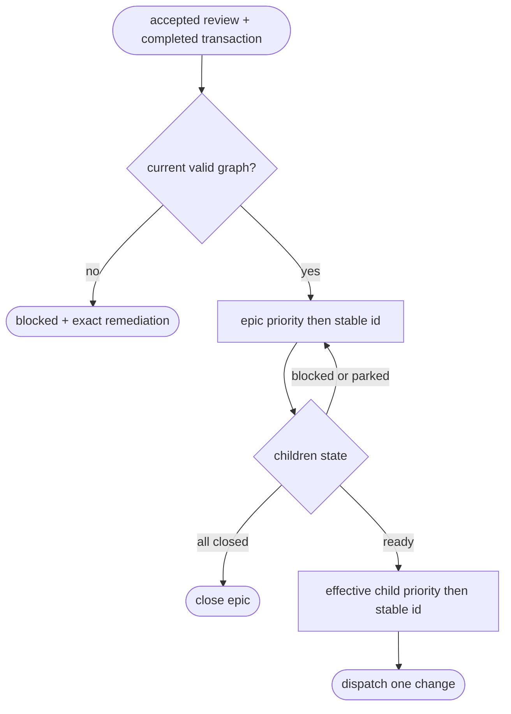

# Prioritized Reviewed-Graph Goal Selection

## Overview
<!-- type: overview lang: markdown -->

The accepted and completely published project plan is the scheduling authority
for `aw goal wi <epic>` and `aw goal backlog --project <project>`. Both roots
load the same review digest, publication checkpoint, current issue inventory,
and canonical epic/change graph before selecting a change.

Selection is hierarchical: epic priority chooses project direction first;
dependency readiness and explicit or inherited change priority choose a leaf
only within that epic. The selector is a pure issue-domain policy. Backlog
parking is an outer runtime concern and never changes graph metadata.

## Requirements
<!-- type: requirements lang: yaml -->

```yaml
requirements:
  - id: R1
    text: Epic and backlog roots consume only the current accepted and completely published project graph.
  - id: R2
    text: Both roots select the same next change for the same graph and exclusion set.
  - id: R3
    text: Epic priority is evaluated before dependency readiness and explicit or inherited child priority.
  - id: R4
    text: A blocked high-priority change is reported and skipped without hiding another ready leaf.
  - id: R5
    text: Invalid ownership, change-as-parent, stale graph labels, stale review provenance, and unresolved dependencies fail closed with executable remediation.
  - id: R6
    text: An open epic whose reviewed children are all closed reuses terminal child rollup and is never re-atomized.
  - id: R7
    text: Selection and parking do not write graph metadata and repeated unchanged reads are deterministic.
```

## Behavior
<!-- type: behavior lang: gherkin -->

```gherkin
Feature: choose one ready change from a reviewed epic graph

  Scenario: epic direction precedes child priority
    Given a p0 epic with a ready p1 child
    And a p1 epic with a ready p0 child
    When either epic or backlog goal selection runs
    Then the p0 epic's p1 child is selected

  Scenario: blocked leaf does not hide ready work
    Given the selected epic has one dependency-blocked p0 child and one ready p1 child
    When selection runs
    Then the blocker is retained in the result
    And the ready p1 sibling is selected

  Scenario: terminal epic rolls up
    Given an open reviewed epic whose children are all closed
    When aw goal wi runs for that epic
    Then it emits aw wi close <epic> --push
    And it never emits aw wi atomize

  Scenario: post-publication graph drift fails closed
    Given one accepted completed project-plan transaction
    When an ownership or priority graph label changes
    Then no change root is dispatched
    And the blocked envelope identifies the stale issue and replanning command
```

## Logic
<!-- type: logic lang: mermaid -->



## CLI
<!-- type: cli lang: yaml -->

```yaml
inputs:
  review: /tmp/aw/workspaces/<workspace>/workitems/<project>/project-plan/project-plan.review.json
  manifest: /tmp/aw/workspaces/<workspace>/workitems/<project>/project-plan/project-plan.manifest.json
  checkpoint: /tmp/aw/workspaces/<workspace>/workitems/<project>/project-plan/project-plan.transaction.json
roots:
  epic: aw goal wi <epic-id>
  backlog: aw goal backlog --project <project>
dispatch: aw goal wi <change-id>
terminal_epic: aw wi close <epic-id> --push
stale_plan_next: aw wi plan --project <project> --json
invalid_issue_next: aw wi show <issue-id>
```

## Unit Test
<!-- type: unit-test lang: yaml -->

```yaml
gates:
  - cargo test -p agentic-workflow --lib ready_graph::tests -- --nocapture
  - cargo test -p agentic-workflow --lib planning_transaction::tests -- --nocapture
proof:
  - epic priority precedes child priority
  - blocked dependencies do not hide ready siblings
  - all-closed children produce terminal epic selection
  - unresolved dependencies fail closed
  - lifecycle metadata may advance while graph-label drift invalidates publication
```

## E2E Test
<!-- type: e2e-test lang: yaml -->

```yaml
gates:
  - cargo test -p agentic-workflow --test wi_reviewed_graph_goal_cli_test -- --nocapture
  - cargo test -p agentic-workflow --test cli_tests goal_backlog -- --nocapture
proof:
  - compiled epic and backlog roots select the same change
  - backlog parks a blocked high-priority leaf and dispatches ready work
  - all-closed children produce the terminal epic close command without atomize
  - stale priority labels and invalid ownership fail closed without dispatch
```

## Changes
<!-- type: changes lang: yaml -->

```yaml
changes:
  - path: apps/agentic-workflow/src/issues/ready_graph.rs
    action: create
    section: logic
    impl_mode: handwrite
    description: "Pure deterministic ready-leaf selector over the canonical epic/change graph."
  - path: apps/agentic-workflow/src/issues/planning_transaction.rs
    action: modify
    section: logic
    impl_mode: handwrite
    description: "Read-only admission verifier for completed reviewed graph metadata."
  - path: apps/agentic-workflow/src/cli/run.rs
    action: modify
    section: logic
    impl_mode: handwrite
    description: "Shared reviewed-graph loading, backlog parking, epic dispatch, and terminal rollup."
  - path: apps/agentic-workflow/tests/wi_reviewed_graph_goal_cli_test.rs
    action: create
    section: e2e-test
    impl_mode: handwrite
    description: "Compiled parity, blocker continuation, terminal, stale-plan, and invalid-graph proof."
```
