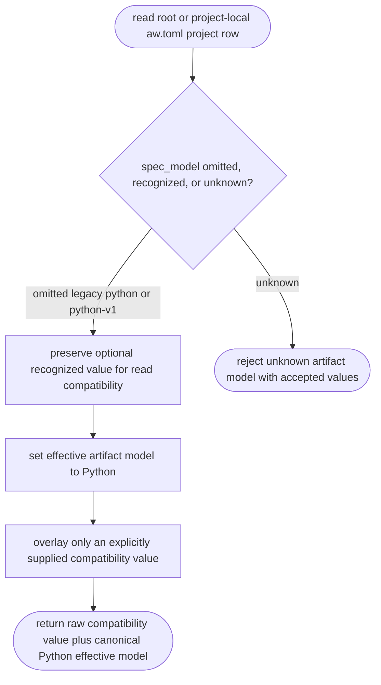

# Python Artifact-Model Compatibility Parser

## Logic
<!-- type: logic lang: mermaid -->



`spec_model` is a read-compatible project field with the canonical `python`
value plus the historical `legacy` and `python-v1` spellings. It deserializes
to `ProjectArtifactModel`, never a free string. Omission is preserved as `None`
in the raw project and narrow configuration rows so a project-local overlay
that does not mention the field cannot erase an explicit root value.
`effective_artifact_model()` always returns `PythonV1`; neither omission nor a
stale `legacy` value may route EC/TD back to the Markdown lifecycle.

Unknown values remain a TOML configuration parse error. The compatibility
parser deliberately does not inspect a project tree or infer lifecycle from
files. EC, TD, goal, and health adapters consume the same effective Python
model, while later cleanup may remove the now-nonselectable legacy readers.

## Unit Test

```mermaid
---
id: aw-python-artifact-model-selector-unit-tests
requirements:
  compatibility_values:
    id: R1
    text: "legacy and Python spellings remain readable through full and narrow project registry views, but both resolve to Python."
    kind: contract
    risk: high
    verify: "cargo test -p agentic-workflow --test artifact_model_config_test spec_model_config_keeps_legacy_values_readable_but_always_routes_python -- --nocapture"
  compatibility:
    id: R2
    text: "Omitted configuration resolves to Python and an omitted local overlay preserves the raw root compatibility value."
    kind: regression
    risk: high
    verify: "cargo test -p agentic-workflow --test artifact_model_config_test artifact_model_config_defaults_unconfigured_projects_to_python -- --nocapture"
  rejection:
    id: R3
    text: "Unknown artifact-model values fail with the accepted choices."
    kind: regression
    risk: medium
    verify: "cargo test -p agentic-workflow --test artifact_model_config_test artifact_model_config_rejects_unknown_values_with_accepted_options -- --nocapture"
elements:
  spec_model_config_keeps_legacy_values_readable_but_always_routes_python: { kind: test, type: "rs/#[test]" }
  artifact_model_config_defaults_unconfigured_projects_to_python: { kind: test, type: "rs/#[test]" }
  artifact_model_config_rejects_unknown_values_with_accepted_options: { kind: test, type: "rs/#[test]" }
  artifact_model_config_preserves_root_opt_in_when_local_overlay_omits_it: { kind: test, type: "rs/#[test]" }
relations:
  - { from: spec_model_config_keeps_legacy_values_readable_but_always_routes_python, verifies: compatibility_values }
  - { from: artifact_model_config_defaults_unconfigured_projects_to_python, verifies: compatibility }
  - { from: artifact_model_config_preserves_root_opt_in_when_local_overlay_omits_it, verifies: compatibility }
  - { from: artifact_model_config_rejects_unknown_values_with_accepted_options, verifies: rejection }
---
requirementDiagram
  requirement R1 {
    id: R1
    text: "read-compatible values route Python"
    risk: high
    verifymethod: test
  }
  requirement R2 {
    id: R2
    text: "Python default and safe overlay"
    risk: high
    verifymethod: test
  }
  requirement R3 {
    id: R3
    text: "unknown config rejection"
    risk: medium
    verifymethod: test
  }
  element spec_model_config_keeps_legacy_values_readable_but_always_routes_python {
    type: "rs/#[test]"
  }
  element artifact_model_config_defaults_unconfigured_projects_to_python {
    type: "rs/#[test]"
  }
  element artifact_model_config_rejects_unknown_values_with_accepted_options {
    type: "rs/#[test]"
  }
  element artifact_model_config_preserves_root_opt_in_when_local_overlay_omits_it {
    type: "rs/#[test]"
  }
```

<!-- type: unit-test lang: mermaid -->



## Changes
<!-- type: changes lang: yaml -->

```yaml
changes:
  - path: apps/agentic-workflow/src/models/project.rs
    action: modify
    section: schema
    impl_mode: codegen
    description: "Keep typed ProjectArtifactModel compatibility parsing while making Python the only effective model."
  - path: apps/agentic-workflow/tech-design/core/interfaces/models/project.md
    action: modify
    section: schema
    impl_mode: hand-written
    description: "Declare the optional spec_model compatibility schema and canonical Python effective model."
  - path: apps/agentic-workflow/src/services/project_registry.rs
    action: modify
    section: logic
    impl_mode: codegen
    description: "Parse, expose, and merge spec_model compatibility values without allowing them to select legacy EC/TD."
  - path: apps/agentic-workflow/tech-design/core/interfaces/services/project_registry.md
    action: modify
    section: source
    impl_mode: hand-written
    description: "Synchronize the project registry source snapshot."
  - path: apps/agentic-workflow/src/services/project_discovery.rs
    action: modify
    section: logic
    impl_mode: codegen
    description: "Keep discovered project entries explicitly unconfigured."
  - path: apps/agentic-workflow/src/cli/project.rs
    action: modify
    section: unit-test
    impl_mode: codegen
    description: "Keep existing project health test constructors explicit about the compatibility model."
  - path: apps/agentic-workflow/tests/project_registry_test.rs
    action: modify
    section: unit-test
    impl_mode: codegen
    description: "Keep existing registry test constructors explicit about the compatibility model."
  - path: apps/agentic-workflow/tests/artifact_model_config_test.rs
    action: modify
    section: unit-test
    impl_mode: hand-written
    description: "Prove compatibility parsing, the Python default, unknown-value diagnostics, and safe local overlay behavior."
  - path: apps/agentic-workflow/src/cli/run.rs
    action: modify
    section: logic
    impl_mode: hand-written
    description: "Route stale legacy tracker phases back to EC-first Python authoring."
  - path: apps/agentic-workflow/tests/ec_python_inventory_check.rs
    action: modify
    section: unit-test
    impl_mode: hand-written
    description: "Prove an omitted spec_model still selects the Python EC inventory."
  - path: apps/agentic-workflow/tests/python_artifact_readiness.rs
    action: modify
    section: unit-test
    impl_mode: hand-written
    description: "Prove a stale legacy value cannot disable Python artifact readiness."
```
