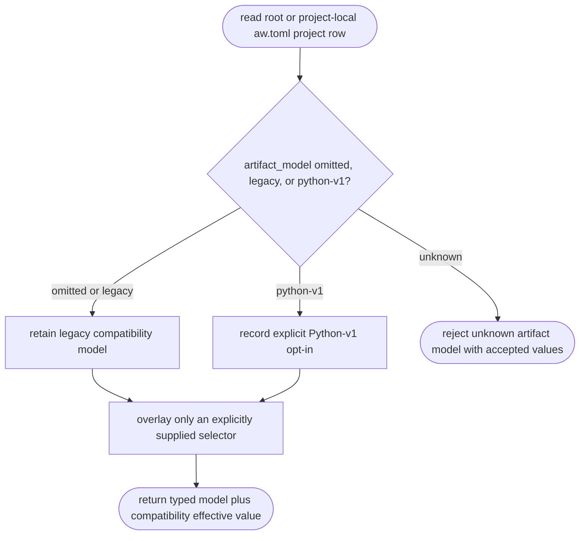

# Python Artifact-Model Selector

## Logic
<!-- type: logic lang: mermaid -->



`artifact_model` is an opt-in project field with exactly two accepted serialized
values: `legacy` and `python-v1`. It deserializes to
`ProjectArtifactModel`, never a free string. Omission is preserved as `None` in
the raw project and narrow configuration rows so a project-local overlay that
does not mention the field cannot reset a root-level opt-in. Consumers use
`effective_artifact_model()`, which supplies the documented `Legacy` default.

Unknown values are a TOML configuration parse error and serde reports the two
accepted values. This selector deliberately does not inspect a project tree,
route commands, migrate a project, generate a scaffold, or delete any legacy
reader. Later EC, TD, goal, and health adapters consume the same typed row.

## Unit Test

```mermaid
---
id: aw-python-artifact-model-selector-unit-tests
requirements:
  typed_values:
    id: R1
    text: "legacy and python-v1 parse to the typed enum through full and narrow project registry views."
    kind: contract
    risk: high
    verify: "cargo test -p agentic-workflow --test artifact_model_config_test artifact_model_config_parses_typed_legacy_and_python_v1_values -- --nocapture"
  compatibility:
    id: R2
    text: "Omitted configuration is legacy and an omitted local overlay preserves root python-v1."
    kind: regression
    risk: high
    verify: "cargo test -p agentic-workflow --test artifact_model_config_test artifact_model_config_preserves_root_opt_in_when_local_overlay_omits_it -- --nocapture"
  rejection:
    id: R3
    text: "Unknown artifact-model values fail with the accepted choices."
    kind: regression
    risk: medium
    verify: "cargo test -p agentic-workflow --test artifact_model_config_test artifact_model_config_rejects_unknown_values_with_accepted_options -- --nocapture"
elements:
  artifact_model_config_parses_typed_legacy_and_python_v1_values: { kind: test, type: "rs/#[test]" }
  artifact_model_config_defaults_unconfigured_projects_to_legacy: { kind: test, type: "rs/#[test]" }
  artifact_model_config_rejects_unknown_values_with_accepted_options: { kind: test, type: "rs/#[test]" }
  artifact_model_config_preserves_root_opt_in_when_local_overlay_omits_it: { kind: test, type: "rs/#[test]" }
relations:
  - { from: artifact_model_config_parses_typed_legacy_and_python_v1_values, verifies: typed_values }
  - { from: artifact_model_config_defaults_unconfigured_projects_to_legacy, verifies: compatibility }
  - { from: artifact_model_config_preserves_root_opt_in_when_local_overlay_omits_it, verifies: compatibility }
  - { from: artifact_model_config_rejects_unknown_values_with_accepted_options, verifies: rejection }
---
requirementDiagram
  requirement R1 {
    id: R1
    text: "typed artifact model values"
    risk: high
    verifymethod: test
  }
  requirement R2 {
    id: R2
    text: "legacy compatibility and safe overlay"
    risk: high
    verifymethod: test
  }
  requirement R3 {
    id: R3
    text: "unknown config rejection"
    risk: medium
    verifymethod: test
  }
  element artifact_model_config_parses_typed_legacy_and_python_v1_values {
    type: "rs/#[test]"
  }
  element artifact_model_config_defaults_unconfigured_projects_to_legacy {
    type: "rs/#[test]"
  }
  element artifact_model_config_rejects_unknown_values_with_accepted_options {
    type: "rs/#[test]"
  }
  element artifact_model_config_preserves_root_opt_in_when_local_overlay_omits_it {
    type: "rs/#[test]"
  }
```

<!-- type: unit-test lang: mermaid -->



## Changes
<!-- type: changes lang: yaml -->

```yaml
changes:
  - path: apps/agentic-workflow/src/models/project.rs
    action: modify
    section: schema
    impl_mode: codegen
    description: "Add typed ProjectArtifactModel and compatibility effective-model access for Project."
  - path: apps/agentic-workflow/tech-design/core/interfaces/models/project.md
    action: modify
    section: schema
    impl_mode: hand-written
    description: "Declare the optional artifact_model schema, accepted values, and legacy default."
  - path: apps/agentic-workflow/src/services/project_registry.rs
    action: modify
    section: logic
    impl_mode: codegen
    description: "Parse, expose, and merge artifact_model without an omitted local overlay erasing an explicit root opt-in."
  - path: apps/agentic-workflow/tech-design/core/interfaces/services/project_registry.md
    action: modify
    section: source
    impl_mode: hand-written
    description: "Synchronize the project registry source snapshot."
  - path: apps/agentic-workflow/src/services/project_discovery.rs
    action: modify
    section: logic
    impl_mode: codegen
    description: "Keep discovered project entries explicitly unconfigured."
  - path: apps/agentic-workflow/src/cli/project.rs
    action: modify
    section: unit-test
    impl_mode: codegen
    description: "Keep existing project health test constructors explicit about the compatibility model."
  - path: apps/agentic-workflow/tests/project_registry_test.rs
    action: modify
    section: unit-test
    impl_mode: codegen
    description: "Keep existing registry test constructors explicit about the compatibility model."
  - path: apps/agentic-workflow/tests/artifact_model_config_test.rs
    action: create
    section: unit-test
    impl_mode: hand-written
    description: "Prove typed values, legacy default, unknown-value diagnostics, and safe local overlay behavior."
```
