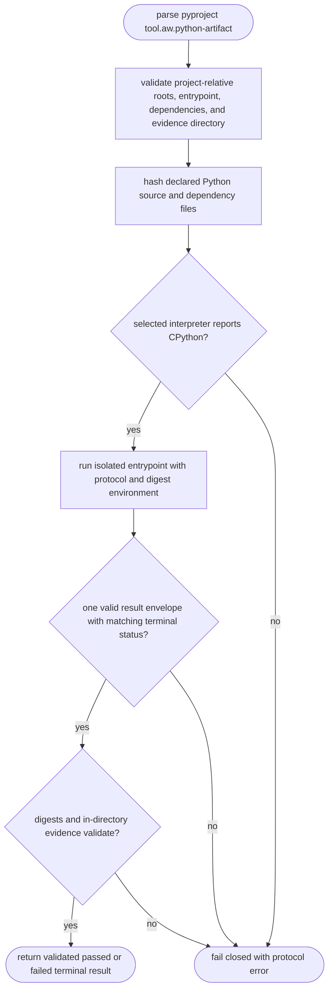

# AW Python Artifact Project Protocol

## Logic
<!-- type: logic lang: mermaid -->



`aw.python-artifact.v1` defines the common CPython project boundary for the
Python-v1 migration. A project is discovered only by parsing its
`pyproject.toml` `[tool.aw.python-artifact]` table; discovery never imports an
application module. The table declares one `.py` entrypoint, one or more Python
`source_roots`, `dependency_files` including `pyproject.toml`, and an
`evidence_dir`, all as safe project-relative paths.

AW collects sorted `.py` files below the declared source roots, excluding cache
and virtual-environment directories. It separately hashes declared dependency
metadata. Before every invocation, AW probes the selected interpreter with
`platform.python_implementation()` and accepts only `CPython`. Both SHA-256
digests are then passed to a direct `python3 -I <entrypoint> <command>`
invocation. The command is one token, never a shell expression; `-I` prevents
ambient Python path/import configuration from making project discovery or
execution depend on host application imports.

The project prints exactly one `aw.python-artifact.result.v1` JSON document:

```json
{
  "schema_version": "aw.python-artifact.result.v1",
  "status": "passed | failed",
  "source_digest": "sha256:<hex>",
  "dependency_lock_digest": "sha256:<hex>",
  "evidence": ["evidence/<case>.json"]
}
```

`passed` requires process exit `0`; `failed` requires exit `1`. AW independently
matches both digests, requires non-empty unique regular evidence files inside
the declared evidence directory, and rejects malformed JSON, ambiguous output,
exit/status disagreement, stale digests, path escapes, symlinks, and timeout.
This protocol returns a validated terminal failure as data, but never treats a
malformed or unverifiable result as a green result.

## Unit Test

```mermaid
---
id: aw-python-artifact-project-protocol-unit-tests
requirements:
  cpython_success:
    id: R1
    text: "A declared CPython artifact project runs in isolation and ignores cache or virtual-environment files for source digesting."
    kind: contract
    risk: high
    verify: "cargo test -p agentic-workflow --test python_artifact_protocol_test python_artifact_protocol_discovers_and_runs_a_cpython_project -- --nocapture"
  terminal_failure:
    id: R2
    text: "A failed envelope with exit 1 is returned as a validated terminal failure."
    kind: contract
    risk: medium
    verify: "cargo test -p agentic-workflow --test python_artifact_protocol_test python_artifact_protocol_accepts_a_structured_terminal_failure -- --nocapture"
  fail_closed:
    id: R3
    text: "Malformed output, stale digests, empty evidence, configured symlinks, non-CPython interpreters, and timeout are rejected."
    kind: regression
    risk: high
    verify: "cargo test -p agentic-workflow --test python_artifact_protocol_test -- --nocapture"
elements:
  python_artifact_protocol_discovers_and_runs_a_cpython_project: { kind: test, type: "rs/#[test]" }
  python_artifact_protocol_accepts_a_structured_terminal_failure: { kind: test, type: "rs/#[test]" }
  python_artifact_protocol_rejects_malformed_stdout: { kind: test, type: "rs/#[test]" }
  python_artifact_protocol_rejects_stale_source_digest: { kind: test, type: "rs/#[test]" }
  python_artifact_protocol_rejects_empty_evidence: { kind: test, type: "rs/#[test]" }
  python_artifact_protocol_rejects_configured_symlink_components: { kind: test, type: "rs/#[cfg(unix)] #[test]" }
  python_artifact_protocol_rejects_a_non_cpython_interpreter: { kind: test, type: "rs/#[cfg(unix)] #[test]" }
  python_artifact_protocol_terminates_a_timed_out_runner: { kind: test, type: "rs/#[test]" }
relations:
  - { from: python_artifact_protocol_discovers_and_runs_a_cpython_project, verifies: cpython_success }
  - { from: python_artifact_protocol_accepts_a_structured_terminal_failure, verifies: terminal_failure }
  - { from: python_artifact_protocol_rejects_malformed_stdout, verifies: fail_closed }
  - { from: python_artifact_protocol_rejects_stale_source_digest, verifies: fail_closed }
  - { from: python_artifact_protocol_rejects_empty_evidence, verifies: fail_closed }
  - { from: python_artifact_protocol_rejects_configured_symlink_components, verifies: fail_closed }
  - { from: python_artifact_protocol_rejects_a_non_cpython_interpreter, verifies: fail_closed }
  - { from: python_artifact_protocol_terminates_a_timed_out_runner, verifies: fail_closed }
---
requirementDiagram
  requirement R1 {
    id: R1
    text: "isolated CPython project success"
    risk: high
    verifymethod: test
  }
  requirement R2 {
    id: R2
    text: "validated terminal failure"
    risk: medium
    verifymethod: test
  }
  requirement R3 {
    id: R3
    text: "protocol failures close safely"
    risk: high
    verifymethod: test
  }
  element python_artifact_protocol_discovers_and_runs_a_cpython_project {
    type: "rs/#[test]"
  }
  element python_artifact_protocol_accepts_a_structured_terminal_failure {
    type: "rs/#[test]"
  }
  element python_artifact_protocol_rejects_malformed_stdout {
    type: "rs/#[test]"
  }
  element python_artifact_protocol_rejects_stale_source_digest {
    type: "rs/#[test]"
  }
  element python_artifact_protocol_rejects_empty_evidence {
    type: "rs/#[test]"
  }
  element python_artifact_protocol_rejects_configured_symlink_components {
    type: "rs/#[cfg(unix)] #[test]"
  }
  element python_artifact_protocol_rejects_a_non_cpython_interpreter {
    type: "rs/#[cfg(unix)] #[test]"
  }
  element python_artifact_protocol_terminates_a_timed_out_runner {
    type: "rs/#[test]"
  }
```

<!-- type: unit-test lang: mermaid -->



- A static CPython fixture is discovered and run with an isolated interpreter;
  `__pycache__` and `.venv` mutations do not change source or dependency
  digests.
- A `failed` envelope with exit `1` is preserved as a validated terminal
  result, not converted into malformed runner failure.
- Malformed stdout, a stale source digest, empty evidence, configured symlinks,
  a non-CPython interpreter, and a timeout each fail closed.

Gate: `cargo test -p agentic-workflow python_artifact_protocol -- --nocapture`

## Changes
<!-- type: changes lang: yaml -->

```yaml
changes:
  - path: apps/agentic-workflow/src/services/python_artifact.rs
    action: create
    section: logic
    impl_mode: hand-written
    description: "CPython project discovery, digesting, direct invocation, result-envelope, and evidence validation."
  - path: apps/agentic-workflow/src/services/mod.rs
    action: modify
    section: logic
    impl_mode: codegen
    description: "Expose the shared Python artifact runner to later TD and EC adapters."
  - path: apps/agentic-workflow/tests/python_artifact_protocol_test.rs
    action: create
    section: unit-test
    impl_mode: hand-written
    description: "Run static CPython project fixtures through all terminal and fail-closed boundaries."
  - path: apps/agentic-workflow/tests/fixtures/python_artifact_protocol
    action: create
    section: unit-test
    impl_mode: hand-written
    description: "Static success, structured-failure, malformed-output, stale-digest, and timeout CPython projects."
```
