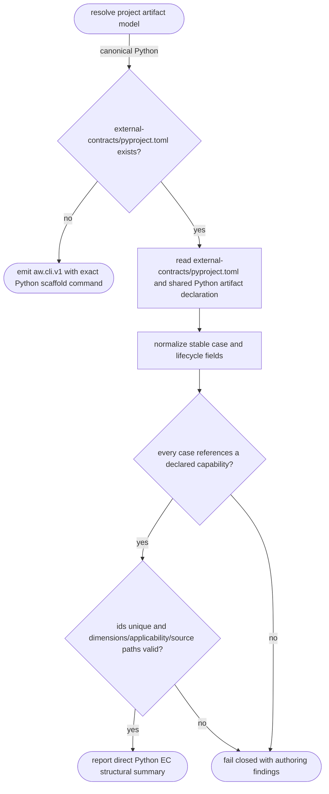

# Python EC Inventory Check

## Logic
<!-- type: logic lang: mermaid -->



Every project resolves to the canonical Python artifact model regardless of
whether `spec_model` is omitted or contains a migration-era value. `aw ec
check` first looks for `external-contracts/pyproject.toml`. When it is absent,
the read-only check emits an `aw.cli.v1` authoring envelope whose runnable next
command is `aw ec draft`; the command creates `pyproject.toml`, `src/runner.py`,
one bounded `src/<id>.py` source, and `evidence/`, never Markdown EC source.
The scaffold is deliberately incomplete and cannot false-green verification:
authors must replace its capability/oracle/source placeholders and produce the
declared evidence.

Once the scaffold exists, check discovers it through the shared
`aw.python-artifact.v1` project declaration, so the EC remains an ordinary
CPython project with direct `src/*.py` ownership. It then reads
`[tool.aw.python-ec]` in `pyproject.toml`; it never imports a module, runs a
case, or writes generated case entries to project `aw.toml`.

The `aw.python-ec.v1` inventory uses one `[[tool.aw.python-ec.cases]]` record
per hand-authored source module. Each record requires stable lowercase
hyphenated `id`, `capability_id`, and `use_case_id`, one four-dimensional
`dimension` (`behavior`, `security`, `stability`, or `efficiency`), one safe
existing `src/*.py` `test_path`, and one lifecycle `applicability`. `td` is
reserved for behavior/security gates that must be green for TD progression;
`post-gen` is reserved for stability/efficiency checks added after TD
generation. Case ids are unique, and every capability id must resolve from
the project's `CAPABILITIES.md`.

All invalid configuration is accumulated into deterministic findings and makes
the summary red. The old Markdown extractor and generated-manifest comparison
remain test-only compatibility machinery; public configuration never selects
that lifecycle.

## Unit Test

```mermaid
---
id: aw-python-ec-inventory-check-unit-tests
requirements:
  direct_inventory:
    id: R1
    text: "An opted-in Python EC project checks direct hand-authored cases from pyproject.toml without a generated project aw.toml inventory or executing its Python entrypoint."
    kind: contract
    risk: high
    verify: "cargo test -p agentic-workflow --test ec_python_inventory_check ec_python_inventory_check_accepts_hand_authored_project_without_generated_aw_toml -- --nocapture"
  structural_rejection:
    id: R2
    text: "Duplicate ids, unknown dimensions, missing capability references, and invalid applicability are reported and fail closed."
    kind: regression
    risk: high
    verify: "cargo test -p agentic-workflow --test ec_python_inventory_check ec_python_inventory_check_rejects_duplicate_unknown_dimension_missing_reference_and_bad_applicability -- --nocapture"
  omitted_selector:
    id: R3
    text: "A project without spec_model still uses the canonical Python EC inventory."
    kind: regression
    risk: high
    verify: "cargo test -p agentic-workflow --test ec_python_inventory_check ec_python_inventory_check_uses_python_when_spec_model_is_omitted -- --nocapture"
  missing_scaffold:
    id: R4
    text: "A missing pyproject.toml returns a successful aw.cli.v1 continuation with one runnable Python scaffold command and does not mutate the project."
    kind: regression
    risk: high
    verify: "cargo test -p agentic-workflow --test ec_python_inventory_check ec_python_inventory_check_routes_missing_pyproject_to_runnable_scaffold -- --nocapture"
  python_draft:
    id: R5
    text: "aw ec draft creates only a Python scaffold, advertises pyproject.toml in help, and the generated inventory passes the structural check when given a real capability id."
    kind: contract
    risk: high
    verify: "cargo test -p agentic-workflow --test ec_python_inventory_check ec_python_draft_creates_only_python_scaffold_and_checks_clean -- --nocapture"
elements:
  ec_python_inventory_check_accepts_hand_authored_project_without_generated_aw_toml: { kind: test, type: "rs/#[test]" }
  ec_python_inventory_check_rejects_duplicate_unknown_dimension_missing_reference_and_bad_applicability: { kind: test, type: "rs/#[test]" }
  ec_python_inventory_check_uses_python_when_spec_model_is_omitted: { kind: test, type: "rs/#[test]" }
  ec_python_inventory_check_routes_missing_pyproject_to_runnable_scaffold: { kind: test, type: "rs/#[test]" }
  ec_python_draft_creates_only_python_scaffold_and_checks_clean: { kind: test, type: "rs/#[test]" }
  ec_help_teaches_python_pyproject_contract: { kind: test, type: "rs/#[test]" }
relations:
  - { from: ec_python_inventory_check_accepts_hand_authored_project_without_generated_aw_toml, verifies: direct_inventory }
  - { from: ec_python_inventory_check_rejects_duplicate_unknown_dimension_missing_reference_and_bad_applicability, verifies: structural_rejection }
  - { from: ec_python_inventory_check_uses_python_when_spec_model_is_omitted, verifies: omitted_selector }
  - { from: ec_python_inventory_check_routes_missing_pyproject_to_runnable_scaffold, verifies: missing_scaffold }
  - { from: ec_python_draft_creates_only_python_scaffold_and_checks_clean, verifies: python_draft }
  - { from: ec_help_teaches_python_pyproject_contract, verifies: python_draft }
---
requirementDiagram
  requirement R1 {
    id: R1
    text: "direct hand-authored Python inventory"
    risk: high
    verifymethod: test
  }
  requirement R2 {
    id: R2
    text: "fail closed structural diagnostics"
    risk: high
    verifymethod: test
  }
  requirement R3 {
    id: R3
    text: "omitted selector remains Python"
    risk: high
    verifymethod: test
  }
  requirement R4 {
    id: R4
    text: "missing inventory routes to scaffold"
    risk: high
    verifymethod: test
  }
  requirement R5 {
    id: R5
    text: "Python-only draft and help"
    risk: high
    verifymethod: test
  }
  element ec_python_inventory_check_accepts_hand_authored_project_without_generated_aw_toml {
    type: "rs/#[test]"
  }
  element ec_python_inventory_check_rejects_duplicate_unknown_dimension_missing_reference_and_bad_applicability {
    type: "rs/#[test]"
  }
  element ec_python_inventory_check_uses_python_when_spec_model_is_omitted {
    type: "rs/#[test]"
  }
  element ec_python_inventory_check_routes_missing_pyproject_to_runnable_scaffold {
    type: "rs/#[test]"
  }
  element ec_python_draft_creates_only_python_scaffold_and_checks_clean {
    type: "rs/#[test]"
  }
  element ec_help_teaches_python_pyproject_contract {
    type: "rs/#[test]"
  }
```

<!-- type: unit-test lang: mermaid -->



## Changes
<!-- type: changes lang: yaml -->

```yaml
changes:
  - path: apps/agentic-workflow/src/services/python_ec.rs
    action: create
    section: logic
    impl_mode: hand-written
    description: "Discover and normalize the pyproject-backed direct Python EC inventory without importing or executing contract modules."
  - path: apps/agentic-workflow/src/services/mod.rs
    action: modify
    section: source
    impl_mode: codegen
    description: "Expose the Python EC inventory adapter to the CLI boundary."
  - path: apps/agentic-workflow/tech-design/core/interfaces/services/mod.md
    action: modify
    section: source
    impl_mode: hand-written
    description: "Synchronize the service facade snapshot with the Python EC adapter."
  - path: apps/agentic-workflow/src/cli/ec.rs
    action: modify
    section: logic
    impl_mode: codegen
    description: "Route missing Python EC inventory to an aw.cli.v1 scaffold command, create Python-only draft artifacts, and keep check/help agent-chainable without a Markdown fallback."
  - path: apps/agentic-workflow/tests/ec_python_inventory_check.rs
    action: create
    section: unit-test
    impl_mode: hand-written
    description: "Run the real CLI against valid, invalid, omitted-selector, missing-scaffold, Python-draft, and help fixture configurations."
```
