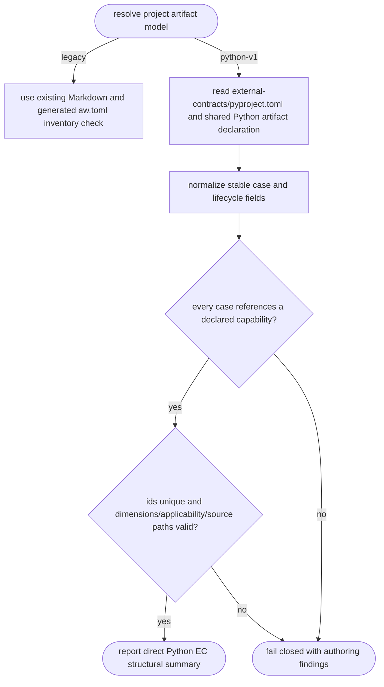

# Python EC Inventory Check

## Logic
<!-- type: logic lang: mermaid -->



`artifact_model = "python-v1"` opts only `aw ec check` into this adapter. It
first discovers the `external-contracts/` directory through the shared
`aw.python-artifact.v1` project declaration, so the EC remains an ordinary
CPython project with direct `src/*.py` ownership. The check then reads
`[tool.aw.python-ec]` in that project's `pyproject.toml`; it never imports a
module, runs a case, writes an EC scaffold, or writes generated case entries to
the project `aw.toml`.

The `aw.python-ec.v1` inventory uses one `[[tool.aw.python-ec.cases]]` record
per hand-authored source module. Each record requires stable lowercase
hyphenated `id`, `capability_id`, and `use_case_id`, one four-dimensional
`dimension` (`behavior`, `security`, `stability`, or `efficiency`), one safe
existing `src/*.py` `test_path`, and one lifecycle `applicability`. `td` is
reserved for behavior/security gates that must be green for TD progression;
`post-gen` is reserved for stability/efficiency checks added after TD
generation. Case ids are unique, and every capability id must resolve from
the project's `CAPABILITIES.md`.

All invalid configuration is accumulated into deterministic findings and makes
the summary red. The old Markdown extractor, generated manifest comparison,
and test-scaffold drift checks remain the only path when the model is omitted
or explicitly `legacy`.

## Unit Test

```mermaid
---
id: aw-python-ec-inventory-check-unit-tests
requirements:
  direct_inventory:
    id: R1
    text: "An opted-in Python EC project checks direct hand-authored cases from pyproject.toml without a generated project aw.toml inventory or executing its Python entrypoint."
    kind: contract
    risk: high
    verify: "cargo test -p agentic-workflow --test ec_python_inventory_check ec_python_inventory_check_accepts_hand_authored_project_without_generated_aw_toml -- --nocapture"
  structural_rejection:
    id: R2
    text: "Duplicate ids, unknown dimensions, missing capability references, and invalid applicability are reported and fail closed."
    kind: regression
    risk: high
    verify: "cargo test -p agentic-workflow --test ec_python_inventory_check ec_python_inventory_check_rejects_duplicate_unknown_dimension_missing_reference_and_bad_applicability -- --nocapture"
  legacy_dispatch:
    id: R3
    text: "A project without the python-v1 selector retains the existing Markdown EC check even if an external-contracts Python project is present."
    kind: regression
    risk: high
    verify: "cargo test -p agentic-workflow --test ec_python_inventory_check ec_python_inventory_check_keeps_legacy_dispatch_when_python_mode_is_not_opted_in -- --nocapture"
elements:
  ec_python_inventory_check_accepts_hand_authored_project_without_generated_aw_toml: { kind: test, type: "rs/#[test]" }
  ec_python_inventory_check_rejects_duplicate_unknown_dimension_missing_reference_and_bad_applicability: { kind: test, type: "rs/#[test]" }
  ec_python_inventory_check_keeps_legacy_dispatch_when_python_mode_is_not_opted_in: { kind: test, type: "rs/#[test]" }
relations:
  - { from: ec_python_inventory_check_accepts_hand_authored_project_without_generated_aw_toml, verifies: direct_inventory }
  - { from: ec_python_inventory_check_rejects_duplicate_unknown_dimension_missing_reference_and_bad_applicability, verifies: structural_rejection }
  - { from: ec_python_inventory_check_keeps_legacy_dispatch_when_python_mode_is_not_opted_in, verifies: legacy_dispatch }
---
requirementDiagram
  requirement R1 {
    id: R1
    text: "direct hand-authored Python inventory"
    risk: high
    verifymethod: test
  }
  requirement R2 {
    id: R2
    text: "fail closed structural diagnostics"
    risk: high
    verifymethod: test
  }
  requirement R3 {
    id: R3
    text: "legacy EC compatibility"
    risk: high
    verifymethod: test
  }
  element ec_python_inventory_check_accepts_hand_authored_project_without_generated_aw_toml {
    type: "rs/#[test]"
  }
  element ec_python_inventory_check_rejects_duplicate_unknown_dimension_missing_reference_and_bad_applicability {
    type: "rs/#[test]"
  }
  element ec_python_inventory_check_keeps_legacy_dispatch_when_python_mode_is_not_opted_in {
    type: "rs/#[test]"
  }
```

<!-- type: unit-test lang: mermaid -->



## Changes
<!-- type: changes lang: yaml -->

```yaml
changes:
  - path: apps/agentic-workflow/src/services/python_ec.rs
    action: create
    section: logic
    impl_mode: hand-written
    description: "Discover and normalize the pyproject-backed direct Python EC inventory without importing or executing contract modules."
  - path: apps/agentic-workflow/src/services/mod.rs
    action: modify
    section: source
    impl_mode: codegen
    description: "Expose the Python EC inventory adapter to the CLI boundary."
  - path: apps/agentic-workflow/tech-design/core/interfaces/services/mod.md
    action: modify
    section: source
    impl_mode: hand-written
    description: "Synchronize the service facade snapshot with the Python EC adapter."
  - path: apps/agentic-workflow/src/cli/ec.rs
    action: modify
    section: logic
    impl_mode: codegen
    description: "Dispatch opt-in Python-v1 checks directly and preserve the legacy Markdown/generated-manifest path otherwise."
  - path: apps/agentic-workflow/tests/ec_python_inventory_check.rs
    action: create
    section: unit-test
    impl_mode: hand-written
    description: "Run the real CLI against valid, invalid, and legacy Python EC fixture configurations."
```
