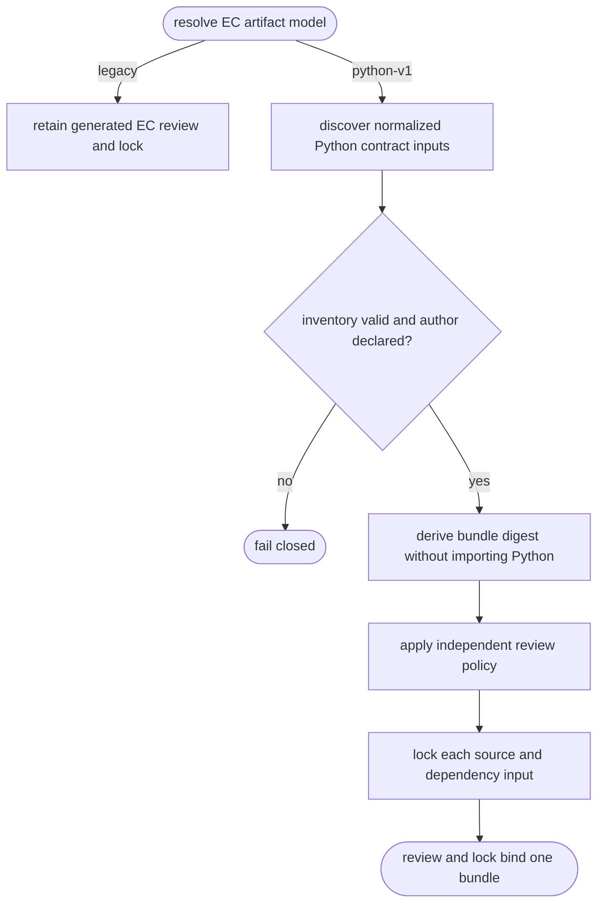

# Python EC Review and Lock

## Logic
<!-- type: logic lang: mermaid -->



For `artifact_model = "python-v1"`, `aw ec review` adapts the direct
`external-contracts/pyproject.toml` inventory into the existing semantic-review
manifest without scaffolding, importing, or executing Python. Its digest
contains the normalized Python source digest, declared dependency-file digest
(which must include `pyproject.toml`), and normalized case inventory. Thus a
case, source module, author declaration, or dependency/configuration change
invalidates previously accepted review evidence.

The Python inventory must declare a non-empty `author`. Before any review AW
records that declared identity against the current bundle digest, then retains
the existing `agent`, `human`, `either`, and deferred review policies. An agent
whose `reviewed_by` identity matches that declared author is rejected. A
revision target may be the direct Python `pyproject.toml` inventory or a
regular Python EC source file; it does not require legacy Markdown fill
machinery.

`aw ec lock` records every normalized source and dependency input individually,
alongside the derived EC IR. Lock metadata names `pyproject.toml` as the Python
inventory, rather than a non-existent project `aw.toml`, so lock diagnostics
show the exact source or dependency entry that changed. Legacy projects retain
their existing Markdown/manifest review and lock path unchanged. When a
root-owned Python WI encounters an existing lock from that project's legacy
`aw.toml`/Markdown inventory, `aw ec lock --wi` may replace it only if the
complete current Python bundle has a digest-current accepted independent
review. Project-global locking, unreviewed bundles, and every other
removed-contract transition retain the fail-closed migration guard.

## Unit Test

```mermaid
---
id: aw-python-ec-review-lock-unit-tests
requirements:
  complete_bundle_lock:
    id: R1
    text: "A Python EC lock records its pyproject inventory and every normalized source/dependency input, and becomes stale when either a source or pyproject dependency changes."
    kind: contract
    risk: high
    verify: "cargo test -p agentic-workflow --test ec_python_review_lock -- --nocapture"
  independent_review:
    id: R2
    text: "A same-author agent review is rejected, while an independent agent review can accept the current digest under the existing policy."
    kind: security
    risk: high
    verify: "cargo test -p agentic-workflow --test ec_python_review_lock -- --nocapture"
  stale_evidence:
    id: R3
    text: "A Python source mutation changes the review digest and routes the project back to pending independent review."
    kind: regression
    risk: high
    verify: "cargo test -p agentic-workflow --test ec_python_review_lock -- --nocapture"
  reviewed_legacy_replacement:
    id: R4
    text: "A root-owned Python WI can replace a legacy inventory lock only after digest-current independent review; the project-global removed-contract guard remains closed."
    kind: security
    risk: high
    verify: "cargo test -p agentic-workflow --lib reviewed_python_wi_replaces_legacy_inventory_lock_without_weakening_global_guard -- --nocapture"
elements:
  ec_python_review_and_lock_bind_complete_bundle_and_reject_self_review: { kind: test, type: "rs/#[test]" }
  reviewed_python_wi_replaces_legacy_inventory_lock_without_weakening_global_guard: { kind: test, type: "rs/#[test]" }
relations:
  - { from: ec_python_review_and_lock_bind_complete_bundle_and_reject_self_review, verifies: complete_bundle_lock }
  - { from: ec_python_review_and_lock_bind_complete_bundle_and_reject_self_review, verifies: independent_review }
  - { from: ec_python_review_and_lock_bind_complete_bundle_and_reject_self_review, verifies: stale_evidence }
  - { from: reviewed_python_wi_replaces_legacy_inventory_lock_without_weakening_global_guard, verifies: reviewed_legacy_replacement }
---
requirementDiagram
  requirement R1 {
    id: R1
    text: "complete Python bundle lock"
    risk: high
    verifymethod: test
  }
  requirement R2 {
    id: R2
    text: "independent author and reviewer"
    risk: high
    verifymethod: test
  }
  requirement R3 {
    id: R3
    text: "stale review evidence rejected"
    risk: high
    verifymethod: test
  }
  requirement R4 {
    id: R4
    text: "reviewed legacy-to-Python lock replacement"
    risk: high
    verifymethod: test
  }
  element ec_python_review_and_lock_bind_complete_bundle_and_reject_self_review {
    type: "rs/#[test]"
  }
  element reviewed_python_wi_replaces_legacy_inventory_lock_without_weakening_global_guard {
    type: "rs/#[test]"
  }
```

<!-- type: unit-test lang: mermaid -->



## Changes
<!-- type: changes lang: yaml -->

```yaml
changes:
  - path: apps/agentic-workflow/src/services/python_artifact.rs
    action: modify
    section: logic
    impl_mode: hand-written
    description: "Expose normalized content-addressed Python source and dependency inputs for consumers that require a durable contract lock."
  - path: apps/agentic-workflow/src/services/python_ec.rs
    action: modify
    section: logic
    impl_mode: hand-written
    description: "Require a declared Python EC author and carry complete artifact bundle digest/input metadata into the direct inventory."
  - path: apps/agentic-workflow/src/cli/ec.rs
    action: modify
    section: logic
    impl_mode: codegen
    description: "Adapt Python inventory into digest-bound semantic review and lock IR while preserving legacy and review-policy behavior."
  - path: apps/agentic-workflow/tests/ec_python_review_lock.rs
    action: create
    section: unit-test
    impl_mode: hand-written
    description: "Exercise independent review plus source and dependency lock invalidation through the real CLI."
```
