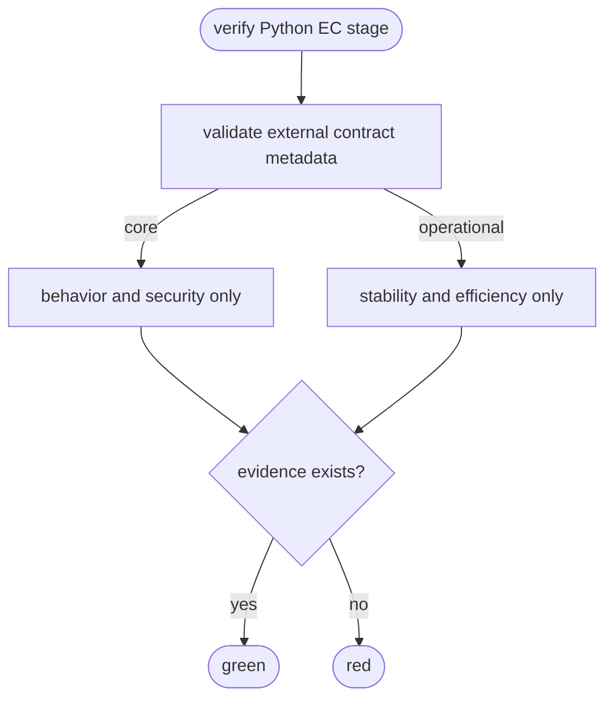
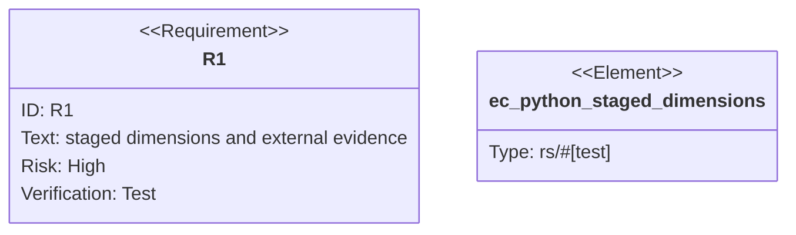

# Python EC Staged Verification

## Logic
<!-- type: logic lang: mermaid -->



Each Python EC case declares a promise, independent oracle label, target,
external command, and one or more safe `evidence/*` outputs. Stability and
efficiency also declare a threshold. `aw ec verify --stage core` runs only
behavior/security and emits explicit skipped entries for operational cases;
`--stage operational` does the reverse. A command is green only when every
declared external evidence file exists and is non-empty afterwards.

Rust defaults to `efficiency_policy = "required"`; all other targets must
declare `required`, `optional`, or `not-applicable` explicitly. Legacy EC
verification remains on its existing all-case behavior.

## Unit Test
<!-- type: unit-test lang: mermaid -->



## Changes
<!-- type: changes lang: yaml -->

```yaml
changes:
  - path: apps/agentic-workflow/src/services/python_ec.rs
    action: modify
    section: logic
    impl_mode: hand-written
    description: "Validate direct-case promise, oracle, target, threshold, external evidence, and target efficiency policy."
  - path: apps/agentic-workflow/src/cli/ec.rs
    action: modify
    section: logic
    impl_mode: codegen
    description: "Run core or operational Python EC subsets and fail successful commands whose declared external evidence is absent."
  - path: apps/agentic-workflow/tests/ec_python_review_lock.rs
    action: modify
    section: unit-test
    impl_mode: hand-written
    description: "Exercise core/operational filtering and evidence failure through the real CLI."
```
