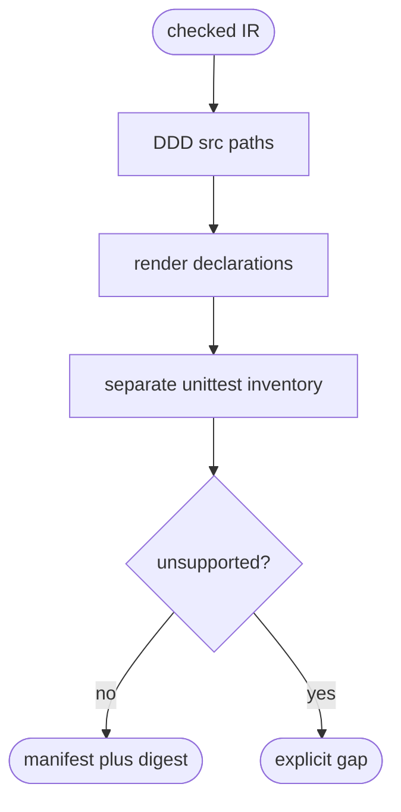

# DDD Python Source Generation

## Logic
<!-- type: logic lang: mermaid -->



Generation uses only the canonical PythonTdIr. It creates package markers and
deterministic source skeletons under `src/`, plus a minimal installable
`pyproject.toml`; unit tests live under `tests/unit` and verify generated
declaration imports. It deliberately does not write
`external-contracts/`, does not copy reference source bodies, and does not
convert an unmodelled declaration into HANDWRITE without an explicit gap.
Function bodies are an explicit `python-td-function-body` HANDWRITE gap until
the semantic IR models their implementation.

The public target entrypoint is `aw td gen --target python --source-root
<python-project> --output-dir <target>`. It is intentionally separate from
slug-based lifecycle generation: it consumes a checked Python project as input
and emits only its target package and native unit tests.

## Unit Test
<!-- type: unit-test lang: mermaid -->

```mermaid
---
id: aw-ddd-python-source-generation-unit-tests
requirements:
  cold_determinism: { id: R1, text: "Both reference IRs produce byte-identical cold Python targets.", kind: regression, risk: high, verify: "cargo test -p agentic-workflow --test python_td_target -- --nocapture" }
  native_tests: { id: R2, text: "Generated unittest suites are separate from EC and pass under CPython.", kind: contract, risk: high, verify: "cargo test -p agentic-workflow --test python_td_target -- --nocapture" }
elements:
  python_td_target_generates_deterministic_packages_and_native_tests: { kind: test, type: "rs/#[test]" }
relations:
  - { from: python_td_target_generates_deterministic_packages_and_native_tests, verifies: cold_determinism }
  - { from: python_td_target_generates_deterministic_packages_and_native_tests, verifies: native_tests }
---
requirementDiagram
  requirement R1 { id: R1 text: "cold deterministic Python target" risk: high verifymethod: test }
  requirement R2 { id: R2 text: "separate native unit test" risk: high verifymethod: test }
```

## Changes
<!-- type: changes lang: yaml -->

```yaml
changes:
  - path: apps/agentic-workflow/src/services/python_td_target.rs
    action: create
    section: logic
    impl_mode: hand-written
    description: "Render PythonTdIr to deterministic package skeletons and unittest inventory."
  - path: apps/agentic-workflow/src/cli/cb.rs
    action: modify
    section: logic
    impl_mode: hand-written
    description: "Route aw td gen --target python to the native Python TD emitter."
  - path: apps/agentic-workflow/src/cli/td.rs
    action: modify
    section: logic
    impl_mode: hand-written
    description: "Keep target-native generation offline by skipping issue lifecycle guards."
  - path: apps/agentic-workflow/tests/python_td_target.rs
    action: create
    section: unit-test
    impl_mode: hand-written
    description: "Cold-generate both reference IRs, compare manifests, and run generated CPython unit tests."
```
