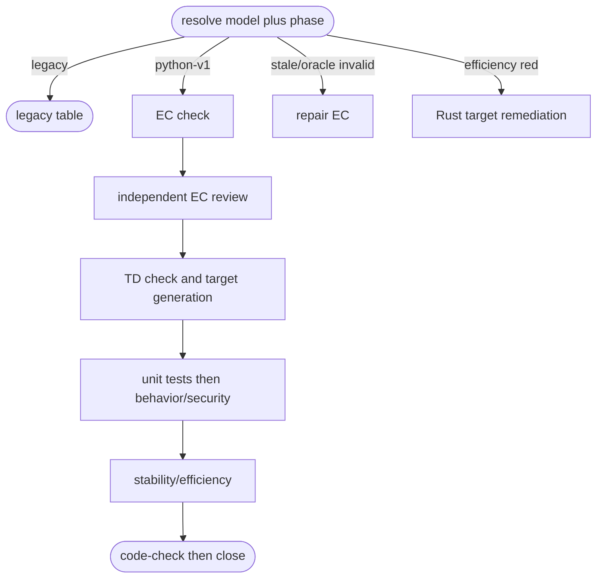

# Python Artifact Goal Flow

## Logic
<!-- type: logic lang: mermaid -->



`python-v1` is an explicit artifact-model adapter, never a file heuristic. The
single phase table is called by `aw goal wi`; backlog reaches it by selecting
and probing the same WI; capability invokes it for its active WI. Legacy
projects receive no new phase interpretation. A successful digest-bound review
returns `aw ec lock --project <project> --wi <wi>`; the lock transition itself
persists `aw td check <td-root> --project <project> --wi <wi>`, so a root cannot
loop forever on a project-global lock operation.

The canonical progression is `ec_missing` → `ec_checked` → `ec_reviewed` →
`td_compiled` → `td_generated` → `unit_green` → `ec_core_green` →
`ec_operational_green` → `code_checked`. Behavior/security red, stability red,
and efficiency red are separate recovery branches. A stale contract or invalid
oracle always routes to EC check/review rather than product adaptation. EC
review HITL is surfaced as a HITL envelope, not a false terminal action.

## Unit Test
<!-- type: unit-test lang: mermaid -->

```mermaid
---
id: aw-python-artifact-goal-flow-unit-tests
requirements:
  phase_table: { id: R1, text: "python-v1 phases emit EC-first runnable commands through terminal code-check.", kind: contract, risk: high, verify: "cargo test -p agentic-workflow python_artifact_goal_routing -- --nocapture" }
  dimensions: { id: R2, text: "red dimensions and stale contracts route to their distinct owner.", kind: regression, risk: high, verify: "cargo test -p agentic-workflow python_artifact_goal_routing -- --nocapture" }
  legacy: { id: R3, text: "legacy projects remain on the existing lifecycle table.", kind: regression, risk: high, verify: "cargo test -p agentic-workflow python_artifact_goal_routing -- --nocapture" }
elements:
  python_artifact_goal_routing_uses_one_ec_first_phase_table: { kind: test, type: "rs/#[test]" }
  python_artifact_goal_routing_separates_red_dimensions_and_contract_repairs: { kind: test, type: "rs/#[test]" }
  python_artifact_goal_routing_keeps_legacy_projects_on_the_legacy_table: { kind: test, type: "rs/#[test]" }
relations:
  - { from: python_artifact_goal_routing_uses_one_ec_first_phase_table, verifies: phase_table }
  - { from: python_artifact_goal_routing_separates_red_dimensions_and_contract_repairs, verifies: dimensions }
  - { from: python_artifact_goal_routing_keeps_legacy_projects_on_the_legacy_table, verifies: legacy }
---
requirementDiagram
  requirement R1 { id: R1 text: "EC-first phase table" risk: high verifymethod: test }
  requirement R2 { id: R2 text: "dimension-aware recovery" risk: high verifymethod: test }
  requirement R3 { id: R3 text: "legacy compatibility" risk: high verifymethod: test }
```

## Changes
<!-- type: changes lang: yaml -->

```yaml
changes:
  - path: apps/agentic-workflow/src/cli/run.rs
    action: modify
    section: logic
    impl_mode: hand-written
    description: "Add the shared python-v1 artifact/gate resolver and route WI/backlog envelopes through it."
  - path: apps/agentic-workflow/src/cli/capability.rs
    action: modify
    section: logic
    impl_mode: hand-written
    description: "Route active capability WIs through the shared python-v1 resolver while retaining legacy dispatch."
  - path: apps/agentic-workflow/src/cli/ec.rs
    action: modify
    section: logic
    impl_mode: hand-written
    description: "Persist direct Python EC checks and staged core/operational verdict transitions on the owning WI."
  - path: apps/agentic-workflow/src/cli/cb.rs
    action: modify
    section: logic
    impl_mode: hand-written
    description: "Persist the core EC handoff after target-native Python generation when an owning WI is supplied."
  - path: apps/agentic-workflow/src/cli/td.rs
    action: modify
    section: logic
    impl_mode: hand-written
    description: "Persist target-native generation after a checked Python TD project owned by a WI."
```
