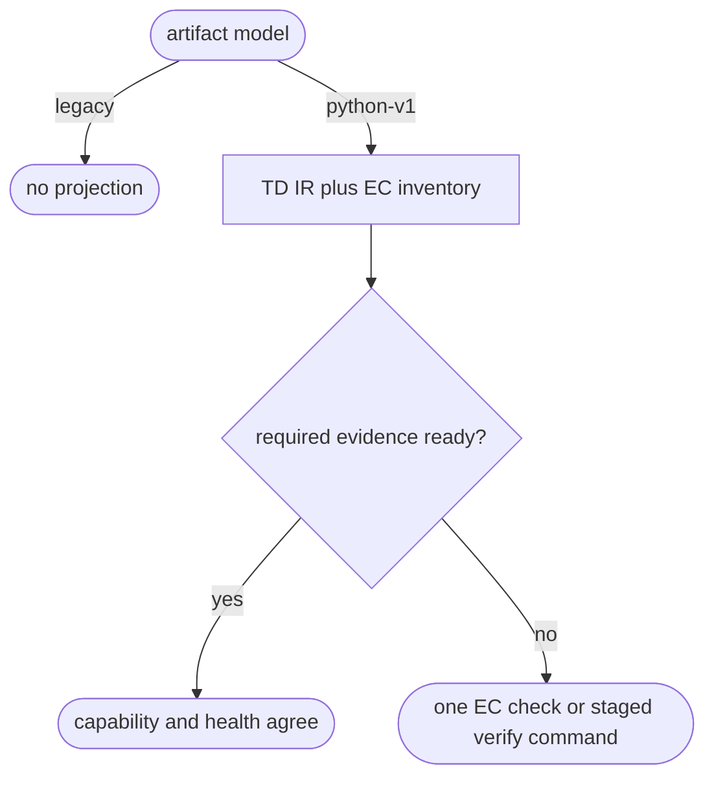

# Python Artifact Readiness

## Logic
<!-- type: logic lang: mermaid -->



The shared projection is read-only. It exposes stable TD module IDs, direct
Python EC case IDs, dimension/applicability, source and dependency digests, and
per-case evidence readiness. Capability and health both consume the same
projection; missing TD/EC inventory routes to `aw ec check`, while missing
required `td` evidence routes to core EC verification and post-generation
evidence routes to operational verification. Legacy projects receive no added
projection or blocker.

## Unit Test
<!-- type: unit-test lang: mermaid -->

```mermaid
---
id: aw-python-artifact-readiness-unit-tests
requirements:
  projection: { id: R1, text: "Shared projection exposes IDs, dimensions, and digests.", kind: contract, risk: high, verify: "cargo test -p agentic-workflow --test python_artifact_readiness -- --nocapture" }
  remediation: { id: R2, text: "Missing evidence returns one executable staged remediation.", kind: regression, risk: high, verify: "cargo test -p agentic-workflow --test python_artifact_readiness -- --nocapture" }
  legacy: { id: R3, text: "Legacy projects remain unchanged.", kind: regression, risk: medium, verify: "cargo test -p agentic-workflow --test python_artifact_readiness -- --nocapture" }
elements:
  python_artifact_readiness_reports_shared_ids_dimensions_and_digests: { kind: test, type: "rs/#[test]" }
  python_artifact_readiness_routes_missing_evidence_to_one_stage_command: { kind: test, type: "rs/#[test]" }
  python_artifact_readiness_leaves_legacy_projects_unchanged: { kind: test, type: "rs/#[test]" }
---
requirementDiagram
  requirement R1 { id: R1 text: "shared inventory projection" risk: high verifymethod: test }
  requirement R2 { id: R2 text: "one remediation command" risk: high verifymethod: test }
  requirement R3 { id: R3 text: "legacy compatibility" risk: medium verifymethod: test }
```

## Changes
<!-- type: changes lang: yaml -->

```yaml
changes:
  - path: apps/agentic-workflow/src/services/python_artifact_readiness.rs
    action: add
    section: logic
    impl_mode: hand-written
    description: "Derive the shared read-only Python TD/EC readiness projection."
  - path: apps/agentic-workflow/src/cli/capability.rs
    action: modify
    section: logic
    impl_mode: hand-written
    description: "Expose Python readiness and its deterministic remediation in capability reports."
  - path: apps/agentic-workflow/src/cli/project.rs
    action: modify
    section: logic
    impl_mode: hand-written
    description: "Expose and gate health using the same Python readiness projection."
  - path: apps/agentic-workflow/tests/python_artifact_readiness.rs
    action: add
    section: unit-test
    impl_mode: hand-written
    description: "Verify IDs, dimensions, evidence remediation, and legacy compatibility."
```
