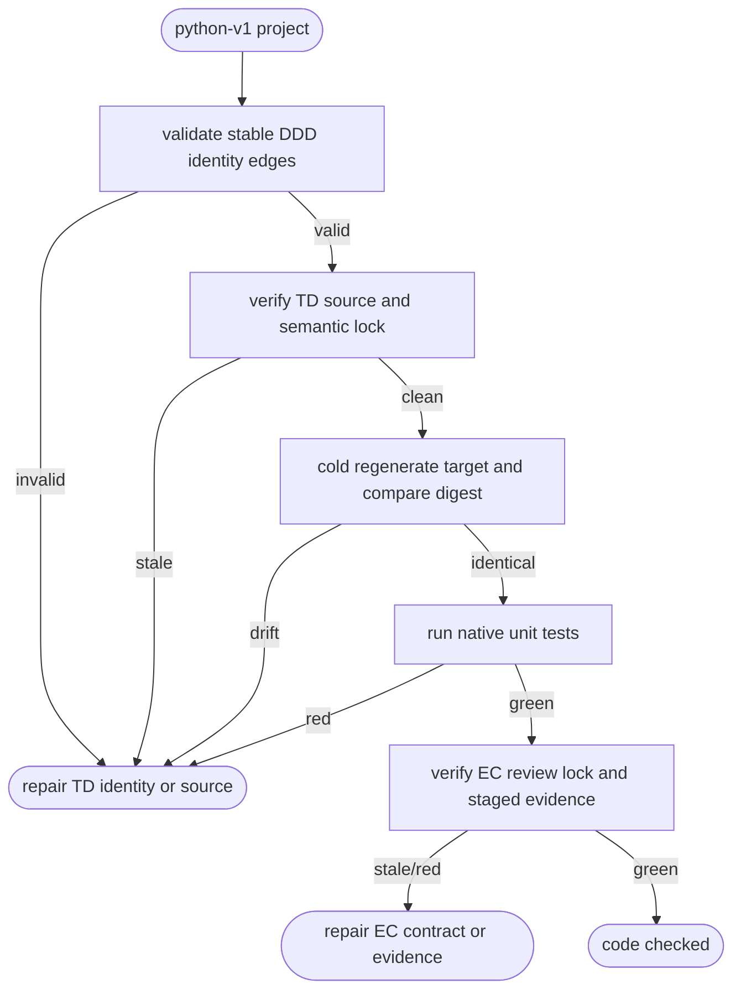

# Python Artifact Trace Code Check

## Logic
<!-- type: logic lang: mermaid -->



`python-v1` terminal closure is a graph, never a collection of path anchors.
The project context map supplies canonical `context:*`, `aggregate:*`,
`use-case:*`, `port:*`, `adapter:*`, and `artifact:*` identities. TD modules
and EC cases declare these identity strings explicitly; paths and Markdown
anchors remain projections. Moving a projection therefore does not change the
graph digest, while an invalid or mismatched edge fails closed.

`aw td lock --project <project>` records sorted Python TD source and compiler
semantic digests. `aw td code-check --project <project> <wi>` recompiles the
TD, checks the lock, emits the selected target into an empty temporary
directory, compares its manifest/digest with owned `src/*`, then runs native
unit tests. Source, semantic, target, or unit drift routes to TD authoring or
generation before the WI can advance.

Terminal closure also requires a clean accepted EC review/lock bound to the
same declared artifact and use-case identities. It consumes normalized staged
EC results: behavior and security always; stability and efficiency when
required by target applicability. Evidence binds EC source, TD semantic,
target build, target, case, and artifact digests. A stale EC contract, oracle,
lock, or evidence routes to EC authoring/review; EC code cannot self-sign the
terminal result.

## Unit Test
<!-- type: unit-test lang: mermaid -->

```mermaid
---
id: aw-python-artifact-trace-code-check-unit-tests
requirements:
  closure: { id: R1, text: "Matching identities, locks, cold target digest, units, and staged EC evidence close one graph.", kind: contract, risk: high, verify: "cargo test -p agentic-workflow python_artifact_code_check -- --nocapture" }
  stale: { id: R2, text: "TD source, semantic, target, EC, or evidence mutation fails before terminal closure with an owning repair command.", kind: regression, risk: high, verify: "cargo test -p agentic-workflow python_artifact_code_check -- --nocapture" }
  move: { id: R3, text: "Moving a projected file without changing its explicit identity leaves identity closure valid.", kind: regression, risk: high, verify: "cargo test -p agentic-workflow python_artifact_code_check -- --nocapture" }
  applicability: { id: R4, text: "Required dimension applicability, including Rust-default efficiency, is enforced without false green.", kind: regression, risk: high, verify: "cargo test -p agentic-workflow python_artifact_code_check -- --nocapture" }
elements:
  python_artifact_code_check_closes_matching_digest_graph: { kind: test, type: "rs/#[test]" }
  python_artifact_code_check_rejects_stale_td_target_ec_and_evidence_edges: { kind: test, type: "rs/#[test]" }
  python_artifact_code_check_preserves_explicit_identity_across_projection_move: { kind: test, type: "rs/#[test]" }
  python_artifact_code_check_enforces_required_target_applicability: { kind: test, type: "rs/#[test]" }
relations:
  - { from: python_artifact_code_check_closes_matching_digest_graph, verifies: closure }
  - { from: python_artifact_code_check_rejects_stale_td_target_ec_and_evidence_edges, verifies: stale }
  - { from: python_artifact_code_check_preserves_explicit_identity_across_projection_move, verifies: move }
  - { from: python_artifact_code_check_enforces_required_target_applicability, verifies: applicability }
---
requirementDiagram
  requirement R1 { id: R1 text: "matching graph closes" risk: high verifymethod: test }
  requirement R2 { id: R2 text: "stale edges fail closed" risk: high verifymethod: test }
  requirement R3 { id: R3 text: "identity survives projection move" risk: high verifymethod: test }
  requirement R4 { id: R4 text: "required applicability enforced" risk: high verifymethod: test }
```

## Changes
<!-- type: changes lang: yaml -->

```yaml
changes:
  - path: apps/agentic-workflow/src/services/python_artifact_code_check.rs
    action: create
    section: logic
    impl_mode: hand-written
    description: "Validate identity, TD-lock, cold target, unit, EC-lock, and normalized evidence edges as one Python terminal graph."
  - path: apps/agentic-workflow/src/services/python_td.rs
    action: modify
    section: logic
    impl_mode: hand-written
    description: "Parse explicit DDD identity declarations independently of projected source paths."
  - path: apps/agentic-workflow/src/services/python_ec.rs
    action: modify
    section: logic
    impl_mode: hand-written
    description: "Require Python EC cases and evidence to bind declared stable DDD identities."
  - path: apps/agentic-workflow/src/cli/td_lock.rs
    action: modify
    section: logic
    impl_mode: hand-written
    description: "Lock the exact Python compiler-owned module and referenced OpenAPI inputs plus their semantic digest without Markdown AST fallback (#2713)."
  - path: apps/agentic-workflow/src/cli/cb.rs
    action: modify
    section: logic
    impl_mode: codegen
    description: "Dispatch python-v1 terminal code-check through the graph verifier before lifecycle closure."
  - path: apps/agentic-workflow/src/cli/ec.rs
    action: modify
    section: logic
    impl_mode: hand-written
    description: "Persist and validate normalized staged EC evidence edges for terminal code-check."
  - path: apps/agentic-workflow/tests/python_artifact_code_check.rs
    action: create
    section: unit-test
    impl_mode: hand-written
    description: "Exercise green closure, stale edges, projection moves, and dimension applicability."
```
