# Python TD Mutation Evidence

## Logic

```mermaid
---
id: aw-python-td-mutation-evidence
entry: result
nodes:
  result: { kind: start, label: "typed mutant plus complete run result" }
  inputs: { kind: process, label: "bind TD EC and baseline source digests" }
  gates: { kind: process, label: "digest commands outputs and inventory" }
  report: { kind: process, label: "digest target verdict and canonical report payload" }
  persist: { kind: process, label: "write deterministic JSON" }
  verify: { kind: decision, label: "current inputs and every derived digest match" }
  valid: { kind: terminal, label: "current reproducible evidence" }
  stale: { kind: terminal, label: "reject stale or tampered evidence" }
edges:
  - { from: result, to: inputs }
  - { from: inputs, to: gates }
  - { from: gates, to: report }
  - { from: report, to: persist }
  - { from: persist, to: verify }
  - { from: verify, to: valid, label: "yes" }
  - { from: verify, to: stale, label: "no" }
---
flowchart LR
  result([mutation result]) --> inputs[TD EC source digests]
  inputs --> gates[gate and output digests]
  gates --> report[canonical report digest]
  report --> persist[deterministic JSON]
  persist --> verify{all current?}
  verify -->|yes| valid([valid])
  verify -->|no| stale([reject])
```

<!-- type: logic lang: mermaid -->



Evidence contains no timestamp or temporary path. Gate command, stdout, and
stderr digests are recomputed from their retained bytes; gate inventory digest
is recomputed from ordered gate identities/configuration; the report digest
binds those values with current TD, EC, baseline source, mutant descriptor,
mutated semantic digest, generated target digest, and killed/survived verdict.
Verification additionally compares the recorded TD/EC/source bindings with the
caller's current values, so unchanged evidence becomes stale when any input
changes.

## Unit Test
<!-- type: unit-test lang: mermaid -->

```mermaid
---
id: aw-python-td-mutation-evidence-unit-tests
requirements:
  reproducible: { id: R1, text: "Equivalent inputs render byte-identical evidence and round-trip through JSON.", kind: contract, risk: high, verify: "cargo test -p agentic-workflow --test mutation_evidence_cli_test" }
  input_staleness: { id: R2, text: "TD, EC, or baseline source digest changes reject evidence as stale.", kind: regression, risk: critical, verify: "cargo test -p agentic-workflow --test mutation_evidence_cli_test" }
  report_tamper: { id: R3, text: "Gate, target, output, mutant, or verdict tamper is detected by recomputed derived and report digests.", kind: regression, risk: critical, verify: "cargo test -p agentic-workflow --test mutation_evidence_cli_test" }
elements:
  evidence_round_trips_reproducibly: { kind: test, type: "rs/#[test]" }
  any_bound_input_gate_or_verdict_tamper_is_rejected: { kind: test, type: "rs/#[test]" }
relations:
  - { from: evidence_round_trips_reproducibly, verifies: reproducible }
  - { from: any_bound_input_gate_or_verdict_tamper_is_rejected, verifies: input_staleness }
  - { from: any_bound_input_gate_or_verdict_tamper_is_rejected, verifies: report_tamper }
---
requirementDiagram
  requirement R1 { id: R1 text: "reproducible JSON evidence" risk: high verifymethod: test }
  requirement R2 { id: R2 text: "input staleness detection" risk: critical verifymethod: test }
  requirement R3 { id: R3 text: "derived and report tamper detection" risk: critical verifymethod: test }
```

## Changes
<!-- type: changes lang: yaml -->

```yaml
changes:
  - path: apps/agentic-workflow/src/services/python_td_mutation_evidence.rs
    action: add
    section: logic
    impl_mode: hand-written
    description: "Build, render, persist, read, and verify canonical mutation evidence with recomputed sub-digests."
  - path: apps/agentic-workflow/src/services/mod.rs
    action: modify
    section: logic
    impl_mode: codegen
    description: "Expose the mutation evidence service."
  - path: apps/agentic-workflow/tests/mutation_evidence_cli_test.rs
    action: add
    section: unit-test
    impl_mode: hand-written
    description: "Prove deterministic round-trip and exhaustive input/gate/verdict tamper rejection."
```
