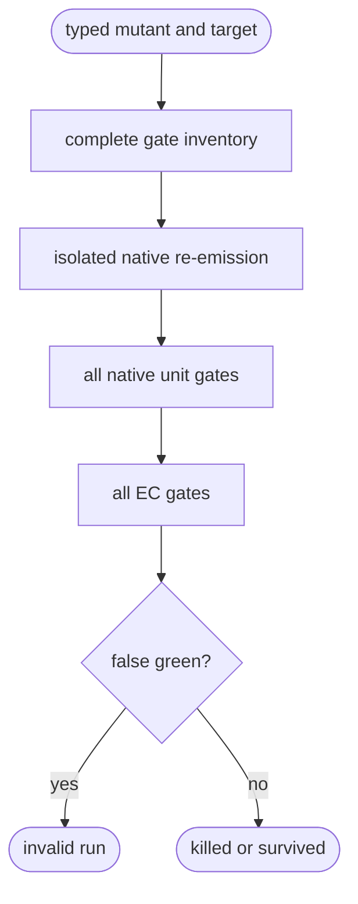

# Python TD Mutation Execution

## Logic
<!-- type: logic lang: mermaid -->



A native-scoped mutant may execute only against its declared target; a
semantic mutant may execute once per supported target. Re-emission must succeed
before any gate runs. The runner then executes every declared gate even after
one has killed the mutant, preserving complete per-gate attribution. Unit
gates must report a non-zero test count and their configured compiled-target
marker. Recognized test-framework EC commands also reject zero tests. Timeout,
missing gate kinds, duplicate ids, missing markers, and zero-test success are
invalid runner outcomes, not mutation verdicts.

## Unit Test
<!-- type: unit-test lang: mermaid -->

```mermaid
---
id: aw-python-td-mutation-execution-unit-tests
requirements:
  complete: { id: R1, text: "Every mutant-target execution re-emits and runs every configured unit and EC gate.", kind: contract, risk: high, verify: "cargo test -p agentic-workflow --test mutation_execution_cli_test" }
  zero_test: { id: R2, text: "A successful command that reports zero tests fails the mutation run closed.", kind: regression, risk: critical, verify: "cargo test -p agentic-workflow --test mutation_execution_cli_test" }
  compiled: { id: R3, text: "A unit gate missing its target compilation marker fails closed.", kind: regression, risk: critical, verify: "cargo test -p agentic-workflow --test mutation_execution_cli_test" }
elements:
  every_mutant_runs_reemission_unit_and_ec_gates: { kind: test, type: "rs/#[test]" }
  zero_test_and_uncompiled_target_false_greens_are_rejected: { kind: test, type: "rs/#[test]" }
relations:
  - { from: every_mutant_runs_reemission_unit_and_ec_gates, verifies: complete }
  - { from: zero_test_and_uncompiled_target_false_greens_are_rejected, verifies: zero_test }
  - { from: zero_test_and_uncompiled_target_false_greens_are_rejected, verifies: compiled }
---
requirementDiagram
  requirement R1 { id: R1 text: "complete attributed gate execution" risk: high verifymethod: test }
  requirement R2 { id: R2 text: "zero-test false green rejected" risk: critical verifymethod: test }
  requirement R3 { id: R3 text: "uncompiled target false green rejected" risk: critical verifymethod: test }
```

## Changes
<!-- type: changes lang: yaml -->

```yaml
changes:
  - path: apps/agentic-workflow/src/services/python_td_mutation_runner.rs
    action: add
    section: logic
    impl_mode: hand-written
    description: "Validate a complete gate plan, re-emit an isolated native target, execute all gates with timeout, and attribute killed/survived results."
  - path: apps/agentic-workflow/src/services/mod.rs
    action: modify
    section: logic
    impl_mode: codegen
    description: "Expose the mutation runner service."
  - path: apps/agentic-workflow/tests/mutation_execution_cli_test.rs
    action: add
    section: unit-test
    impl_mode: hand-written
    description: "Verify all-mutant execution and explicit zero-test/uncompiled-target refusal."
```
