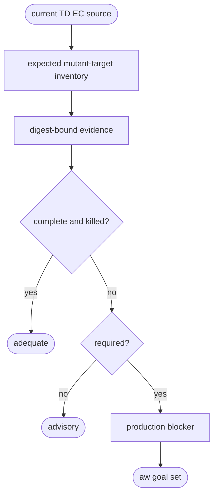

# Python TD Mutation Adequacy Health

## Logic
<!-- type: logic lang: mermaid -->



The evaluator hashes the configured source tree, recompiles the current TD IR,
and discovers the current EC inventory. Semantic mutants require Python,
Rust, and TypeScript evidence; native mutants require their own target.
Missing, duplicate, unexpected, stale, malformed, or surviving evidence is
inadequate. The default `advisory` policy never changes production readiness.
Only project-local `[project]` configuration with
`mutation_adequacy = "required"` blocks and routes to an ad-hoc goal whose
machine gate is `aw health --project <project> mutation`. Optional
`mutation_evidence_dir` and `mutation_source_path` are also project-local and
resolved relative to that project, so root registry regeneration cannot erase
the opt-in policy.

## Unit Test
<!-- type: unit-test lang: mermaid -->

```mermaid
---
id: aw-python-td-mutation-health-unit-tests
requirements:
  advisory: { id: R1, text: "Missing evidence is visible but non-blocking under the default advisory policy.", kind: contract, risk: high, verify: "cargo test -p agentic-workflow --test mutation_health_goal_cli_test" }
  required: { id: R2, text: "Explicit required policy blocks with a chain-valid aw goal remediation command.", kind: contract, risk: critical, verify: "cargo test -p agentic-workflow --test mutation_health_goal_cli_test" }
  complete: { id: R3, text: "Only complete digest-current killed evidence for every required mutant-target pair is adequate.", kind: regression, risk: critical, verify: "cargo test -p agentic-workflow --test mutation_health_goal_cli_test" }
elements:
  advisory_missing_evidence_reports_without_becoming_required: { kind: test, type: "rs/#[test]" }
  required_missing_evidence_routes_to_chain_valid_goal: { kind: test, type: "rs/#[test]" }
  complete_killed_inventory_is_adequate: { kind: test, type: "rs/#[test]" }
relations:
  - { from: advisory_missing_evidence_reports_without_becoming_required, verifies: advisory }
  - { from: required_missing_evidence_routes_to_chain_valid_goal, verifies: required }
  - { from: complete_killed_inventory_is_adequate, verifies: complete }
---
requirementDiagram
  requirement R1 { id: R1 text: "advisory first" risk: high verifymethod: test }
  requirement R2 { id: R2 text: "required goal routing" risk: critical verifymethod: test }
  requirement R3 { id: R3 text: "complete current killed inventory" risk: critical verifymethod: test }
```

## Changes
<!-- type: changes lang: yaml -->

```yaml
changes:
  - path: apps/agentic-workflow/src/services/python_td_mutation_health.rs
    action: add
    section: logic
    impl_mode: hand-written
    description: "Evaluate exact mutation-target evidence coverage against current TD, EC, and baseline source digests."
  - path: apps/agentic-workflow/src/cli/project.rs
    action: modify
    section: logic
    impl_mode: hand-written
    description: "Expose focused and compact mutation health, advisory/required classification, and deterministic goal routing."
  - path: apps/agentic-workflow/src/cli/chain.rs
    action: modify
    section: logic
    impl_mode: hand-written
    description: "Parse quoted emitted arguments so nested ad-hoc goal gate commands remain chain-valid."
  - path: apps/agentic-workflow/src/services/project_registry.rs
    action: modify
    section: schema
    impl_mode: codegen
    description: "Read per-project mutation policy, evidence directory, and source path."
  - path: apps/agentic-workflow/tests/mutation_health_goal_cli_test.rs
    action: add
    section: unit-test
    impl_mode: hand-written
    description: "Prove advisory, required, chain-routing, and complete-killed inventory behavior."
```
