# Python TD Mutation Operators

## Logic

```mermaid
---
id: aw-python-td-mutation-operators
entry: ir
nodes:
  ir: { kind: start, label: "canonical PythonTdIr" }
  scope: { kind: process, label: "semantic plus Python Rust TypeScript scopes" }
  operation: { kind: process, label: "typed rename remove or toggle-async operation" }
  identity: { kind: process, label: "digest descriptor into stable mutant id" }
  apply: { kind: process, label: "apply one operation to cloned IR" }
  result: { kind: terminal, label: "ordered non-empty attributable mutants" }
edges:
  - { from: ir, to: scope }
  - { from: scope, to: operation }
  - { from: operation, to: identity }
  - { from: identity, to: apply }
  - { from: apply, to: result }
---
flowchart LR
  ir([PythonTdIr]) --> scope[semantic and native scopes]
  scope --> operation[typed operation]
  operation --> identity[stable descriptor digest]
  identity --> apply[clone and apply]
  apply --> result([ordered mutants])
```

<!-- type: logic lang: mermaid -->



Mutation enumeration never edits Python source text. Each descriptor binds the
input semantic digest, scope, operator, module id, and declaration id. Semantic
scope represents a target-neutral regression; native scopes attribute the same
typed regression to exactly one supported lowering. Explicit scope and operator
orders plus the compiler's sorted module/declaration IR make repeated
enumeration byte-stable. Applying a descriptor must resolve exactly one typed
declaration or fail closed.

## Unit Test
<!-- type: unit-test lang: mermaid -->

```mermaid
---
id: aw-python-td-mutation-operators-unit-tests
requirements:
  deterministic: { id: R1, text: "Repeated enumeration emits identical unique mutant ids and order.", kind: contract, risk: high, verify: "cargo test -p agentic-workflow --test mutation_operator_cli_test" }
  supported_scopes: { id: R2, text: "Semantic, Python, Rust, and TypeScript scopes each enumerate at least one mutant.", kind: contract, risk: high, verify: "cargo test -p agentic-workflow --test mutation_operator_cli_test" }
  typed_apply: { id: R3, text: "Every descriptor applies to a cloned IR and changes its semantic digest without source-text mutation.", kind: regression, risk: high, verify: "cargo test -p agentic-workflow --test mutation_operator_cli_test" }
elements:
  repeated_enumeration_is_stable_for_every_supported_lowering: { kind: test, type: "rs/#[test]" }
relations:
  - { from: repeated_enumeration_is_stable_for_every_supported_lowering, verifies: deterministic }
  - { from: repeated_enumeration_is_stable_for_every_supported_lowering, verifies: supported_scopes }
  - { from: repeated_enumeration_is_stable_for_every_supported_lowering, verifies: typed_apply }
---
requirementDiagram
  requirement R1 { id: R1 text: "stable mutant identity and order" risk: high verifymethod: test }
  requirement R2 { id: R2 text: "every supported lowering is non-empty" risk: high verifymethod: test }
  requirement R3 { id: R3 text: "typed clone-only application" risk: high verifymethod: test }
```

## Changes
<!-- type: changes lang: yaml -->

```yaml
changes:
  - path: apps/agentic-workflow/src/services/python_td_mutation.rs
    action: add
    section: logic
    impl_mode: hand-written
    description: "Define typed mutation scopes, operators, stable descriptors, enumeration, and clone-only application."
  - path: apps/agentic-workflow/src/services/mod.rs
    action: modify
    section: logic
    impl_mode: codegen
    description: "Expose the mutation service beside the canonical Python TD compiler and native emitters."
  - path: apps/agentic-workflow/tests/mutation_operator_cli_test.rs
    action: add
    section: unit-test
    impl_mode: hand-written
    description: "Prove stable unique non-empty mutation identities for semantic and all supported native lowering scopes."
```
