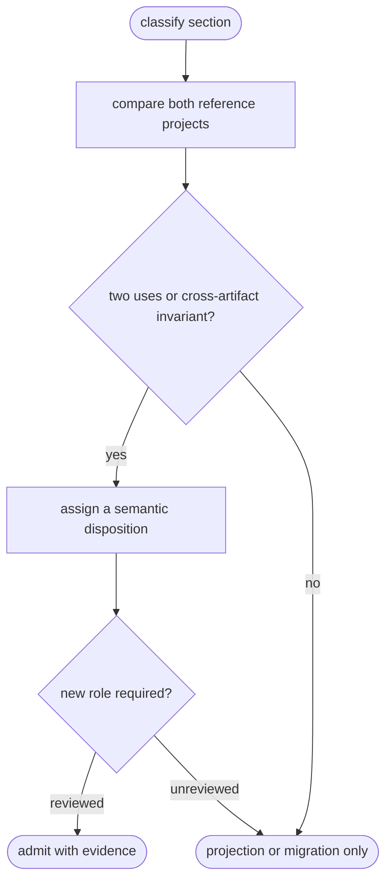

# Python TD Semantic Kernel

## Logic
<!-- type: logic lang: mermaid -->



The kernel is descriptive, not a Python framework. The Typer reference proves
a DDD CLI binding with a plain application use case; the FastAPI/SQLite
reference proves a distinct HTTP, DTO, repository, and persistence journey.
EC remains externally observable truth. TD records construction; source and
generated files are projections of that construction rather than canonical
identity or contract truth.

## Schema
<!-- type: schema lang: yaml -->

```yaml
semantic_kernel:
  admission_rule: "A role requires evidence from both references or an explicit cross-artifact invariant; otherwise retain it only as a projection or migration concern."
  roles:
    - { role: context, evidence: [typer.task_cli, http_db.product_api], disposition: stable DDD identity }
    - { role: aggregate, evidence: [http_db.product], admission: "cross-artifact invariant: persistence identity must remain distinct from HTTP DTO", disposition: TD construction }
    - { role: entity, evidence: [http_db.Product(id)], admission: "cross-artifact invariant: persisted identity must not be caller-controlled", disposition: TD construction }
    - { role: value_object, evidence: [typer.Task, http_db.create_product_input], disposition: TD construction }
    - { role: use_case, evidence: [typer.create_task, http_db.create_product], disposition: TD construction }
    - { role: port, evidence: [http_db.ProductRepository], admission: "cross-artifact invariant: application code must not bind a storage framework", disposition: TD construction }
    - { role: adapter, evidence: [typer.Typer_binding, http_db.SqlAlchemyProductRepository], disposition: TD construction }
    - { role: binding, evidence: [typer.cli_command, http_db.FastAPI_route], disposition: public boundary }
    - { role: artifact, evidence: [typer.pyproject, http_db.pyproject], disposition: project metadata and build/test inputs }
    - { role: test, evidence: [typer.tests_unit, http_db.tests_unit], disposition: native product-unit evidence }
    - { role: ec_ref, evidence: [typer.external_contracts, http_db.external_contracts], disposition: external truth and independent verification }
  restricted_python_subset:
    allowed: [ordinary_modules, dataclasses, typing.Protocol, framework_native_bindings, pytest, pyproject_metadata]
    forbidden_assumptions: [new_AW_decorators, mambalibs_dependency, implicit_framework_discovery, target_specific_lowering]
    extension_rule: "A proposed role or construct needs a second executable reference or a documented cross-artifact invariant, a TD disposition, and a failing acceptance test before it enters the kernel."
section_disposition:
  - { section: changes, disposition: td_construction, python_mapping: owned_file_manifest, migration: retain }
  - { section: source, disposition: migration_only, python_mapping: no Python source replay, migration: preserve only for legacy source-template import }
  - { section: rust-source-unit, disposition: migration_only, python_mapping: none, migration: retain Rust-only replay path }
  - { section: text-source-unit, disposition: migration_only, python_mapping: none, migration: retain opaque text replay path }
  - { section: scenarios, disposition: ec_truth, python_mapping: behavior journey, migration: map to external-contracts case }
  - { section: unit-test, disposition: native_test, python_mapping: pytest unit test, migration: retain }
  - { section: e2e-test, disposition: ec_truth, python_mapping: black-box CLI or HTTP contract, migration: retain }
  - { section: interaction, disposition: td_construction, python_mapping: binding and adapter collaboration, migration: retain }
  - { section: logic, disposition: td_construction, python_mapping: use case and invariant flow, migration: retain }
  - { section: dependency, disposition: td_construction, python_mapping: context/port/adapter relationships, migration: retain }
  - { section: state-machine, disposition: td_construction, python_mapping: aggregate lifecycle when observed, migration: retain }
  - { section: db-model, disposition: td_construction, python_mapping: SQLAlchemy persistence projection, migration: retain }
  - { section: mindmap, disposition: projection, python_mapping: disposable narrative map, migration: retain as projection }
  - { section: rest-api, disposition: ec_truth, python_mapping: FastAPI public HTTP boundary, migration: retain }
  - { section: rpc-api, disposition: ec_truth, python_mapping: public RPC boundary when observed, migration: extension evidence required }
  - { section: async-api, disposition: ec_truth, python_mapping: public event boundary when observed, migration: extension evidence required }
  - { section: cli, disposition: td_construction, python_mapping: Typer command binding, migration: retain }
  - { section: schema, disposition: td_construction, python_mapping: Pydantic boundary DTO or value-object projection, migration: retain }
  - { section: config, disposition: artifact_plugin, python_mapping: pyproject project protocol, migration: retain }
  - { section: wireframe, disposition: projection, python_mapping: UI layout outside current corpus, migration: extension evidence required }
  - { section: component, disposition: projection, python_mapping: UI component contract outside current corpus, migration: extension evidence required }
  - { section: design-token, disposition: projection, python_mapping: UI token contract outside current corpus, migration: extension evidence required }
  - { section: manifest, disposition: artifact_plugin, python_mapping: package/dependency metadata, migration: retain }
  - { section: tool-contract, disposition: ec_truth, python_mapping: external verifier binding, migration: retain }
  - { section: dx-contract, disposition: projection, python_mapping: agent/developer navigation narrative, migration: retain }
  - { section: runtime-image, disposition: artifact_plugin, python_mapping: build artifact outside current corpus, migration: extension evidence required }
  - { section: deployment, disposition: artifact_plugin, python_mapping: runtime projection outside current corpus, migration: extension evidence required }
deprecated_section_disposition:
  - { section: overview, disposition: migration_only, replacement: frontmatter_summary_or_PRD }
  - { section: requirements, disposition: migration_only, replacement: issue_requirements }
  - { section: doc, disposition: migration_only, replacement: user_facing_documentation }
separation_invariants:
  - "EC cases assert only public CLI/HTTP behavior and do not authorize TD or generated source."
  - "TD owns executable construction and stable semantic references, never rendered Markdown headings or file paths as identity."
  - "Generated source and narrative diagrams are disposable projections; normal Python src/ keeps DDD grouping with unit tests."
  - "Legacy source replay remains migration-only until separately adopted by a target-specific artifact plugin."
```

## Changes
<!-- type: changes lang: yaml -->

```yaml
changes:
  - path: apps/agentic-workflow/tech-design/aw-python-td-semantic-kernel.md
    action: create
    section: schema
    impl_mode: hand-written
    description: "Corpus-derived semantic roles, section dispositions, and extension admission rule for later Python TD adapters."
```
