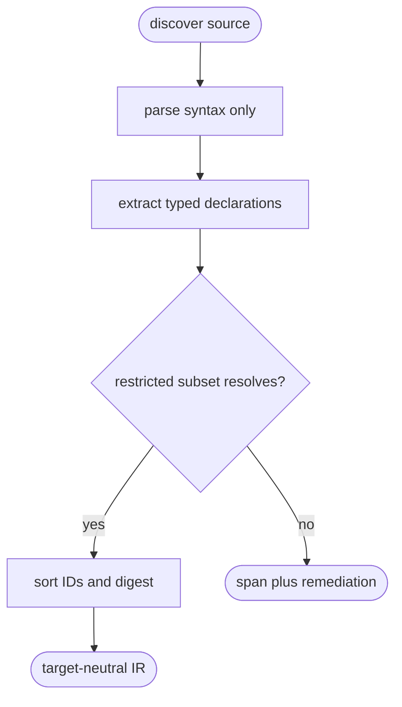

# Python Tech-Design Lowering

## Logic
<!-- type: logic lang: mermaid -->



`PythonTdIr` is an authoring inventory, not the existing Python emitter AST.
It records stable module/declaration IDs, DDD ownership inferred from source
paths, type annotations, async/error declarations, imports and local
relations, public bindings, native tests, and EC references. Parsing uses
tree-sitter only; it never imports a module, evaluates a decorator, or starts
the project.

The first accepted subset is ordinary `src/` modules with imports, functions,
async functions, classes, annotated fields, dataclasses/protocols, and native
framework bindings. Unsupported syntax and unresolved local module references
are deterministic errors with byte spans, line/column locations, and a
specific remediation. The semantic digest hashes canonical IR only, never raw
whitespace, comments, file headings, or source spans.

## Unit Test
<!-- type: unit-test lang: mermaid -->

```mermaid
---
id: aw-python-tech-design-lowering-unit-tests
requirements:
  parser_isolation:
    id: R1
    text: "Both Python reference projects compile through syntax parsing without executing import-time code."
    kind: contract
    risk: high
    verify: "cargo test -p agentic-workflow --test python_td_compiler -- --nocapture"
  deterministic_ir:
    id: R2
    text: "Stable IDs and semantic digests are independent of formatting-only source edits."
    kind: regression
    risk: high
    verify: "cargo test -p agentic-workflow --test python_td_compiler -- --nocapture"
  fail_closed_diagnostics:
    id: R3
    text: "Unsupported syntax and unresolved local semantic references report source spans and remediation."
    kind: regression
    risk: high
    verify: "cargo test -p agentic-workflow --test python_td_compiler -- --nocapture"
elements:
  python_td_compiler_reference_projects_compile_without_execution: { kind: test, type: "rs/#[test]" }
  python_td_compiler_digest_ignores_formatting_only_edits: { kind: test, type: "rs/#[test]" }
  python_td_compiler_reports_source_spans_for_rejected_semantics: { kind: test, type: "rs/#[test]" }
relations:
  - { from: python_td_compiler_reference_projects_compile_without_execution, verifies: parser_isolation }
  - { from: python_td_compiler_digest_ignores_formatting_only_edits, verifies: deterministic_ir }
  - { from: python_td_compiler_reports_source_spans_for_rejected_semantics, verifies: fail_closed_diagnostics }
---
requirementDiagram
  requirement R1 { id: R1 text: "syntax-only reference compilation" risk: high verifymethod: test }
  requirement R2 { id: R2 text: "format-insensitive canonical digest" risk: high verifymethod: test }
  requirement R3 { id: R3 text: "actionable rejected semantics" risk: high verifymethod: test }
```

## Changes
<!-- type: changes lang: yaml -->

```yaml
changes:
  - path: apps/agentic-workflow/src/services/python_td.rs
    action: create
    section: logic
    impl_mode: hand-written
    description: "Syntax-only Python project parser, typed semantic IR, canonical digest, and source-span diagnostics."
  - path: apps/agentic-workflow/src/cli/td.rs
    action: modify
    section: logic
    impl_mode: hand-written
    description: "Dispatch python-v1 source paths through td check and td ast while retaining Markdown TDAst behavior."
  - path: apps/agentic-workflow/tests/python_td_compiler.rs
    action: create
    section: unit-test
    impl_mode: hand-written
    description: "Exercise both reference corpora, parser isolation, deterministic canonical digest, and rejected syntax diagnostics."
```
