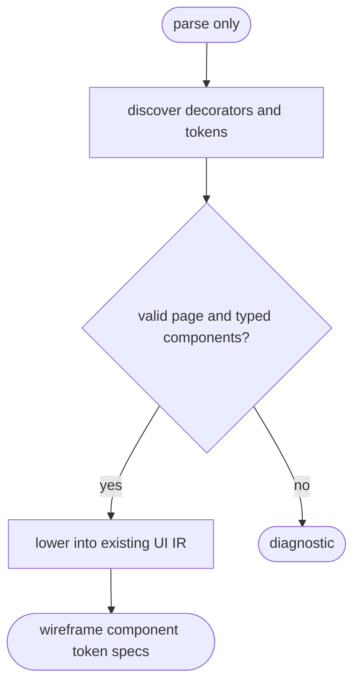

# Python UI Component Lowering

## Logic
<!-- type: logic lang: mermaid -->



The public authoring surface is restricted ordinary Python: `@page` marks one
page function returning a PascalCase component-call tree; `@component` marks a
typed component contract; `Event[T]` parameters become custom events;
`Slot[T]` parameters become named slots; top-level
`token("path", "value", "type")` calls become design tokens. The parser never
imports or evaluates the Python module. Existing YAML `wireframe`, `component`,
and `design-token` TD sections remain supported as the stable IR boundary.

## Unit Test
<!-- type: unit-test lang: mermaid -->

```mermaid
---
id: aw-python-ui-component-lowering-tests
requirements:
  todo_lowering: { id: R1, text: "A Todo page lowers its component tree, events, slots, and tokens into existing UI IR.", kind: contract, risk: high, verify: "cargo test -p agentic-workflow python_ui_td --lib -- --nocapture" }
  invalid_authoring: { id: R2, text: "Missing page and untyped component boundary fail closed with an actionable diagnostic.", kind: regression, risk: high, verify: "cargo test -p agentic-workflow python_ui_td --lib -- --nocapture" }
elements:
  lowers_todo_components_into_existing_ui_ir: { kind: test, type: "rs/#[test]" }
  rejects_missing_page_and_untyped_component_parameters: { kind: test, type: "rs/#[test]" }
relations:
  - { from: lowers_todo_components_into_existing_ui_ir, verifies: todo_lowering }
  - { from: rejects_missing_page_and_untyped_component_parameters, verifies: invalid_authoring }
---
requirementDiagram
  requirement R1 { id: R1 text: "Todo UI lowers to existing IR" risk: high verifymethod: test }
  requirement R2 { id: R2 text: "invalid UI TD fails closed" risk: high verifymethod: test }
```

## Changes
<!-- type: changes lang: yaml -->

```yaml
changes:
  - path: apps/agentic-workflow/src/services/python_ui_td.rs
    action: create
    section: logic
    impl_mode: hand-written
    description: "Parse restricted Python UI TD syntax and lower it to existing wireframe, component, and token IR structs."
  - path: examples/todo-app/td/src/interface/todo_ui.py
    action: create
    section: logic
    impl_mode: hand-written
    description: "First real Todo component-tree authoring fixture for the Python UI TD compiler."
```
