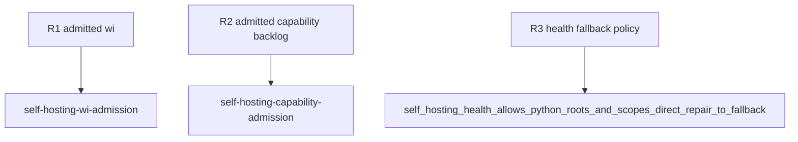

## Logic
<!-- type: logic lang: mermaid -->

```mermaid
---
id: self-hosting-python-first-lifecycle
entry: root
nodes:
  root: { kind: start, label: "aw goal wi, capability, or backlog" }
  admit: { kind: process, label: "run normal EC-first Python lifecycle" }
  worker: { kind: decision, label: "current worker verb runnable?" }
  continue: { kind: process, label: "follow normal verifier and completion gates" }
  repair: { kind: process, label: "repair only the broken worker verb" }
  proof: { kind: process, label: "run focused regression and add Refs issue trailer" }
  resume: { kind: process, label: "resume the original aw goal root" }
  terminal: { kind: terminal, label: "workflow_complete=true" }
edges:
  - { from: root, to: admit }
  - { from: admit, to: worker }
  - { from: worker, to: continue, label: "yes" }
  - { from: continue, to: terminal }
  - { from: worker, to: repair, label: "no" }
  - { from: repair, to: proof }
  - { from: proof, to: resume }
  - { from: resume, to: admit }
---
```

Agentic Workflow enters the same WI, capability, and backlog root dispatchers as
every other Python-first project. EC, TD, CB, reviewed-graph, persistence, and
completion gates are unchanged and remain fail-closed. Health reports
`policy_mode=python_first_lifecycle`, `root_runner_allowed=true`,
`direct_repair_default=false`, `direct_repair_fallback=bounded_direct_repair`,
and `fallback_trigger=current_worker_verb_broken`. A fallback commit is bounded
to the exact broken worker verb, carries `Refs #<issue>`, proves focused
regressions, and then resumes the original root.
## Changes
<!-- type: changes lang: yaml -->

```yaml
changes:
  - path: apps/agentic-workflow/src/cli/run.rs
    action: modify
    section: logic
    impl_mode: hand-written
    anchor: run_wi_root
  - path: apps/agentic-workflow/src/cli/run.rs
    action: modify
    section: logic
    impl_mode: hand-written
    anchor: run_capability_root
  - path: apps/agentic-workflow/src/cli/run.rs
    action: modify
    section: logic
    impl_mode: hand-written
    anchor: project_capability_rollup_command
  - path: apps/agentic-workflow/src/cli/run.rs
    action: modify
    section: logic
    impl_mode: hand-written
    anchor: run_backlog_root
  - path: apps/agentic-workflow/src/cli/project.rs
    action: modify
    section: logic
    impl_mode: hand-written
    anchor: add_self_hosting_policy_fields
  - path: apps/agentic-workflow/tests/self_hosting_runner_policy_cli_test.rs
    action: modify
    section: unit-test
    impl_mode: hand-written
    anchor: self_hosting_health_allows_python_roots_and_scopes_direct_repair_to_fallback
  - path: AGENTS.md
    action: modify
    section: logic
    impl_mode: hand-written
  - path: apps/agentic-workflow/issue-loop.md
    action: modify
    section: logic
    impl_mode: hand-written
  - path: apps/agentic-workflow/CONTRIBUTING.md
    action: modify
    section: logic
    impl_mode: hand-written
  - path: apps/agentic-workflow/CAPABILITIES.md
    action: modify
    section: logic
    impl_mode: hand-written
```
## Unit Test
<!-- type: unit-test lang: mermaid -->


