## Logic
<!-- type: logic lang: mermaid -->

```mermaid
---
id: python-first-self-hosting-admission
entry: root
nodes:
  root: { kind: start, label: "aw goal wi, capability, or backlog" }
  generic: { kind: process, label: "run the generic root engine" }
  artifact: { kind: decision, label: "current artifact phase" }
  authored: { kind: process, label: "hand-author and validate EC or TD" }
  generated: { kind: process, label: "generate, fill, and check CB" }
  worker: { kind: decision, label: "selected worker verb succeeds?" }
  fallback: { kind: process, label: "repair only the bounded current change" }
  proof: { kind: process, label: "run focused regression and add Refs issue trailer" }
  resume: { kind: process, label: "re-enter root and follow next.command" }
  terminal: { kind: terminal, label: "completion.workflow_complete is true" }
edges:
  - { from: root, to: generic }
  - { from: generic, to: artifact }
  - { from: artifact, to: authored, label: "EC or TD" }
  - { from: artifact, to: generated, label: "CB" }
  - { from: authored, to: worker }
  - { from: generated, to: worker }
  - { from: worker, to: resume, label: "yes" }
  - { from: worker, to: fallback, label: "no" }
  - { from: fallback, to: proof }
  - { from: proof, to: resume }
  - { from: resume, to: terminal }
---
```

Agentic Workflow is admitted through the same root dispatcher as every other project. EC and TD are hand-authored Python-first specification projects; CB is the generated implementation stage. The existing self-health gate partition remains observable without blocking root admission. Health reports `policy_mode=python_first_lifecycle`, `fallback_mode=bounded_direct_repair`, `fallback_trigger=selected_worker_verb_is_broken`, `fallback_scope=current_change_only`, `fallback_required_trailer=Refs #<issue>`, and `direct_repair_default=false`. Direct repair is an operator recovery contract used only after the selected worker verb fails, never a root-runner response.
## Changes
<!-- type: changes lang: yaml -->

```yaml
changes:
  - path: apps/agentic-workflow/src/cli/run.rs
    action: modify
    section: logic
    impl_mode: hand-written
    anchor: run_wi_root
  - path: apps/agentic-workflow/src/cli/run.rs
    action: modify
    section: logic
    impl_mode: hand-written
    anchor: run_capability_root
  - path: apps/agentic-workflow/src/cli/run.rs
    action: modify
    section: logic
    impl_mode: hand-written
    anchor: project_capability_rollup_command
  - path: apps/agentic-workflow/src/cli/run.rs
    action: modify
    section: logic
    impl_mode: hand-written
    anchor: run_backlog_root
  - path: apps/agentic-workflow/src/cli/project.rs
    action: modify
    section: logic
    impl_mode: hand-written
    anchor: add_self_hosting_policy_fields
  - path: apps/agentic-workflow/tests/self_hosting_runner_policy_cli_test.rs
    action: modify
    section: unit-test
    impl_mode: hand-written
    anchor: self_hosting_project_and_capability_roots_are_rejected_before_mutation
  - path: AGENTS.md
    action: modify
    section: logic
    impl_mode: hand-written
  - path: apps/agentic-workflow/issue-loop.md
    action: modify
    section: logic
    impl_mode: hand-written
  - path: apps/agentic-workflow/CAPABILITIES.md
    action: modify
    section: logic
    impl_mode: hand-written
```

## Unit Test

```mermaid
---
id: python-first-self-hosting-admission-verification
requirements:
  admitted_capability_backlog:
    id: R2
    text: "Agentic Workflow capability and backlog roots enter their ordinary verifiers and preserve their normal blocked or dispatch envelopes."
    kind: regression
    risk: high
    verify: python_first_self_hosting_capability_and_backlog_enter_normal_verifiers
  admitted_wi:
    id: R1
    text: "An Agentic Workflow change root enters the ordinary EC-first lifecycle instead of being rejected only because the project is Agentic Workflow."
    kind: functional
    risk: high
    verify: python_first_self_hosting_wi_enters_ec_first_lifecycle
  bounded_fallback:
    id: R3
    text: "Health reports direct repair as a non-default fallback restricted to the current change when the selected worker verb is broken."
    kind: regression
    risk: high
    verify: python_first_self_hosting_health_reports_bounded_fallback
---
flowchart TD
    r1[R1 admitted wi] --> python_first_self_hosting_wi_enters_ec_first_lifecycle[python_first_self_hosting_wi_enters_ec_first_lifecycle]
    r2[R2 admitted capability backlog] --> python_first_self_hosting_capability_and_backlog_enter_normal_verifiers[python_first_self_hosting_capability_and_backlog_enter_normal_verifiers]
    r3[R3 bounded fallback] --> python_first_self_hosting_health_reports_bounded_fallback[python_first_self_hosting_health_reports_bounded_fallback]
```

<!-- type: unit-test lang: mermaid -->


