## Logic
<!-- type: logic lang: mermaid -->

```mermaid
---
id: self-hosting-sanctioned-direct-commit
entry: root
nodes:
  root: { kind: start, label: "aw goal wi, capability, or backlog" }
  reject: { kind: process, label: "reject before loop state or dispatch" }
  repair: { kind: process, label: "repair only the bounded current change" }
  proof: { kind: process, label: "run focused regression and add Refs issue trailer" }
  health: { kind: process, label: "run self health without self takeover" }
  terminal: { kind: terminal, label: "report direct repair checkpoint" }
edges:
  - { from: root, to: reject }
  - { from: reject, to: repair }
  - { from: repair, to: proof }
  - { from: proof, to: health }
  - { from: health, to: terminal }
---
```

Agentic Workflow is excluded from its own WI, capability, and backlog root dispatchers because a broken lifecycle cannot be required to repair itself. Health reports `policy_mode=sanctioned_direct_commit`, `required_trailer=Refs #<issue>`, `root_runner_allowed=false`, and `direct_repair_default=true`. The direct change remains bounded by its issue and capability work root, then proves focused regressions without turning advisory self-health axes into a recursive takeover gate.
## Changes
<!-- type: changes lang: yaml -->

```yaml
changes:
  - path: apps/agentic-workflow/src/cli/run.rs
    action: modify
    section: logic
    impl_mode: hand-written
    anchor: run_wi_root
  - path: apps/agentic-workflow/src/cli/run.rs
    action: modify
    section: logic
    impl_mode: hand-written
    anchor: run_capability_root
  - path: apps/agentic-workflow/src/cli/run.rs
    action: modify
    section: logic
    impl_mode: hand-written
    anchor: project_capability_rollup_command
  - path: apps/agentic-workflow/src/cli/run.rs
    action: modify
    section: logic
    impl_mode: hand-written
    anchor: run_backlog_root
  - path: apps/agentic-workflow/src/cli/project.rs
    action: modify
    section: logic
    impl_mode: hand-written
    anchor: add_self_hosting_policy_fields
  - path: apps/agentic-workflow/tests/self_hosting_runner_policy_cli_test.rs
    action: modify
    section: unit-test
    impl_mode: hand-written
    anchor: self_hosting_project_and_capability_roots_are_rejected_before_mutation
  - path: AGENTS.md
    action: modify
    section: logic
    impl_mode: hand-written
  - path: apps/agentic-workflow/issue-loop.md
    action: modify
    section: logic
    impl_mode: hand-written
  - path: apps/agentic-workflow/CONTRIBUTING.md
    action: modify
    section: logic
    impl_mode: hand-written
  - path: apps/agentic-workflow/CAPABILITIES.md
    action: modify
    section: logic
    impl_mode: hand-written
```
## Unit Test

```mermaid
---
id: self-hosting-sanctioned-direct-commit-verification
requirements:
  rejected_capability_backlog:
    id: R2
    text: "Agentic Workflow capability and backlog roots reject before mutation or dispatch."
    kind: regression
    risk: high
    verify: self_hosting_project_and_capability_roots_are_rejected_before_mutation
  rejected_wi:
    id: R1
    text: "An Agentic Workflow change root rejects before loop state or worker dispatch."
    kind: functional
    risk: high
    verify: self_hosting_work_item_root_is_rejected_before_loop_state_or_dispatch
  health_policy:
    id: R3
    text: "Health reports sanctioned direct commit policy and never routes back to a self root."
    kind: regression
    risk: high
    verify: self_hosting_health_reports_policy_and_never_points_back_to_root_runner
---
flowchart TD
    r1[R1 rejected wi] --> self_hosting_work_item_root_is_rejected_before_loop_state_or_dispatch[self_hosting_work_item_root_is_rejected_before_loop_state_or_dispatch]
    r2[R2 rejected capability backlog] --> self_hosting_project_and_capability_roots_are_rejected_before_mutation[self_hosting_project_and_capability_roots_are_rejected_before_mutation]
    r3[R3 health policy] --> self_hosting_health_reports_policy_and_never_points_back_to_root_runner[self_hosting_health_reports_policy_and_never_points_back_to_root_runner]
```

<!-- type: unit-test lang: mermaid -->


