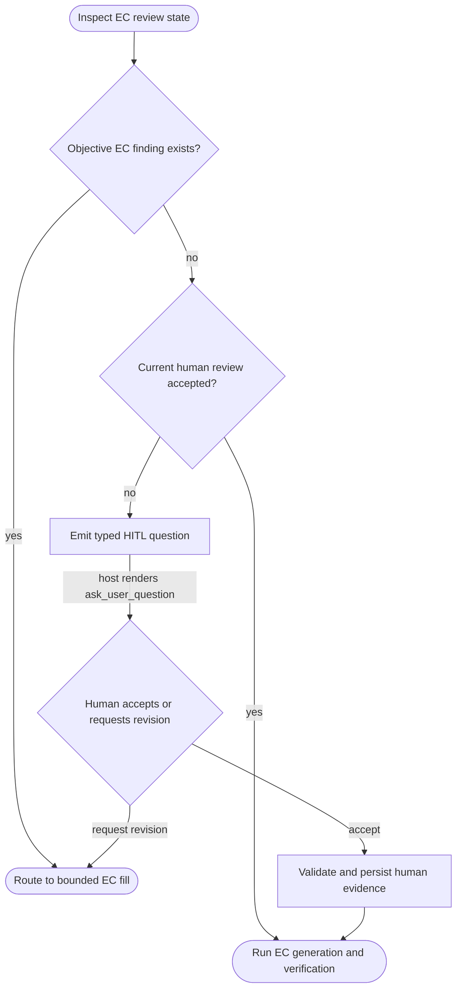

## Logic
<!-- type: logic lang: mermaid -->



## Changes
<!-- type: changes lang: yaml -->

```yaml
changes:
  - path: apps/agentic-workflow/src/cli/ec.rs
    action: modify
    section: logic
    impl_mode: codegen
  - path: apps/agentic-workflow/src/cli/llm.rs
    action: modify
    section: logic
    impl_mode: hand-written
  - path: apps/agentic-workflow/tech-design/logic/emit-actionable-hitl-questions-for-pending-ec-review.md
    action: modify
    section: logic
    impl_mode: hand-written
```
