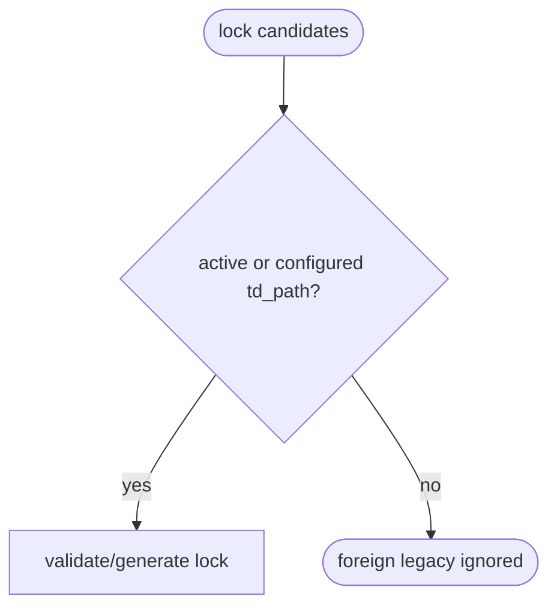

## Logic
<!-- type: logic lang: mermaid -->



TD generation considers the requested active spec and TDs under configured
project roots only. A worktree-local legacy `.aw` file outside every configured
`td_path` is preservation input, not a lock participant, and cannot block an
unrelated project's generation.

## Changes
<!-- type: changes lang: yaml -->

```yaml
changes:
  - path: apps/agentic-workflow/tech-design/surface/interfaces/src/td.md
    action: modify
    section: logic
    impl_mode: codegen
  - path: apps/agentic-workflow/src/cli/td.rs
    action: modify
    section: logic
    impl_mode: codegen
  - path: apps/agentic-workflow/tech-design/surface/validate/tests/td_no_merge_test.md
    action: modify
    section: unit-test
    impl_mode: codegen
  - path: apps/agentic-workflow/tests/cli/tests/td_no_merge_test.rs
    action: modify
    section: unit-test
    impl_mode: codegen
```
