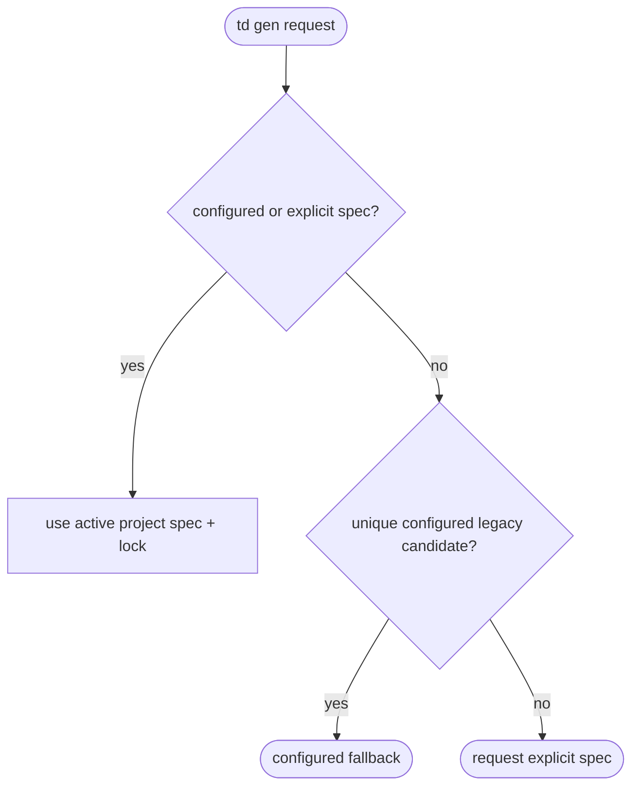
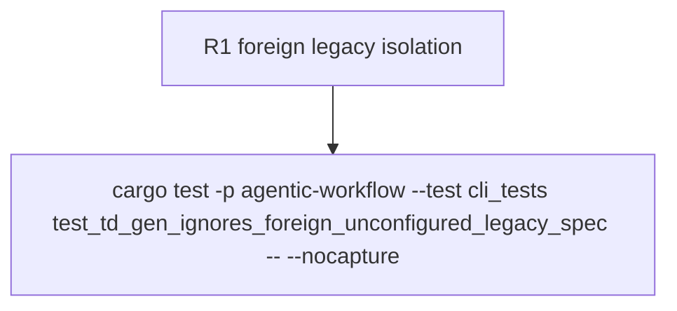

## Logic
<!-- type: logic lang: mermaid -->



`td gen` resolves an explicit or project-qualified active spec before any
legacy worktree discovery. Legacy fallback is valid only for a unique candidate
under a configured project root. A foreign `.aw` path is never selected and is
never passed into TD lock validation.
## Changes
<!-- type: changes lang: yaml -->

```yaml
changes:
  - path: apps/agentic-workflow/tech-design/surface/interfaces/src/td.md
    action: modify
    section: logic
    impl_mode: codegen
  - path: apps/agentic-workflow/src/cli/td.rs
    action: modify
    section: logic
    impl_mode: codegen
  - path: apps/agentic-workflow/tech-design/surface/validate/tests/td_no_merge_test.md
    action: modify
    section: unit-test
    impl_mode: codegen
  - path: apps/agentic-workflow/tests/cli/tests/td_no_merge_test.rs
    action: modify
    section: unit-test
    impl_mode: codegen
```

## Unit Test
<!-- type: unit-test lang: mermaid -->


