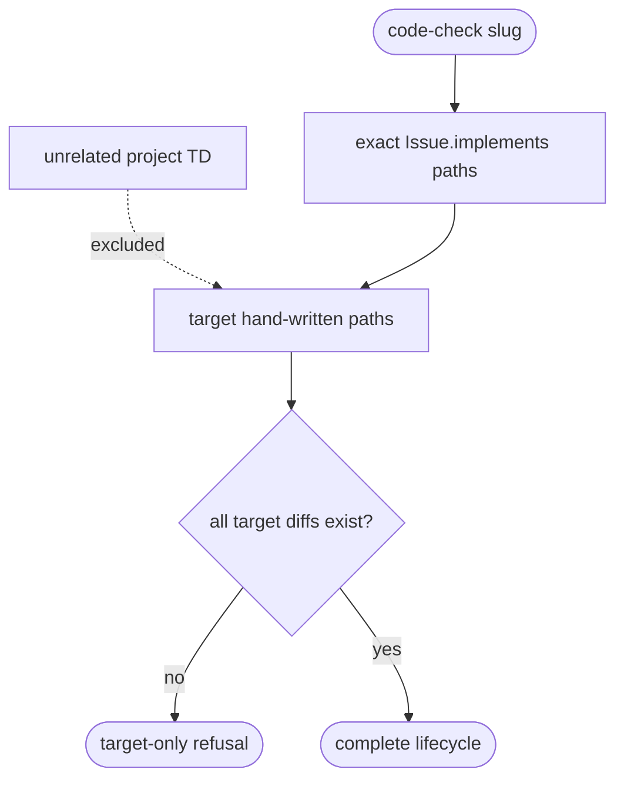
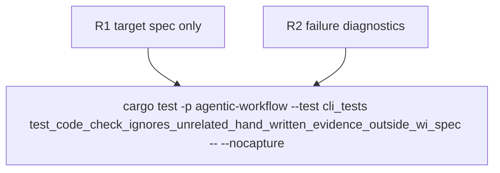

## Logic
<!-- type: logic lang: mermaid -->


## Changes
<!-- type: changes lang: yaml -->

```yaml
changes:
  - path: apps/agentic-workflow/tech-design/surface/validate/tests/td_no_merge_test.md
    action: modify
    section: source
    impl_mode: hand-written
    description: Add the source snapshot regression that proves a terminal code-check reads only the requested WI's declared TD paths.
  - path: apps/agentic-workflow/tests/cli/tests/td_no_merge_test.rs
    action: modify
    section: source
    impl_mode: hand-written
    description: Describe the real-AW integration regression without claiming whole-file ownership; the td_no_merge_test source snapshot is the sole CODEGEN owner.
```
## Unit Test
<!-- type: unit-test lang: mermaid -->


