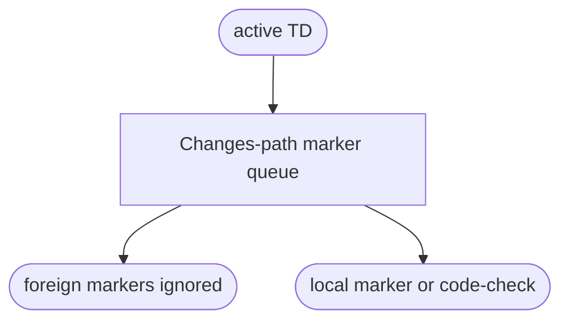

## Logic
<!-- type: logic lang: mermaid -->



Both brief and apply modes resolve the same active TD Changes paths. They enumerate and reconcile only HANDWRITE markers inside that scope. An unrelated marker can neither become the next fill target nor prevent the scoped queue from reaching code-check.

## Changes
<!-- type: changes lang: yaml -->

```yaml
changes:
  - path: apps/agentic-workflow/src/cli/cb_fill.rs
    action: modify
    section: logic
    impl_mode: codegen
  - path: apps/agentic-workflow/tech-design/surface/interfaces/src/cb_fill.md
    action: modify
    section: logic
    impl_mode: codegen
  - path: apps/agentic-workflow/CAPABILITIES.md
    action: modify
    section: logic
    impl_mode: hand-written
```
