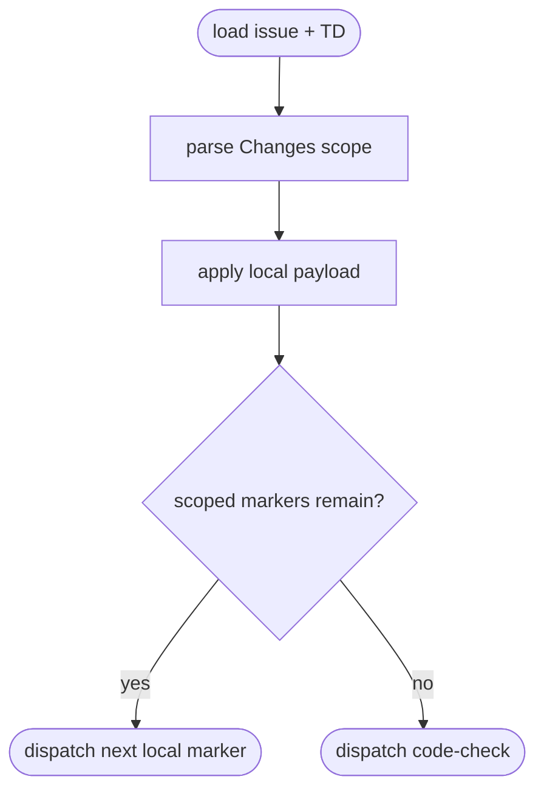
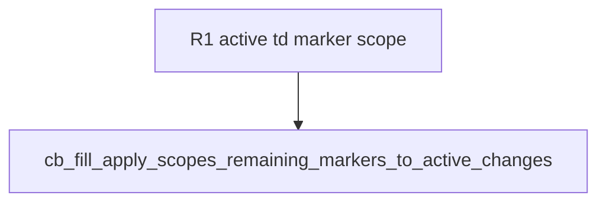

## Logic
<!-- type: logic lang: mermaid -->



`run_apply` derives the active TD spec exactly as brief mode does, parses its Changes paths, and uses `markers_for_td_changes` both to locate the requested marker and to compute `remaining`. If the local queue is empty after the replacement, it advances to `cb_filled` and dispatches code-check even when unrelated unfilled markers exist elsewhere.
## Changes
<!-- type: changes lang: yaml -->

```yaml
changes:
  - path: apps/agentic-workflow/src/cli/cb_fill.rs
    action: modify
    section: logic
    impl_mode: hand-written
  - path: apps/agentic-workflow/tech-design/surface/interfaces/src/cb_fill.md
    action: modify
    section: logic
    impl_mode: codegen
  - path: apps/agentic-workflow/CAPABILITIES.md
    action: modify
    section: logic
    impl_mode: hand-written
```
## Unit Test
<!-- type: unit-test lang: mermaid -->


