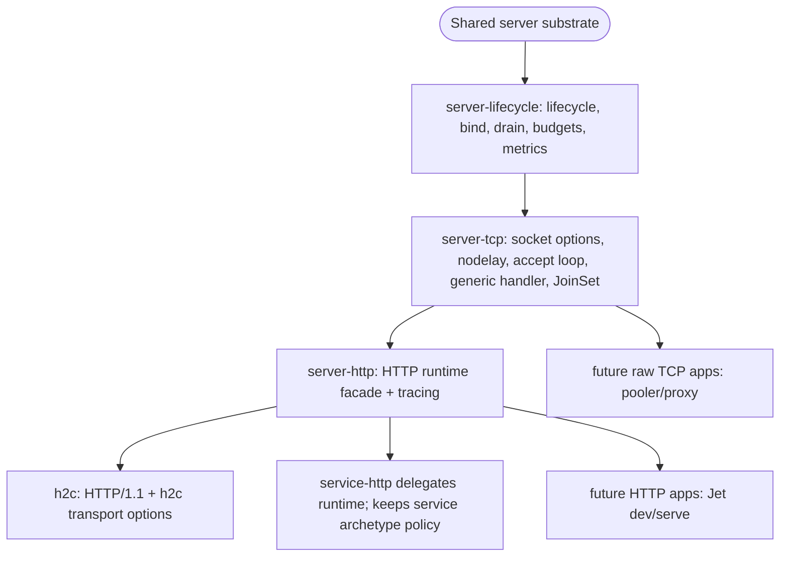
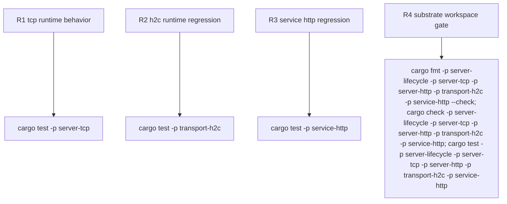

# TD: shared server substrate performance layers

## Logic
<!-- type: logic lang: mermaid -->

```mermaid
---
id: shared-server-substrate-contract
entry: start
nodes:
  start: { kind: start, label: "Shared server substrate contract" }
  core: { kind: process, label: "server-lifecycle owns bind config, drain state, shutdown signal, connection budget, metrics hook" }
  tcp: { kind: process, label: "server-tcp owns socket bind, TCP_NODELAY, accept loop, zero-boxing handler API, JoinSet supervision" }
  http: { kind: process, label: "server-http owns HTTP runtime facade and request tracing" }
  h2c: { kind: process, label: "h2c owns hyper-util HTTP/1.1 + h2c transport and tunable server options" }
  service: { kind: terminal, label: "service-http remains service archetype shell and delegates runtime to server-http" }
  future: { kind: terminal, label: "Jet and Postgres pooler can adopt server-http or server-tcp later without service-http policy" }
edges:
  - { from: start, to: core }
  - { from: core, to: tcp }
  - { from: tcp, to: http }
  - { from: http, to: h2c }
  - { from: http, to: service }
  - { from: tcp, to: future }
  - { from: http, to: future }
---
flowchart TD
  start([Shared server substrate]) --> core[server-lifecycle: lifecycle, bind, drain, budgets, metrics]
  core --> tcp[server-tcp: socket options, nodelay, accept loop, generic handler, JoinSet]
  tcp --> http[server-http: HTTP runtime facade + tracing]
  http --> h2c[h2c: HTTP/1.1 + h2c transport options]
  http --> service[service-http delegates runtime; keeps service archetype policy]
  tcp --> future[future raw TCP apps: pooler/proxy]
  http --> future_http[future HTTP apps: Jet dev/serve]
```
## Unit Test
<!-- type: unit-test lang: mermaid -->

```mermaid
---
id: shared-server-substrate-performance-layers-verification
requirements:
  h2c_runtime_regression:
    id: R2
    text: "h2c tests continue to pass while server options are exported for HTTP/2 stream and drain tuning."
    kind: regression
    risk: medium
    verify: cargo test -p transport-h2c
  service_http_regression:
    id: R3
    text: "service-http tests continue to pass after transport delegates through server-http."
    kind: regression
    risk: high
    verify: cargo test -p service-http
  substrate_workspace_gate:
    id: R4
    text: "The substrate packages and service-http format, compile, and test as a focused workspace slice."
    kind: regression
    risk: medium
    verify: cargo fmt -p server-lifecycle -p server-tcp -p server-http -p transport-h2c -p service-http --check; cargo check -p server-lifecycle -p server-tcp -p server-http -p transport-h2c -p service-http; cargo test -p server-lifecycle -p server-tcp -p server-http -p transport-h2c -p service-http
  tcp_runtime_behavior:
    id: R1
    text: "server-tcp tests cover socket binding, closure-based generic handler execution, and connection budget permit release."
    kind: functional
    risk: high
    verify: cargo test -p server-tcp
---
flowchart TD
    r1[R1 tcp runtime behavior] --> cargo_test_p_server_tcp[cargo test -p server-tcp]
    r2[R2 h2c runtime regression] --> cargo_test_p_h2c[cargo test -p transport-h2c]
    r3[R3 service http regression] --> cargo_test_p_service_http[cargo test -p service-http]
    r4[R4 substrate workspace gate] --> cargo_fmt_p_server_lifecycle_p_server_tcp_p_server_http_p_h2c_p_service_http_check_cargo_check_p_server_lifecycle_p_server_tcp_p_server_http_p_h2c_p_service_http_cargo_test_p_server_lifecycle_p_server_tcp_p_server_http_p_h2c_p_service_http[cargo fmt -p server-lifecycle -p server-tcp -p server-http -p transport-h2c -p service-http --check; cargo check -p server-lifecycle -p server-tcp -p server-http -p transport-h2c -p service-http; cargo test -p server-lifecycle -p server-tcp -p server-http -p transport-h2c -p service-http]
```
