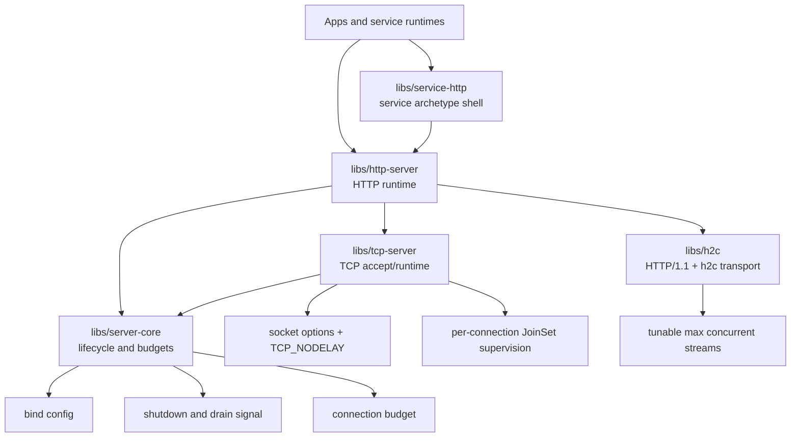

# TD: shared server substrate performance layers

## Logic
<!-- type: logic lang: mermaid -->

```mermaid
flowchart TD
    AppRuntime[Apps and service runtimes]
    ServiceHttp[libs/service-http\nservice archetype shell]
    HttpServer[libs/http-server\nHTTP runtime]
    TcpServer[libs/tcp-server\nTCP accept/runtime]
    ServerCore[libs/server-core\nlifecycle and budgets]
    H2c[libs/h2c\nHTTP/1.1 + h2c transport]

    AppRuntime --> ServiceHttp
    AppRuntime --> HttpServer
    ServiceHttp --> HttpServer
    HttpServer --> TcpServer
    HttpServer --> ServerCore
    HttpServer --> H2c
    TcpServer --> ServerCore

    ServerCore --> Bind[bind config]
    ServerCore --> Drain[shutdown and drain signal]
    ServerCore --> Budget[connection budget]
    TcpServer --> Socket[socket options + TCP_NODELAY]
    TcpServer --> Tasks[per-connection JoinSet supervision]
    H2c --> Streams[tunable max concurrent streams]
```
