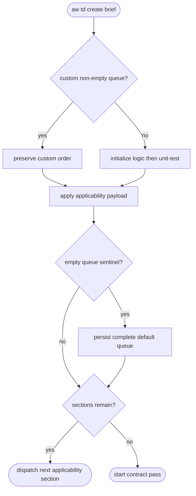

# TD default section queue preservation

## Logic
<!-- type: logic lang: mermaid -->



## Unit Test

```mermaid
---
id: td-default-section-queue-preservation-tests
requirements:
  default_queue:
    id: R1
    text: "A fresh or empty-sentinel TD queue retains logic followed by unit-test after the first logic merge."
    kind: functional
    risk: high
    verify: "cargo test -p agentic-workflow --lib merge_spec_section_preserves_ -- --nocapture"
  next_applicability:
    id: R2
    text: "Logic applicability dispatches unit-test applicability instead of contract logic."
    kind: regression
    risk: high
    verify: "cargo test -p agentic-workflow --test cli_tests td_create_replay_does_not_clobber_authored_logic_section -- --nocapture"
  custom_queue:
    id: R3
    text: "A non-empty custom fill_sections queue remains authoritative and order-preserving."
    kind: functional
    risk: medium
    verify: "cargo test -p agentic-workflow --lib merge_spec_section_preserves_explicit_custom_queue_order -- --nocapture"
elements:
  merge_spec_section_preserves_complete_default_queue_from_empty_skeleton:
    kind: test
    type: "rs/#[test]"
  merge_spec_section_preserves_explicit_custom_queue_order:
    kind: test
    type: "rs/#[test]"
  initialize_td_spec_skeleton_numeric_id_accepts_first_section_apply:
    kind: test
    type: "rs/#[test]"
  td_create_replay_does_not_clobber_authored_logic_section:
    kind: test
    type: "rs/#[test]"
relations:
  - { from: merge_spec_section_preserves_complete_default_queue_from_empty_skeleton, verifies: default_queue }
  - { from: initialize_td_spec_skeleton_numeric_id_accepts_first_section_apply, verifies: default_queue }
  - { from: td_create_replay_does_not_clobber_authored_logic_section, verifies: next_applicability }
  - { from: merge_spec_section_preserves_explicit_custom_queue_order, verifies: custom_queue }
---
requirementDiagram
    requirement R1 {
      id: R1
      text: "default queue survives logic merge"
      risk: high
      verifymethod: test
    }
    requirement R2 {
      id: R2
      text: "unit-test applicability is next"
      risk: high
      verifymethod: test
    }
    requirement R3 {
      id: R3
      text: "custom queue remains authoritative"
      risk: medium
      verifymethod: test
    }
    element merge_spec_section_preserves_complete_default_queue_from_empty_skeleton {
      type: "rs/#[test]"
    }
    element merge_spec_section_preserves_explicit_custom_queue_order {
      type: "rs/#[test]"
    }
    element initialize_td_spec_skeleton_numeric_id_accepts_first_section_apply {
      type: "rs/#[test]"
    }
    element td_create_replay_does_not_clobber_authored_logic_section {
      type: "rs/#[test]"
    }
```

<!-- type: unit-test lang: mermaid -->



## E2E Test
<!-- type: e2e-test lang: yaml -->

```yaml
e2e_tests:
  - id: td-default-section-queue-real-cli
    capability_id: td-cb-lifecycle-automation
    claim_id: td-default-section-queue-preservation
    command: cargo test -p agentic-workflow --test cli_tests td_create_replay_does_not_clobber_authored_logic_section -- --nocapture
    assertions:
      - "the fresh skeleton contains logic followed by unit-test"
      - "logic applicability emits an applicability unit-test dispatch"
      - "contract authoring does not start before unit-test applicability"
```
