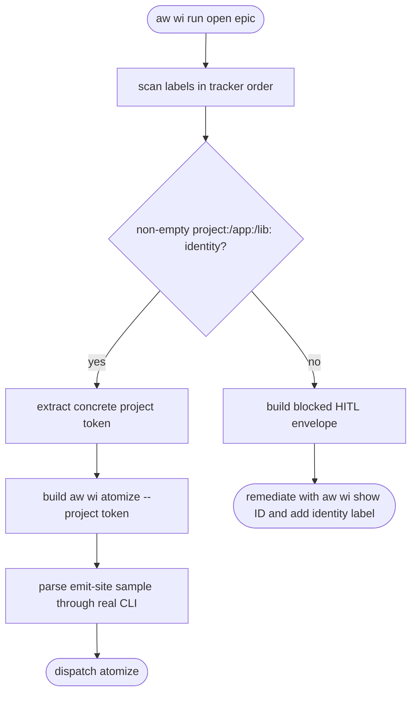

# AW epic project label dispatch

## Logic
<!-- type: logic lang: mermaid -->



## Unit Test

```mermaid
---
id: aw-epic-project-label-dispatch-tests
requirements:
  supported_labels:
    id: R1
    text: "Project identity resolution accepts non-empty project:, app:, and lib: labels while rejecting empty or whitespace-only values."
    kind: functional
    risk: high
    verify: "cargo test -p agentic-workflow --lib epic_project_label_dispatch_ -- --nocapture"
  exact_pgpool:
    id: R2
    text: "The historical #1511 project:pgpool epic shape emits exactly aw wi atomize --project pgpool and never PROJECT."
    kind: regression
    risk: high
    verify: "cargo test -p agentic-workflow --lib epic_project_label_dispatch_emits_exact_chain_valid_pgpool_atomize -- --nocapture"
  unresolved_hitl:
    id: R3
    text: "An unresolved epic emits blocked/HITL state with a runnable aw wi show remediation and no atomize command."
    kind: error
    risk: high
    verify: "cargo test -p agentic-workflow --lib epic_project_label_dispatch_blocks_unresolved_or_empty_labels -- --nocapture"
  chain_conformance:
    id: R4
    text: "The open-epic atomize emit site is cataloged and parses through the real aw clap tree; app/lib commands remain unchanged."
    kind: compatibility
    risk: high
    verify: "cargo test -p agentic-workflow --lib emit_registry_entries_are_all_chain_valid -- --nocapture"
elements:
  epic_project_label_dispatch_emits_exact_chain_valid_pgpool_atomize:
    kind: test
    type: "rs/#[test]"
  epic_project_label_dispatch_preserves_app_and_lib_commands:
    kind: test
    type: "rs/#[test]"
  epic_project_label_dispatch_blocks_unresolved_or_empty_labels:
    kind: test
    type: "rs/#[test]"
  emit_registry_entries_are_all_chain_valid:
    kind: test
    type: "rs/#[test]"
relations:
  - { from: epic_project_label_dispatch_emits_exact_chain_valid_pgpool_atomize, verifies: supported_labels }
  - { from: epic_project_label_dispatch_emits_exact_chain_valid_pgpool_atomize, verifies: exact_pgpool }
  - { from: epic_project_label_dispatch_preserves_app_and_lib_commands, verifies: supported_labels }
  - { from: epic_project_label_dispatch_preserves_app_and_lib_commands, verifies: chain_conformance }
  - { from: epic_project_label_dispatch_blocks_unresolved_or_empty_labels, verifies: unresolved_hitl }
  - { from: emit_registry_entries_are_all_chain_valid, verifies: chain_conformance }
---
requirementDiagram
  requirement R1 {
    id: R1
    text: "supported project identity labels"
    risk: high
    verifymethod: test
  }
  requirement R2 {
    id: R2
    text: "exact pgpool atomize command"
    risk: high
    verifymethod: test
  }
  requirement R3 {
    id: R3
    text: "unresolved epic blocks safely"
    risk: high
    verifymethod: test
  }
  requirement R4 {
    id: R4
    text: "epic handoff is chain-valid"
    risk: high
    verifymethod: test
  }
  element epic_project_label_dispatch_emits_exact_chain_valid_pgpool_atomize {
    type: "rs/#[test]"
  }
  element epic_project_label_dispatch_preserves_app_and_lib_commands {
    type: "rs/#[test]"
  }
  element epic_project_label_dispatch_blocks_unresolved_or_empty_labels {
    type: "rs/#[test]"
  }
  element emit_registry_entries_are_all_chain_valid {
    type: "rs/#[test]"
  }
```

<!-- type: unit-test lang: mermaid -->



## E2E Test
<!-- type: e2e-test lang: yaml -->

```yaml
e2e_tests:
  - id: aw-epic-project-label-dispatch-focused
    capability_id: aw-core-client-model-workitem-first-artifact-lifecycle
    claim_id: aw-epic-project-label-dispatch
    command: cargo test -p agentic-workflow --lib epic_project_label_dispatch_ -- --nocapture
    assertions:
      - "the #1511 project:pgpool fixture emits exactly aw wi atomize --project pgpool"
      - "app:mamba and lib:pg retain their existing atomize commands"
      - "missing, empty, and whitespace-only project labels return blocked/HITL remediation"
      - "no tested envelope contains --project PROJECT"
  - id: aw-epic-project-label-dispatch-chain
    capability_id: aw-core-client-model-workitem-first-artifact-lifecycle
    claim_id: aw-epic-project-label-dispatch
    command: cargo test -p agentic-workflow --lib emit_registry_entries_are_all_chain_valid -- --nocapture
    assertions:
      - "run.rs:open_epic_envelope is present in EMIT_REGISTRY"
      - "aw wi atomize --project pgpool parses through the real CLI tree"
```

## Changes
<!-- type: changes lang: yaml -->

```yaml
changes:
  - path: apps/agentic-workflow/src/cli/run.rs
    action: modify
    section: logic
    impl_mode: codegen
    description: Resolve project/app/lib tracker identity labels before epic dispatch and block unresolved identities without a placeholder command.
  - path: apps/agentic-workflow/src/cli/chain.rs
    action: modify
    section: logic
    impl_mode: codegen
    description: Register the concrete pgpool epic atomize handoff in the emitted-command conformance inventory.
  - path: apps/agentic-workflow/tech-design/semantic/agentic-workflow-cli.md
    action: modify
    section: schema
    impl_mode: hand-written
    description: Synchronize CODEGEN source ownership, symbols, capability linkage, and change evidence for run.rs and chain.rs.
  - path: apps/agentic-workflow/tech-design/surface/interfaces/src/chain.md
    action: modify
    section: source
    impl_mode: codegen
    description: Refresh the chain.rs authoritative source snapshot and emit-site change evidence.
  - path: apps/agentic-workflow/CAPABILITIES.md
    action: modify
    section: capability
    impl_mode: hand-written
    description: Register #1518 as the sole AW epic project label dispatch work-root.
```
