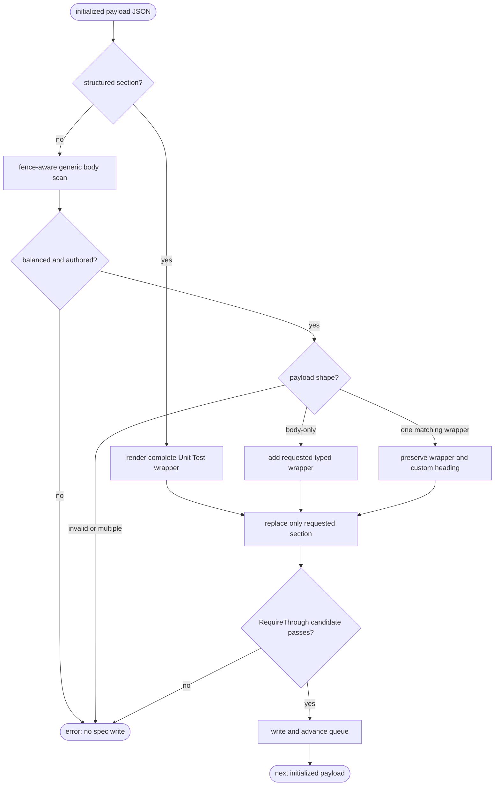

# AW TD apply section lookup parity

## Logic
<!-- type: logic lang: mermaid -->



## Unit Test

```mermaid
---
id: aw-td-apply-section-lookup-parity-verification
requirements:
  body_only_normalization:
    id: R1
    text: "A body-only generic Logic payload gains the requested complete H2 and annotation wrapper before merge."
    kind: regression
    risk: high
    verify: cargo test -p agentic-workflow --lib normalize_generic_td_section_payload -- --nocapture
  wrapped_compatibility:
    id: R2
    text: "A complete matching wrapper, including a custom heading, remains byte and semantically compatible."
    kind: compatibility
    risk: high
    verify: cargo test -p agentic-workflow --lib normalize_generic_td_section_payload -- --nocapture
  malformed_non_mutation:
    id: R3
    text: "Empty, wrong-language, unclosed-fence, mismatched, broken, or multiple-wrapper payloads fail before the spec is written."
    kind: negative
    risk: high
    verify: cargo test -p agentic-workflow --test cli_tests td_create_apply_normalizes_body_only_logic_then_advances_structured_unit_test -- --nocapture
  sequential_apply:
    id: R4
    text: "A valid existing TD advances initialized applicability Logic and then structured Unit Test payloads without losing either typed wrapper."
    kind: regression
    risk: high
    verify: cargo test -p agentic-workflow --test cli_tests td_create_apply_normalizes_body_only_logic_then_advances_structured_unit_test -- --nocapture
elements:
  normalize_generic_td_section_payload:
    kind: function
    type: "rs/fn"
  td_payload_top_level_shape:
    kind: function
    type: "rs/fn"
  normalize_generic_td_section_payload_tests:
    kind: test
    type: "rs/#[test]"
  td_create_apply_normalizes_body_only_logic_then_advances_structured_unit_test:
    kind: test
    type: "rs/#[test]"
relations:
  - { from: normalize_generic_td_section_payload, verifies: body_only_normalization }
  - { from: normalize_generic_td_section_payload_tests, verifies: wrapped_compatibility }
  - { from: td_payload_top_level_shape, verifies: malformed_non_mutation }
  - { from: td_create_apply_normalizes_body_only_logic_then_advances_structured_unit_test, verifies: sequential_apply }
---
requirementDiagram
    requirement R1 {
      id: R1
      text: "body-only payload gains typed wrapper"
      risk: high
      verifymethod: test
    }
    requirement R2 {
      id: R2
      text: "complete custom wrapper stays compatible"
      risk: high
      verifymethod: test
    }
    requirement R3 {
      id: R3
      text: "malformed payload cannot mutate spec"
      risk: high
      verifymethod: test
    }
    requirement R4 {
      id: R4
      text: "Logic then Unit Test advances"
      risk: high
      verifymethod: test
    }
    element normalize_generic_td_section_payload {
      type: "rs/fn"
    }
    element td_payload_top_level_shape {
      type: "rs/fn"
    }
    element normalize_generic_td_section_payload_tests {
      type: "rs/#[test]"
    }
    element td_create_apply_normalizes_body_only_logic_then_advances_structured_unit_test {
      type: "rs/#[test]"
    }
```

<!-- type: unit-test lang: mermaid -->



## E2E Test
<!-- type: e2e-test lang: yaml -->

```yaml
e2e_tests:
  - id: aw-td-apply-section-lookup-parity-real-cli
    name: TD body-only section apply parity real CLI
    capability_id: td-cb-lifecycle-automation
    claim_id: td-apply-section-lookup-parity
    command: cargo test -p agentic-workflow --test cli_tests td_create_apply_normalizes_body_only_logic_then_advances_structured_unit_test -- --nocapture
    assertions:
      - "the already-valid fixture passes aw td check with zero findings"
      - "missing and malformed payload attempts leave the spec byte-identical"
      - "body-only Logic applies with exactly one typed Logic wrapper"
      - "the next initialized payload is applicability/unit-test.json"
      - "structured Unit Test applies and dispatches contract Logic"
```
