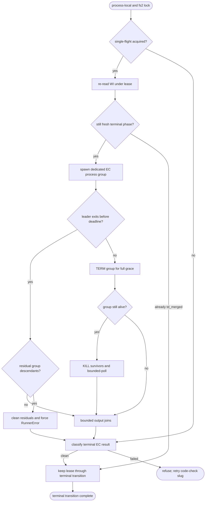

# AW terminal VAT EC process lifecycle

## Logic
<!-- type: logic lang: mermaid -->



Each EC command gets a distinct process group so the shell, VAT wrapper,
Cargo, and descendants share one cleanup boundary. `AW_EC_COMMAND_TIMEOUT_SECS`
overrides the deadline; the default remains 30 minutes because production
Cargo and VAT evaluations may legitimately be long-running. The deadline is
therefore configurable without turning normal builds into false timeouts, and
once reached the cleanup itself is bounded.

Timeout cleanup sends TERM to the process group and preserves the full grace
period even if the leader exits first. AW probes the group, treats ESRCH as an
already-clean success, sends KILL to survivors, bounded-polls leader reaping and
group disappearance, and refuses to join stdout or stderr readers indefinitely.
A normally exited leader is probed before output is joined. If descendants
remain, AW cleans the group within the same TERM/KILL bounds and returns a
runner failure even when the leader exited 0; an unsafe background-verifier
shape can therefore never become a false green.

Terminal EC failures are classified as command failure, timeout, runner error,
or single-flight. `aw td code-check` maps those to distinct structured
`error_kind` values while always emitting the exact retry command
`aw td code-check <slug>`. This refusal occurs before issue phase, close state,
or terminal commit mutation. The process-local guard and project-scoped fs2
lock form a lease that is acquired before evaluation. The caller re-reads the
WI under that lease, evaluates only while the refreshed phase is still fresh,
and keeps the lease through phase/close mutation, remote closure, landing,
terminal commit, and workflow unlock. A stale reader that acquires after an
earlier fast-green completion sees `td_merged` and follows terminal retry
without running EC. A caller that begins in retry phase also acquires the lease
(while still skipping EC), so it cannot race an owner whose phase update has
landed but whose remote/branch/commit/unlock steps are still in progress.
Issue #1586 is separate scope and is not changed here.

## Unit Test

```mermaid
---
id: aw-terminal-vat-ec-process-lifecycle-verification
requirements:
  no_child_wrapper:
    id: R1
    text: "A shell wrapper whose external child already exited times out and is reaped within the bounded cleanup window."
    kind: regression
    risk: high
    verify: cargo test -p agentic-workflow --lib ec_verify_bounds_a_wrapper_after_its_child_exits -- --nocapture
  surviving_descendant:
    id: R2
    text: "When the leader exits on TERM, a TERM-ignoring descendant is still found through the process group and killed."
    kind: regression
    risk: high
    verify: cargo test -p agentic-workflow --lib ec_verify_kills_surviving_group_member_after_leader_exits_on_sigterm -- --nocapture
  natural_exit_residual:
    id: R3
    text: "A leader that exits 0 while a descendant remains is cleaned and returned as RunnerError, never passed."
    kind: regression
    risk: high
    verify: cargo test -p agentic-workflow --lib ec_verify_rejects_natural_leader_success_with_live_descendant -- --nocapture
  process_single_flight:
    id: R4
    text: "A duplicate in-process terminal inventory evaluation is rejected without a second command launch."
    kind: concurrency
    risk: high
    verify: cargo test -p agentic-workflow --lib terminal_ec_gate_rejects_a_duplicate_inflight_inventory -- --nocapture
elements:
  run_ec_command_with_timeout:
    kind: function
    type: "rs/fn"
  terminate_ec_command:
    kind: function
    type: "rs/fn"
  ec_verify_bounds_a_wrapper_after_its_child_exits:
    kind: test
    type: "rs/#[test]"
  ec_verify_kills_surviving_group_member_after_leader_exits_on_sigterm:
    kind: test
    type: "rs/#[test]"
  ec_verify_rejects_natural_leader_success_with_live_descendant:
    kind: test
    type: "rs/#[test]"
  terminal_ec_gate_rejects_a_duplicate_inflight_inventory:
    kind: test
    type: "rs/#[test]"
relations:
  - { from: ec_verify_bounds_a_wrapper_after_its_child_exits, verifies: no_child_wrapper }
  - { from: ec_verify_kills_surviving_group_member_after_leader_exits_on_sigterm, verifies: surviving_descendant }
  - { from: ec_verify_rejects_natural_leader_success_with_live_descendant, verifies: natural_exit_residual }
  - { from: terminal_ec_gate_rejects_a_duplicate_inflight_inventory, verifies: process_single_flight }
---
requirementDiagram
    requirement R1 {
      id: R1
      text: "no-child wrapper cleanup is bounded"
      risk: high
      verifymethod: test
    }
    requirement R2 {
      id: R2
      text: "leader exit does not orphan descendant"
      risk: high
      verifymethod: test
    }
    requirement R3 {
      id: R3
      text: "exit 0 plus descendants is RunnerError"
      risk: high
      verifymethod: test
    }
    requirement R4 {
      id: R4
      text: "one in-process EC evaluation"
      risk: high
      verifymethod: test
    }
    element run_ec_command_with_timeout {
      type: "rs/fn"
    }
    element terminate_ec_command {
      type: "rs/fn"
    }
```

<!-- type: unit-test lang: mermaid -->



## E2E Test
<!-- type: e2e-test lang: yaml -->

```yaml
e2e_tests:
  - id: terminal-ec-no-child-wrapper-real-cli
    name: Terminal EC timeout preserves lifecycle phase and leaves no wrapper
    capability_id: td-cb-lifecycle-automation
    claim_id: terminal-ec-process-liveness
    command: cargo test -p agentic-workflow --test cli_tests test_code_check_bounds_no_child_ec_wrapper_and_preserves_phase -- --nocapture
    assertions:
      - "the real aw binary returns within the configured one-second deadline plus bounded cleanup grace"
      - "the helper confirms its external child exited before the wrapper timed out"
      - "the wrapper PID no longer exists after aw returns"
      - "the envelope has terminal_ec_timeout and exact aw td code-check slug next.command"
      - "the work item remains open in cb_filled and no terminal commit is created"
  - id: terminal-ec-cross-process-single-flight-real-cli
    name: Two aw processes launch one terminal EC inventory
    capability_id: td-cb-lifecycle-automation
    claim_id: terminal-ec-process-liveness
    command: cargo test -p agentic-workflow --test cli_tests test_code_check_cross_process_single_flight_prevents_duplicate_ec_launch -- --nocapture
    assertions:
      - "the first aw process owns the project lock while its EC command runs"
      - "the second same-slug aw process returns terminal_ec_single_flight promptly"
      - "both refusal envelopes point to exact aw td code-check slug retry commands"
      - "the append-only EC launch marker contains exactly one line"
      - "the work item remains open in cb_filled and no terminal commit is created"
  - id: terminal-ec-fast-green-stale-reader-real-cli
    name: Stale reader revalidates phase after acquiring a released lease
    capability_id: td-cb-lifecycle-automation
    claim_id: terminal-ec-process-liveness
    command: cargo test -p agentic-workflow --test cli_tests test_code_check_fast_green_stale_reader_rechecks_phase_before_ec -- --nocapture
    assertions:
      - "a debug-only bounded barrier proves process B read cb_filled before process A completes"
      - "process A executes the fast-green inventory and completes the terminal transition"
      - "process B acquires afterward, re-reads td_merged, and reports terminal retry without EC"
      - "the EC launch marker contains one line and git contains one Cb-CodeCheck terminal commit"
  - id: terminal-ec-retry-transition-lease-real-cli
    name: Retry entry contends while the first terminal transition owns the lease
    capability_id: td-cb-lifecycle-automation
    claim_id: terminal-ec-process-liveness
    command: cargo test -p agentic-workflow --test cli_tests test_code_check_retry_contends_while_terminal_transition_holds_lease -- --nocapture
    assertions:
      - "a bounded debug-only barrier pauses the owner after td_merged is written while its lease remains held"
      - "the second process reads retry phase and promptly receives terminal_ec_single_flight"
      - "the refusal points to the exact same-slug aw td code-check retry"
      - "after releasing the owner there is one EC launch and one Cb-CodeCheck terminal commit"
```
