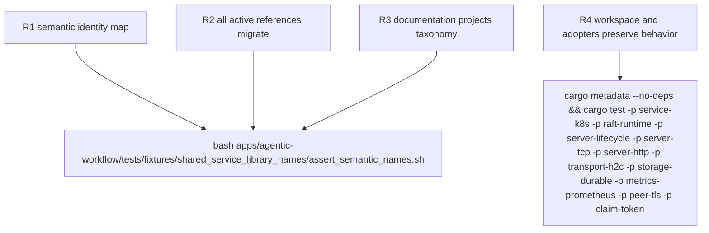

## Logic
<!-- type: logic lang: mermaid -->

```mermaid
---
id: shared-service-library-semantic-name-contract
entry: source_tree
nodes:
  source_tree: { kind: start, label: "read current libs tree and consumer graph" }
  server_family: { kind: process, label: "server-core to server-lifecycle; tcp-server to server-tcp; http-server to server-http" }
  transport_family: { kind: process, label: "h2c to transport-h2c" }
  service_family: { kind: process, label: "operator to service-k8s" }
  raft_family: { kind: process, label: "raft-host to raft-runtime" }
  primitive_family: { kind: process, label: "service-durability to storage-durable; service-metrics to metrics-prometheus; service-tls to peer-tls" }
  token_family: { kind: process, label: "claimtoken to claim-token" }
  identity: { kind: process, label: "directory package and Rust crate identifier change together without compatibility aliases" }
  rewrite: { kind: process, label: "rewrite all active Cargo code test script TD EC and documentation references" }
  canonical_docs: { kind: process, label: "README inventories names; CONTRIBUTING owns naming grammar and boundaries" }
  retired: { kind: decision, label: "retired active path package or crate identity found?" }
  fail: { kind: terminal, label: "fail semantic-name fixture with offending reference" }
  graph: { kind: decision, label: "Cargo metadata and focused tests pass?" }
  repair: { kind: process, label: "repair graph or adopter reference" }
  done: { kind: terminal, label: "new taxonomy is canonical and behavior-preserving" }
edges:
  - { from: source_tree, to: server_family }
  - { from: source_tree, to: transport_family }
  - { from: source_tree, to: service_family }
  - { from: source_tree, to: raft_family }
  - { from: source_tree, to: primitive_family }
  - { from: source_tree, to: token_family }
  - { from: server_family, to: identity }
  - { from: transport_family, to: identity }
  - { from: service_family, to: identity }
  - { from: raft_family, to: identity }
  - { from: primitive_family, to: identity }
  - { from: token_family, to: identity }
  - { from: identity, to: rewrite }
  - { from: rewrite, to: canonical_docs }
  - { from: canonical_docs, to: retired }
  - { from: retired, to: fail, label: "yes" }
  - { from: retired, to: graph, label: "no" }
  - { from: graph, to: repair, label: "no" }
  - { from: repair, to: rewrite }
  - { from: graph, to: done, label: "yes" }
---
flowchart TD
  source_tree([current libs and consumers]) --> server_family[server responsibility family]
  source_tree --> transport_family[transport responsibility family]
  source_tree --> service_family[service integration family]
  source_tree --> raft_family[raft responsibility family]
  source_tree --> primitive_family[storage metrics peer-security families]
  source_tree --> token_family[token identity]
  server_family --> identity[atomic directory package crate identity]
  transport_family --> identity
  service_family --> identity
  raft_family --> identity
  primitive_family --> identity
  token_family --> identity
  identity --> rewrite[rewrite every active reference]
  rewrite --> canonical_docs[README inventory and CONTRIBUTING grammar]
  canonical_docs --> retired{retired identity remains?}
  retired -->|yes| fail([fixture fails with reference])
  retired -->|no| graph{metadata and focused tests pass?}
  graph -->|no| repair[repair graph or adopter]
  repair --> rewrite
  graph -->|yes| done([canonical semantic taxonomy])
```
## Changes
<!-- type: changes lang: yaml -->

```yaml
changes:
  - path: README.md
    action: modify
    section: logic
    impl_mode: hand-written
    description: Project the responsibility-family inventory and links.
  - path: CONTRIBUTING.md
    action: modify
    section: logic
    impl_mode: hand-written
    description: Define the library naming grammar and update the shared service kit contract.
  - path: Cargo.lock
    action: modify
    section: logic
    impl_mode: hand-written
    description: Refresh package identities after the workspace rename.
  - path: libs/service-k8s/Cargo.toml
    action: create
    section: logic
    impl_mode: hand-written
  - path: libs/raft-runtime/Cargo.toml
    action: create
    section: logic
    impl_mode: hand-written
  - path: libs/transport-h2c/Cargo.toml
    action: create
    section: logic
    impl_mode: hand-written
  - path: libs/server-lifecycle/Cargo.toml
    action: create
    section: logic
    impl_mode: hand-written
  - path: libs/server-tcp/Cargo.toml
    action: create
    section: logic
    impl_mode: hand-written
  - path: libs/server-http/Cargo.toml
    action: create
    section: logic
    impl_mode: hand-written
  - path: libs/storage-durable/Cargo.toml
    action: create
    section: logic
    impl_mode: hand-written
  - path: libs/metrics-prometheus/Cargo.toml
    action: create
    section: logic
    impl_mode: hand-written
  - path: libs/peer-tls/Cargo.toml
    action: create
    section: logic
    impl_mode: hand-written
  - path: libs/claim-token/Cargo.toml
    action: create
    section: logic
    impl_mode: hand-written
  - path: apps/courier/Cargo.toml
    action: modify
    section: logic
    impl_mode: hand-written
  - path: apps/keep/Cargo.toml
    action: modify
    section: logic
    impl_mode: hand-written
  - path: apps/loom/Cargo.toml
    action: modify
    section: logic
    impl_mode: hand-written
  - path: apps/lumen/Cargo.toml
    action: modify
    section: logic
    impl_mode: hand-written
  - path: apps/pgpool/Cargo.toml
    action: modify
    section: logic
    impl_mode: hand-written
  - path: apps/relay/Cargo.toml
    action: modify
    section: logic
    impl_mode: hand-written
  - path: apps/tape/Cargo.toml
    action: modify
    section: logic
    impl_mode: hand-written
  - path: examples/client-transport-policy/Cargo.toml
    action: modify
    section: logic
    impl_mode: hand-written
  - path: libs/service-backup/Cargo.toml
    action: modify
    section: logic
    impl_mode: hand-written
  - path: libs/service-http/Cargo.toml
    action: modify
    section: logic
    impl_mode: hand-written
  - path: apps/agentic-workflow/tests/fixtures/shared_service_library_names/assert_semantic_names.sh
    action: create
    section: unit-test
    impl_mode: hand-written
    description: Reject retired paths, package identities, and Rust crate identifiers in active source and docs.
```
## Unit Test
<!-- type: unit-test lang: mermaid -->


