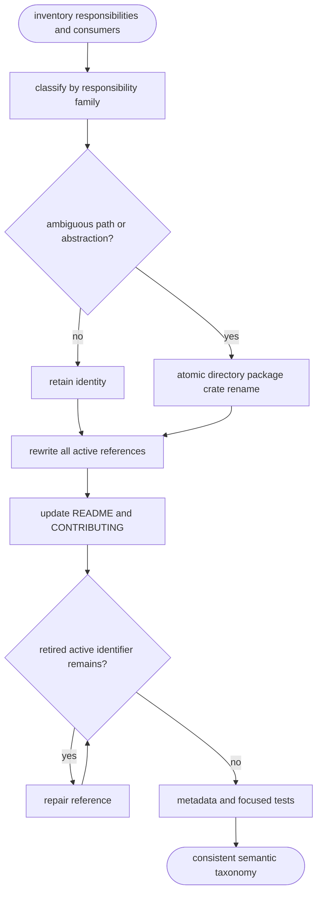
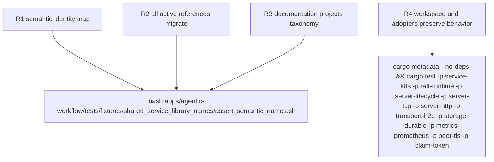

## Logic
<!-- type: logic lang: mermaid -->



## Changes
<!-- type: changes lang: yaml -->

```yaml
changes:
  - path: README.md
    action: modify
    section: logic
    impl_mode: hand-written
    description: Project the responsibility-family inventory and links.
  - path: CONTRIBUTING.md
    action: modify
    section: logic
    impl_mode: hand-written
    description: Define the library naming grammar and update the shared service kit contract.
  - path: Cargo.lock
    action: modify
    section: logic
    impl_mode: hand-written
    description: Refresh package identities after the workspace rename.
  - path: libs/service-k8s/Cargo.toml
    action: create
    section: logic
    impl_mode: hand-written
  - path: libs/raft-runtime/Cargo.toml
    action: create
    section: logic
    impl_mode: hand-written
  - path: libs/transport-h2c/Cargo.toml
    action: create
    section: logic
    impl_mode: hand-written
  - path: libs/server-lifecycle/Cargo.toml
    action: create
    section: logic
    impl_mode: hand-written
  - path: libs/server-tcp/Cargo.toml
    action: create
    section: logic
    impl_mode: hand-written
  - path: libs/server-http/Cargo.toml
    action: create
    section: logic
    impl_mode: hand-written
  - path: libs/storage-durable/Cargo.toml
    action: create
    section: logic
    impl_mode: hand-written
  - path: libs/metrics-prometheus/Cargo.toml
    action: create
    section: logic
    impl_mode: hand-written
  - path: libs/peer-tls/Cargo.toml
    action: create
    section: logic
    impl_mode: hand-written
  - path: libs/claim-token/Cargo.toml
    action: create
    section: logic
    impl_mode: hand-written
  - path: apps/courier/Cargo.toml
    action: modify
    section: logic
    impl_mode: hand-written
  - path: apps/keep/Cargo.toml
    action: modify
    section: logic
    impl_mode: hand-written
  - path: apps/loom/Cargo.toml
    action: modify
    section: logic
    impl_mode: hand-written
  - path: apps/lumen/Cargo.toml
    action: modify
    section: logic
    impl_mode: hand-written
  - path: apps/pgpool/Cargo.toml
    action: modify
    section: logic
    impl_mode: hand-written
  - path: apps/relay/Cargo.toml
    action: modify
    section: logic
    impl_mode: hand-written
  - path: apps/tape/Cargo.toml
    action: modify
    section: logic
    impl_mode: hand-written
  - path: examples/client-transport-policy/Cargo.toml
    action: modify
    section: logic
    impl_mode: hand-written
  - path: libs/service-backup/Cargo.toml
    action: modify
    section: logic
    impl_mode: hand-written
  - path: libs/service-http/Cargo.toml
    action: modify
    section: logic
    impl_mode: hand-written
  - path: apps/agentic-workflow/tests/fixtures/shared_service_library_names/assert_semantic_names.sh
    action: create
    section: unit-test
    impl_mode: hand-written
    description: Reject retired paths, package identities, and Rust crate identifiers in active source and docs.
```

## Unit Test
<!-- type: unit-test lang: mermaid -->


