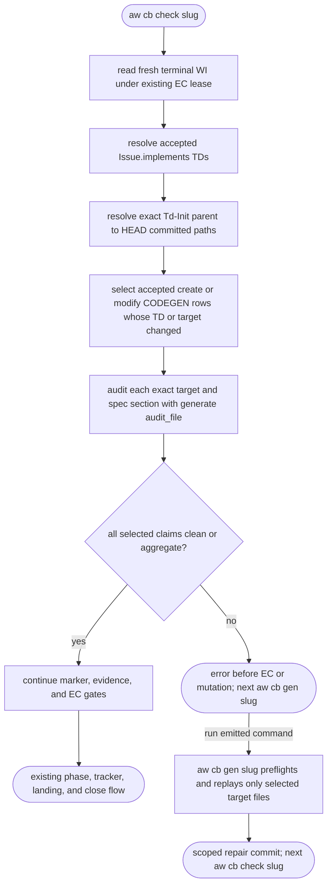

# Terminal touched CODEGEN drift gate

## Logic
<!-- type: logic lang: mermaid -->



The claim set is the intersection of two boundaries: current create/modify
`impl_mode: codegen` rows from the WI's accepted TD files, and the committed
net path set from the exact Td-Init parent through HEAD. A TD path changing
selects its declared generated rows; a target changing selects that target.
HANDWRITE rows, unaccepted TDs, and unrelated source paths never enter the
set. Synthetic legacy fixtures with no lifecycle history keep their existing
vacuous behavior, while corrupt same-slug lifecycle history fails closed.

Each selected target is evaluated by `generate::audit::audit_file`, the same
deterministic per-block regeneration comparator used by path-mode
`aw cb check <path>`. Only reports matching the accepted spec and section
are considered. Drift, an unresolvable owner, a missing target, or a missing
managed region refuses before EC evaluation, phase update, tracker write,
terminal commit, landing, or closure. Clean and aggregate reports continue
through the pre-existing terminal sequence.

The refusal emits `aw cb gen <slug>`. In a fresh terminal phase that command
becomes a repair tick: it preflights every selected spec, regenerates only the
selected target-file scopes with project-wide sibling/README/inventory
post-passes disabled, commits only changed target paths, preserves WI phase,
and emits `aw cb check <slug>`. Normal `td_created` generation remains
unchanged.

## Unit Test

```mermaid
---
id: terminal-touched-codegen-unit-tests
requirements:
  exact_claims:
    id: R1
    text: "Only changed CODEGEN rows from accepted TDs enter the terminal claim set."
    kind: regression
    risk: high
    verify: "cargo test -p agentic-workflow touched_codegen_claims_select_changed_accepted_codegen_only -- --nocapture"
  shared_comparison:
    id: R2
    text: "Terminal and path modes use generate audit_file for deterministic block parity."
    kind: contract
    risk: high
    verify: "cargo test -p agentic-workflow audit_detects_drift_after_hand_edit -- --nocapture"
elements:
  touched_codegen_claims_select_changed_accepted_codegen_only:
    kind: test
    type: "rs/#[test]"
  audit_detects_drift_after_hand_edit:
    kind: test
    type: "rs/#[test]"
relations:
  - { from: touched_codegen_claims_select_changed_accepted_codegen_only, verifies: exact_claims }
  - { from: audit_detects_drift_after_hand_edit, verifies: shared_comparison }
---
requirementDiagram
  requirement R1 {
    id: R1
    text: "accepted touched claims only"
    risk: high
    verifymethod: test
  }
  requirement R2 {
    id: R2
    text: "shared deterministic comparison"
    risk: high
    verifymethod: test
  }
  element touched_codegen_claims_select_changed_accepted_codegen_only {
    type: "rs/#[test]"
  }
  element audit_detects_drift_after_hand_edit {
    type: "rs/#[test]"
  }
```

<!-- type: unit-test lang: mermaid -->



## E2E Test
<!-- type: e2e-test lang: yaml -->

```yaml
e2e_tests:
  - id: terminal-touched-codegen-red-repair-green
    capability_id: td-cb-lifecycle-automation
    claim_id: terminal-touched-codegen-drift-gate
    command: cargo test -p agentic-workflow --test cli_tests test_code_check_terminal_touched_codegen_red_repair_green_unrelated_and_retry -- --nocapture
    assertions:
      - "committed accepted CODEGEN drift refuses before EC and leaves phase, state, issue bytes, HEAD, index tree, cached diff, status, and target bytes unchanged"
      - "the finding names only the accepted target and exact spec section while a second unaccepted generated target remains drifted"
      - "the emitted aw cb gen slug command regenerates and commits only the accepted target, preserves terminal phase, and emits the exact retry command"
      - "restored parity runs EC once, closes the WI, and a td_merged retry neither reruns EC nor duplicates the terminal commit"
```

## Changes
<!-- type: changes lang: yaml -->

```yaml
changes:
  - path: apps/agentic-workflow/src/cli/cb.rs
    action: modify
    section: logic
    impl_mode: hand-written
    description: Resolve accepted touched CODEGEN claims, run the shared pre-EC parity gate, emit scoped remediation, and support phase-safe terminal regeneration.
  - path: apps/agentic-workflow/src/generate/apply.rs
    action: modify
    section: source
    impl_mode: codegen
    description: Add target-file-scoped replay with project-wide post-passes disabled for terminal repair.
  - path: apps/agentic-workflow/tests/cli/tests/td_no_merge_test.rs
    action: modify
    section: e2e-test
    impl_mode: hand-written
    description: Prove red-path immutability, executable repair, unrelated-drift exclusion, green closure, and retry idempotency through the real CLI.
  - path: apps/agentic-workflow/tech-design/core/generate/apply.md
    action: modify
    section: source
    impl_mode: hand-written
    description: Synchronize the apply primitive contract and authoritative source snapshot.
  - path: apps/agentic-workflow/tech-design/surface/interfaces/src/cb.md
    action: modify
    section: source
    impl_mode: hand-written
    description: Synchronize terminal gate and repair source plus capability metadata.
  - path: apps/agentic-workflow/tech-design/surface/validate/tests/td_no_merge_test.md
    action: modify
    section: source
    impl_mode: hand-written
    description: Synchronize the real CLI regression source snapshot and capability metadata.
  - path: apps/agentic-workflow/tech-design/semantic/agentic-workflow-cli.md
    action: modify
    section: schema
    impl_mode: hand-written
    description: Register terminal touched CODEGEN parity and scoped regeneration semantics.
  - path: apps/agentic-workflow/tech-design/semantic/agentic-workflow-tests-cli-tests.md
    action: modify
    section: schema
    impl_mode: hand-written
    description: Register the terminal red, repair, green, unrelated, and retry evidence.
  - path: apps/agentic-workflow/CAPABILITIES.md
    action: modify
    section: capability
    impl_mode: hand-written
    description: Register WI 1635 as the terminal touched CODEGEN parity work root.
```
