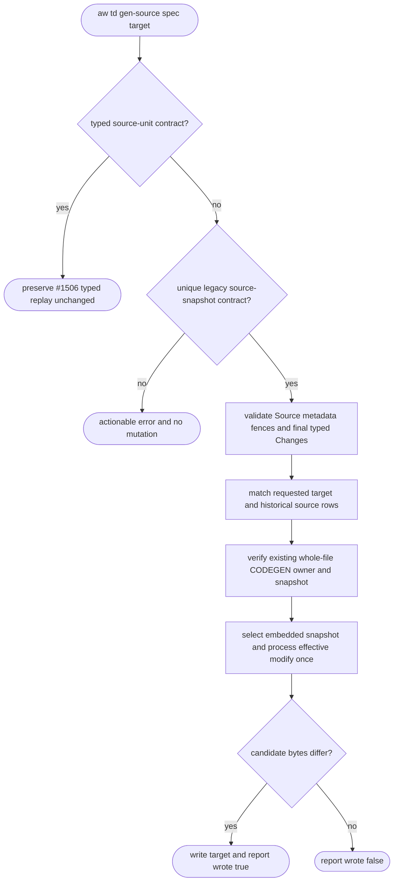

# TD gen-source source-snapshot projection

## Logic
<!-- type: logic lang: mermaid -->



The legacy branch is fail-closed. It accepts exactly one non-fenced
`source-snapshot` directive belonging to one top-level `## Source`, an
immediate exact `type: source` annotation, one complete source payload fence,
and a following literal `## Changes` section with an exact YAML annotation and
one closed YAML payload. The snapshot path must equal the requested target.
Only same-target historical `create`/`modify` source rows are permitted; the
last `modify` row is the single effective replay entry. Different targets,
non-source rows, `replaces`, incompatible actions, missing/foreign/partial
ownership, and concurrent target drift all fail before mutation.

## Unit Test

```mermaid
---
id: td-gen-source-source-snapshot-projection-tests
requirements:
  snapshot_wins:
    id: R1
    text: "A semantic const-only edit in the authoritative embedded snapshot replaces the matching target even when source-from-target metadata is present."
    kind: regression
    risk: high
    verify: "cargo test -p agentic-workflow --lib exact_legacy_source_snapshot_const_only_edit_wins_over_source_from_target -- --nocapture"
  strict_contract:
    id: R2
    text: "Duplicate, malformed, cross-target, non-source, replaces, incompatible-action, and unmatched-target contracts fail without mutation."
    kind: error
    risk: high
    verify: "cargo test -p agentic-workflow --lib legacy_source_snapshot -- --nocapture"
  exact_once:
    id: R3
    text: "Historical create plus modify rows process the effective modify once, preserve siblings, and report wrote false after an idempotent replay."
    kind: compatibility
    risk: high
    verify: "cargo test -p agentic-workflow --lib exact_legacy_source_snapshot_const_only_edit_wins_over_source_from_target -- --nocapture"
  typed_unchanged:
    id: R4
    text: "Typed and partitioned exact-source ownership, concurrency, no-sibling, no-postpass, and report semantics remain unchanged from issue 1506."
    kind: compatibility
    risk: high
    verify: "cargo test -p agentic-workflow --lib exact_source_apply_ -- --nocapture"
elements:
  exact_legacy_source_snapshot_const_only_edit_wins_over_source_from_target:
    kind: test
    type: "rs/#[test]"
  exact_legacy_source_snapshot_rejects_ambiguous_or_unsafe_metadata_without_mutation:
    kind: test
    type: "rs/#[test]"
  legacy_source_snapshot_metadata_and_fence_are_unique_and_top_level:
    kind: test
    type: "rs/#[test]"
  exact_source_apply_is_lossless_and_has_no_sibling_postpasses:
    kind: test
    type: "rs/#[test]"
relations:
  - { from: exact_legacy_source_snapshot_const_only_edit_wins_over_source_from_target, verifies: snapshot_wins }
  - { from: exact_legacy_source_snapshot_const_only_edit_wins_over_source_from_target, verifies: exact_once }
  - { from: exact_legacy_source_snapshot_rejects_ambiguous_or_unsafe_metadata_without_mutation, verifies: strict_contract }
  - { from: legacy_source_snapshot_metadata_and_fence_are_unique_and_top_level, verifies: strict_contract }
  - { from: exact_source_apply_is_lossless_and_has_no_sibling_postpasses, verifies: typed_unchanged }
---
requirementDiagram
  requirement R1 {
    id: R1
    text: "authoritative snapshot wins"
    risk: high
    verifymethod: test
  }
  requirement R2 {
    id: R2
    text: "legacy contract fails closed"
    risk: high
    verifymethod: test
  }
  requirement R3 {
    id: R3
    text: "effective modify runs once"
    risk: high
    verifymethod: test
  }
  requirement R4 {
    id: R4
    text: "typed replay remains stable"
    risk: high
    verifymethod: test
  }
  element exact_legacy_source_snapshot_const_only_edit_wins_over_source_from_target {
    type: "rs/#[test]"
  }
  element exact_legacy_source_snapshot_rejects_ambiguous_or_unsafe_metadata_without_mutation {
    type: "rs/#[test]"
  }
  element legacy_source_snapshot_metadata_and_fence_are_unique_and_top_level {
    type: "rs/#[test]"
  }
  element exact_source_apply_is_lossless_and_has_no_sibling_postpasses {
    type: "rs/#[test]"
  }
```

<!-- type: unit-test lang: mermaid -->



## E2E Test
<!-- type: e2e-test lang: yaml -->

```yaml
e2e_tests:
  - id: td-gen-source-source-snapshot-projection-real-cli
    capability_id: existing-project-standardization
    claim_id: authoritative-source-snapshot-projection
    command: cargo test -p agentic-workflow --test cli_tests test_gen_source_projects_legacy_snapshot_and_runs_generated_test -- --nocapture
    assertions:
      - "a const changes from before to after in the exact requested target"
      - "a uniquely named generated Rust test is present in exact target bytes"
      - "cargo test with that unique filter reports running 1 test and 1 passed"
      - "siblings and an unmatched existing target remain byte-identical"
      - "a second replay reports summary.wrote_files=false"
      - "the unmatched target error names the snapshot target and runnable --target remediation"
```

## Changes
<!-- type: changes lang: yaml -->

```yaml
changes:
  - path: apps/agentic-workflow/src/generate/apply.rs
    action: modify
    section: logic
    impl_mode: codegen
    description: Add a strict legacy source-snapshot exact-replay branch while leaving typed and partitioned source-unit behavior unchanged.
  - path: apps/agentic-workflow/tests/cli/tests/cb_claim_test.rs
    action: modify
    section: e2e-test
    impl_mode: codegen
    description: Prove target-byte projection, exact filtered test execution, idempotence, sibling isolation, and actionable unmatched-target failure through the real CLI.
  - path: apps/agentic-workflow/tech-design/core/generate/apply.md
    action: modify
    section: source
    impl_mode: codegen
    description: Synchronize the authoritative apply.rs source snapshot and issue 1548 contract evidence.
  - path: apps/agentic-workflow/tech-design/surface/validate/tests/cb_claim_test.md
    action: modify
    section: source
    impl_mode: codegen
    description: Synchronize the authoritative CLI regression source snapshot and normalize its outer fence delimiter.
  - path: apps/agentic-workflow/tech-design/semantic/agentic-workflow-generate.md
    action: modify
    section: schema
    impl_mode: hand-written
    description: Register the exact source replay symbols and semantic coverage.
  - path: apps/agentic-workflow/tech-design/semantic/agentic-workflow-tests-cli-tests.md
    action: modify
    section: schema
    impl_mode: hand-written
    description: Register the real CLI regression symbol and semantic coverage.
  - path: apps/agentic-workflow/CAPABILITIES.md
    action: modify
    section: capability
    impl_mode: hand-written
    description: Register issue 1548 as the sole source-snapshot projection work-root.
```
