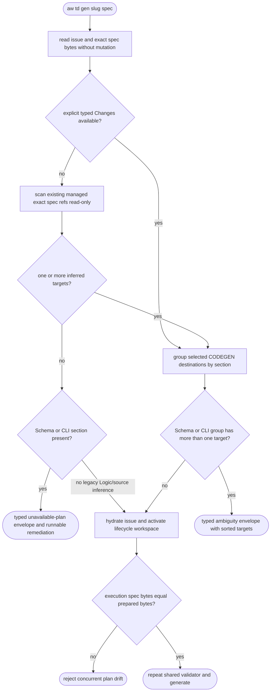

# TD generation target ownership

## Logic
<!-- type: logic lang: mermaid -->



The admission boundary is the complete selected generation plan, not each
target as it is visited. For Schema and CLI, every selected create/modify
entry using `impl_mode: codegen` consumes shared whole-section IR unless it is
an entry-local `rust_source` generator. More than one such destination is
therefore ambiguous and returns `GenerateError::AmbiguousGenerationPlan` with
the section, deterministically sorted paths, and the exact shell-safe rerun
command. A HANDWRITE sibling is not a generated destination, so single-target
and CODEGEN-plus-HANDWRITE plans stay valid.

The caller runs the same pure predicate before remote issue hydration, branch
activation, index writes, lifecycle state updates, or source generation. From
`main`, an existing `td-<slug>` spec is read through Git object storage instead
of checkout. When Changes is absent, the caller uses the executor's read-only
scanner to find existing managed files with an exact `<spec>#<section>` ref:
one Schema/CLI target is admitted, multiple targets receive the same sorted
ambiguity error, and no target returns `GenerationPlanUnavailable` with an
explicit Changes remediation. The prepared bytes are compared exactly after
activation, and the executor repeats the shared validator over its final
scoped/inferred plan just before its first write. Legacy Logic/source inference
remains compatible. Canonical multi-target unit partitioning through
`generates:` is deliberately owned by WI #1634, not this safety fix.

## Unit Test

```mermaid
---
id: td-generation-target-ownership-unit-tests
requirements:
  complete_plan:
    id: R1
    text: "Two Schema targets, sequence-form CLI targets, and a later ambiguous group fail before an earlier valid target is written."
    kind: regression
    risk: high
    verify: "cargo test -p agentic-workflow --lib generation_plan -- --nocapture"
  typed_error:
    id: R2
    text: "Plan failures carry a stable typed variant, section, sorted targets, remediation, and executable next command."
    kind: contract
    risk: high
    verify: "cargo test -p agentic-workflow --lib generation_plan -- --nocapture"
  compatibility:
    id: R3
    text: "Single Schema CODEGEN plus HANDWRITE, one inferred no-Changes Schema target, and legacy Logic inference remain compatible."
    kind: compatibility
    risk: high
    verify: "cargo test -p agentic-workflow --lib generation_plan -- --nocapture"
  containment:
    id: R4
    text: "An ambiguous symlink target never changes bytes outside the repository."
    kind: security
    risk: high
    verify: "cargo test -p agentic-workflow --lib generation_plan -- --nocapture"
elements:
  ambiguous_generation_plan_rejects_two_schema_targets_before_any_write:
    kind: test
    type: "rs/#[test]"
  ambiguous_generation_plan_rejects_sequence_cli_targets_before_any_write:
    kind: test
    type: "rs/#[test]"
  ambiguous_generation_plan_rejects_later_schema_before_earlier_logic_write:
    kind: test
    type: "rs/#[test]"
  generation_plan_preserves_single_codegen_plus_handwrite_idempotently:
    kind: test
    type: "rs/#[test]"
  generation_plan_preserves_legacy_no_changes_logic_inference:
    kind: test
    type: "rs/#[test]"
  ambiguous_generation_plan_does_not_follow_external_target_symlink:
    kind: test
    type: "rs/#[test]"
  generation_plan_preserves_single_inferred_schema_target:
    kind: test
    type: "rs/#[test]"
  ambiguous_generation_plan_rejects_multiple_inferred_schema_targets:
    kind: test
    type: "rs/#[test]"
relations:
  - { from: ambiguous_generation_plan_rejects_two_schema_targets_before_any_write, verifies: complete_plan }
  - { from: ambiguous_generation_plan_rejects_sequence_cli_targets_before_any_write, verifies: complete_plan }
  - { from: ambiguous_generation_plan_rejects_later_schema_before_earlier_logic_write, verifies: complete_plan }
  - { from: ambiguous_generation_plan_rejects_two_schema_targets_before_any_write, verifies: typed_error }
  - { from: generation_plan_preserves_single_codegen_plus_handwrite_idempotently, verifies: compatibility }
  - { from: generation_plan_preserves_single_inferred_schema_target, verifies: compatibility }
  - { from: generation_plan_preserves_legacy_no_changes_logic_inference, verifies: compatibility }
  - { from: ambiguous_generation_plan_rejects_multiple_inferred_schema_targets, verifies: complete_plan }
  - { from: ambiguous_generation_plan_does_not_follow_external_target_symlink, verifies: containment }
---
requirementDiagram
  requirement R1 {
    id: R1
    text: "complete plan fails closed"
    risk: high
    verifymethod: test
  }
  requirement R2 {
    id: R2
    text: "typed actionable error"
    risk: high
    verifymethod: test
  }
  requirement R3 {
    id: R3
    text: "compatible valid plans"
    risk: high
    verifymethod: test
  }
  requirement R4 {
    id: R4
    text: "external bytes untouched"
    risk: high
    verifymethod: test
  }
  element ambiguous_generation_plan_rejects_two_schema_targets_before_any_write {
    type: "rs/#[test]"
  }
  element ambiguous_generation_plan_rejects_sequence_cli_targets_before_any_write {
    type: "rs/#[test]"
  }
  element ambiguous_generation_plan_rejects_later_schema_before_earlier_logic_write {
    type: "rs/#[test]"
  }
  element generation_plan_preserves_single_codegen_plus_handwrite_idempotently {
    type: "rs/#[test]"
  }
  element generation_plan_preserves_legacy_no_changes_logic_inference {
    type: "rs/#[test]"
  }
  element ambiguous_generation_plan_does_not_follow_external_target_symlink {
    type: "rs/#[test]"
  }
  element generation_plan_preserves_single_inferred_schema_target {
    type: "rs/#[test]"
  }
  element ambiguous_generation_plan_rejects_multiple_inferred_schema_targets {
    type: "rs/#[test]"
  }
```

<!-- type: unit-test lang: mermaid -->



## E2E Test
<!-- type: e2e-test lang: yaml -->

```yaml
e2e_tests:
  - id: td-generation-target-ownership-real-cli
    capability_id: td-cb-lifecycle-automation
    claim_id: ambiguous-multi-target-generation-preflight
    command: cargo test -p agentic-workflow --test cli_tests td_gen_ambiguous_schema_plan_fails_before_any_lifecycle_mutation -- --nocapture
    assertions:
      - "the public binary emits exactly one stdout JSON error envelope and no second stderr error"
      - "error_kind, section, sorted targets, completion, and executable next.command are stable"
      - "HEAD, symbolic branch, index tree, porcelain-z status, issue bytes, and TD branch ref are unchanged"
      - "the prepared spec and every target blob remain byte-identical"
  - id: td-generation-target-ownership-inferred-single-real-cli
    capability_id: td-cb-lifecycle-automation
    claim_id: ambiguous-multi-target-generation-preflight
    command: cargo test -p agentic-workflow --test cli_tests td_gen_no_changes_single_inferred_schema_target_remains_compatible -- --nocapture
    assertions:
      - "a no-Changes Schema TD with one exact managed spec ref passes caller admission"
      - "the executor selects the same inferred target and generates Widget"
      - "the lifecycle advances to cb_genned on the persistent project branch"
```

## Changes
<!-- type: changes lang: yaml -->

```yaml
changes:
  - path: apps/agentic-workflow/src/generate/mod.rs
    action: modify
    section: schema
    impl_mode: hand-written
    description: Add typed ambiguous and unavailable generation-plan errors with structured remediation data.
  - path: apps/agentic-workflow/src/generate/apply.rs
    action: modify
    section: logic
    impl_mode: hand-written
    description: Share a complete-plan Schema/CLI ownership predicate between caller preflight and the executor write boundary, with focused compatibility and containment tests.
  - path: apps/agentic-workflow/src/cli/td.rs
    action: modify
    section: logic
    impl_mode: hand-written
    description: Prepare exact spec bytes before lifecycle mutation and emit one structured plan-error envelope with a shell-safe next command.
  - path: apps/agentic-workflow/tests/cli/tests/inplace_mode_test.rs
    action: modify
    section: e2e-test
    impl_mode: hand-written
    description: Prove main-to-existing-TD-branch admission failure leaves repository, lifecycle, issue, spec, and target bytes untouched.
  - path: apps/agentic-workflow/tech-design/core/generate/mod_types.md
    action: modify
    section: source
    impl_mode: hand-written
    description: Synchronize the GenerateError schema and authoritative source snapshot.
  - path: apps/agentic-workflow/tech-design/core/generate/apply.md
    action: modify
    section: source
    impl_mode: hand-written
    description: Synchronize the apply pipeline contract and authoritative source snapshot.
  - path: apps/agentic-workflow/tech-design/surface/interfaces/src/td.md
    action: modify
    section: source
    impl_mode: hand-written
    description: Synchronize the TD caller contract and authoritative source snapshot.
  - path: apps/agentic-workflow/tech-design/surface/validate/tests/inplace_mode_test.md
    action: modify
    section: source
    impl_mode: hand-written
    description: Synchronize the real CLI regression source snapshot and capability evidence.
  - path: apps/agentic-workflow/tech-design/semantic/agentic-workflow-cli.md
    action: modify
    section: schema
    impl_mode: hand-written
    description: Register caller-side target-ownership preflight under the TD lifecycle capability.
  - path: apps/agentic-workflow/tech-design/semantic/agentic-workflow-tests-cli-tests.md
    action: modify
    section: schema
    impl_mode: hand-written
    description: Register the public CLI mutation-order proof under the TD lifecycle capability.
  - path: apps/agentic-workflow/CAPABILITIES.md
    action: modify
    section: capability
    impl_mode: hand-written
    description: Register WI #1633 as the target-ownership preflight work root.
```
