# TD generation target ownership

## Logic

```mermaid
---
id: td-generation-target-ownership
entry: request
nodes:
  request: { kind: start, label: "aw td gen slug spec" }
  prepare: { kind: process, label: "read issue and exact spec bytes without mutation" }
  changes: { kind: decision, label: "explicit typed Changes available?" }
  infer: { kind: process, label: "scan existing managed exact spec refs read-only" }
  inferred: { kind: decision, label: "one or more inferred targets?" }
  shared: { kind: decision, label: "Schema or CLI section present?" }
  unavailable: { kind: terminal, label: "typed unavailable-plan envelope and runnable remediation" }
  group: { kind: process, label: "group selected CODEGEN destinations by section" }
  ambiguous: { kind: decision, label: "Schema or CLI group has more than one target?" }
  exact: { kind: decision, label: "any target declares generates?" }
  inventory: { kind: process, label: "enumerate stable schema:name or cli:name typed units" }
  ownership: { kind: decision, label: "every unit owned exactly once and every owner resolves?" }
  reject: { kind: terminal, label: "typed ambiguity or invalid ownership envelope" }
  supported: { kind: decision, label: "every owned unit and target language has a generator?" }
  gap: { kind: terminal, label: "typed generator-gap HITL envelope before mutation" }
  lifecycle: { kind: process, label: "hydrate issue and activate lifecycle workspace" }
  stable: { kind: decision, label: "execution spec bytes equal prepared bytes?" }
  drift: { kind: terminal, label: "reject concurrent plan drift" }
  partition: { kind: process, label: "filter typed IR to the current target's owned unit IDs" }
  execute: { kind: terminal, label: "repeat shared validator and generate partition only" }
edges:
  - { from: request, to: prepare }
  - { from: prepare, to: changes }
  - { from: changes, to: group, label: "yes" }
  - { from: changes, to: infer, label: "no" }
  - { from: infer, to: inferred }
  - { from: inferred, to: group, label: "yes" }
  - { from: inferred, to: shared, label: "no" }
  - { from: shared, to: unavailable, label: "yes" }
  - { from: shared, to: lifecycle, label: "no legacy Logic/source inference" }
  - { from: group, to: ambiguous }
  - { from: ambiguous, to: exact }
  - { from: exact, to: reject, label: "no and multiple targets" }
  - { from: exact, to: lifecycle, label: "no and one target legacy" }
  - { from: exact, to: inventory, label: "yes" }
  - { from: inventory, to: ownership }
  - { from: ownership, to: reject, label: "no" }
  - { from: ownership, to: supported, label: "yes" }
  - { from: supported, to: gap, label: "no" }
  - { from: supported, to: lifecycle, label: "yes" }
  - { from: lifecycle, to: stable }
  - { from: stable, to: drift, label: "no" }
  - { from: stable, to: partition, label: "yes" }
  - { from: partition, to: execute }
---
flowchart TD
  request([aw td gen slug spec]) --> prepare[read issue and exact spec bytes without mutation]
  prepare --> changes{explicit typed Changes available?}
  changes -->|yes| group[group selected CODEGEN destinations by section]
  changes -->|no| infer[scan existing managed exact spec refs read-only]
  infer --> inferred{one or more inferred targets?}
  inferred -->|yes| group
  inferred -->|no| shared{Schema or CLI section present?}
  shared -->|yes| unavailable([typed unavailable-plan envelope and runnable remediation])
  shared -->|no legacy Logic/source inference| lifecycle[hydrate issue and activate lifecycle workspace]
  group --> ambiguous{Schema or CLI group has more than one target?}
  ambiguous --> exact{any target declares generates?}
  exact -->|no and multiple targets| reject([typed ambiguity or invalid ownership envelope])
  exact -->|no and one target legacy| lifecycle
  exact -->|yes| inventory[enumerate stable schema:name or cli:name typed units]
  inventory --> ownership{every unit owned exactly once and every owner resolves?}
  ownership -->|no| reject
  ownership -->|yes| supported{every owned unit and target language has a generator?}
  supported -->|no| gap([typed generator-gap HITL envelope before mutation])
  supported -->|yes| lifecycle
  lifecycle --> stable{execution spec bytes equal prepared bytes?}
  stable -->|no| drift([reject concurrent plan drift])
  stable -->|yes| partition[filter typed IR to current target owned IDs]
  partition --> execute([repeat shared validator and generate partition only])
```

<!-- type: logic lang: mermaid -->



The admission boundary is the complete selected generation plan, not each
target as it is visited. Typed Schema definitions receive stable
`schema:<name>` IDs and top-level CLI commands receive stable `cli:<name>` IDs;
nested CLI commands remain inside their top-level owner. A Changes target opts
into exact ownership with a canonical string list such as `generates:
[schema:Alpha, schema:Beta]`. Once any selected target opts in, every selected
CODEGEN target for that section must declare a non-empty list, every typed unit
must be present exactly once, every claim must resolve, and duplicate, unknown,
missing, or multiply-owned IDs fail as
`GenerateError::InvalidGeneratedUnitOwnership` before mutation.
The declaration itself must be a non-empty list of non-empty strings on one
unique create/modify CODEGEN entry per target path; scalar/empty lists,
delete/HANDWRITE owners, and duplicate target entries fail before the lossy
legacy Changes projection can reinterpret them.

For admitted exact plans the executor filters the typed Schema/CLI value by the
current entry's IDs before invoking the generator. Schema aggregation,
imports, and Mamba registration therefore see only owned definitions; CLI
generation sees only owned top-level commands. Unit inventory and generation
order are sorted by stable ID, so Changes target order and repeated cold
generation produce byte-identical files. An owned alias/shape or target
language without a generator returns
`GenerateError::OwnedGeneratedUnitUnsupported`, sets HITL/generator-gap state,
and never reaches marker-only CODEGEN fallback.

The caller runs the same pure predicate before remote issue hydration, branch
activation, index writes, lifecycle state updates, or source generation. From
`main`, an existing `td-<slug>` spec is read through Git object storage instead
of checkout. When Changes is absent, the caller uses the executor's read-only
scanner to find existing managed files with an exact `<spec>#<section>` ref:
one Schema/CLI target is admitted, multiple targets receive the same sorted
ambiguity error, and no target returns `GenerationPlanUnavailable` with an
explicit Changes remediation. The prepared bytes are compared exactly after
activation, and the executor repeats the shared validator over its final
scoped/inferred plan just before its first write. Legacy Logic/source inference
remains compatible. A valid legacy single-target Schema/CLI plan without
`generates` keeps implicit whole-section ownership; a legacy multi-target plan
receives the deterministic migration diagnostic introduced by #1633. A
HANDWRITE sibling and entry-local `rust_source` are not generated destinations.

## Unit Test

```mermaid
---
id: td-generation-target-ownership-unit-tests
requirements:
  complete_plan:
    id: R1
    text: "Two Schema targets, sequence-form CLI targets, and a later ambiguous group fail before an earlier valid target is written."
    kind: regression
    risk: high
    verify: "cargo test -p agentic-workflow --lib generation_plan -- --nocapture"
  typed_error:
    id: R2
    text: "Plan failures carry a stable typed variant, section, sorted targets, remediation, and executable next command."
    kind: contract
    risk: high
    verify: "cargo test -p agentic-workflow --lib generation_plan -- --nocapture"
  compatibility:
    id: R3
    text: "Single Schema CODEGEN plus HANDWRITE, one inferred no-Changes Schema target, and legacy Logic inference remain compatible."
    kind: compatibility
    risk: high
    verify: "cargo test -p agentic-workflow --lib generation_plan -- --nocapture"
  containment:
    id: R4
    text: "An ambiguous symlink target never changes bytes outside the repository."
    kind: security
    risk: high
    verify: "cargo test -p agentic-workflow --lib generation_plan -- --nocapture"
  exact_partition:
    id: R5
    text: "Stable Schema and CLI IDs route only each target-owned typed IR partition and remain byte-identical across target order and repeat generation."
    kind: contract
    risk: high
    verify: "cargo test -p agentic-workflow --lib generated_unit_ownership -- --nocapture"
  exhaustive_ownership:
    id: R6
    text: "Missing, duplicate, unknown, and multiply-owned IDs fail as typed plan errors before any target write."
    kind: regression
    risk: high
    verify: "cargo test -p agentic-workflow --lib generated_unit_ownership_invalid_claims_fail_before_write -- --nocapture"
  typed_generator_gap:
    id: R7
    text: "An explicitly owned unsupported unit produces a typed HITL generator-gap before lifecycle or source mutation, never marker-only CODEGEN."
    kind: safety
    risk: high
    verify: "cargo test -p agentic-workflow --test cli_tests td_gen_unsupported_owned_unit_fails_before_lifecycle_mutation -- --nocapture"
elements:
  ambiguous_generation_plan_rejects_two_schema_targets_before_any_write:
    kind: test
    type: "rs/#[test]"
  ambiguous_generation_plan_rejects_sequence_cli_targets_before_any_write:
    kind: test
    type: "rs/#[test]"
  ambiguous_generation_plan_rejects_later_schema_before_earlier_logic_write:
    kind: test
    type: "rs/#[test]"
  generation_plan_preserves_single_codegen_plus_handwrite_idempotently:
    kind: test
    type: "rs/#[test]"
  generation_plan_preserves_legacy_no_changes_logic_inference:
    kind: test
    type: "rs/#[test]"
  ambiguous_generation_plan_does_not_follow_external_target_symlink:
    kind: test
    type: "rs/#[test]"
  generation_plan_preserves_single_inferred_schema_target:
    kind: test
    type: "rs/#[test]"
  ambiguous_generation_plan_rejects_multiple_inferred_schema_targets:
    kind: test
    type: "rs/#[test]"
  generated_unit_ownership_partitions_schema_targets_idempotently:
    kind: test
    type: "rs/#[test]"
  generated_unit_ownership_partitions_cli_targets:
    kind: test
    type: "rs/#[test]"
  generated_unit_ownership_invalid_claims_fail_before_write:
    kind: test
    type: "rs/#[test]"
  generated_unit_ownership_unsupported_unit_fails_before_write:
    kind: test
    type: "rs/#[test]"
  generated_unit_ids_are_section_qualified_and_order_stable:
    kind: test
    type: "rs/#[test]"
relations:
  - { from: ambiguous_generation_plan_rejects_two_schema_targets_before_any_write, verifies: complete_plan }
  - { from: ambiguous_generation_plan_rejects_sequence_cli_targets_before_any_write, verifies: complete_plan }
  - { from: ambiguous_generation_plan_rejects_later_schema_before_earlier_logic_write, verifies: complete_plan }
  - { from: ambiguous_generation_plan_rejects_two_schema_targets_before_any_write, verifies: typed_error }
  - { from: generation_plan_preserves_single_codegen_plus_handwrite_idempotently, verifies: compatibility }
  - { from: generation_plan_preserves_single_inferred_schema_target, verifies: compatibility }
  - { from: generation_plan_preserves_legacy_no_changes_logic_inference, verifies: compatibility }
  - { from: ambiguous_generation_plan_rejects_multiple_inferred_schema_targets, verifies: complete_plan }
  - { from: ambiguous_generation_plan_does_not_follow_external_target_symlink, verifies: containment }
  - { from: generated_unit_ownership_partitions_schema_targets_idempotently, verifies: exact_partition }
  - { from: generated_unit_ownership_partitions_cli_targets, verifies: exact_partition }
  - { from: generated_unit_ids_are_section_qualified_and_order_stable, verifies: exact_partition }
  - { from: generated_unit_ownership_invalid_claims_fail_before_write, verifies: exhaustive_ownership }
  - { from: generated_unit_ownership_unsupported_unit_fails_before_write, verifies: typed_generator_gap }
---
requirementDiagram
  requirement R1 {
    id: R1
    text: "complete plan fails closed"
    risk: high
    verifymethod: test
  }
  requirement R2 {
    id: R2
    text: "typed actionable error"
    risk: high
    verifymethod: test
  }
  requirement R3 {
    id: R3
    text: "compatible valid plans"
    risk: high
    verifymethod: test
  }
  requirement R4 {
    id: R4
    text: "external bytes untouched"
    risk: high
    verifymethod: test
  }
  requirement R5 {
    id: R5
    text: "stable exact IR partition"
    risk: high
    verifymethod: test
  }
  requirement R6 {
    id: R6
    text: "exhaustive unique ownership"
    risk: high
    verifymethod: test
  }
  requirement R7 {
    id: R7
    text: "typed generator gap before mutation"
    risk: high
    verifymethod: test
  }
  element ambiguous_generation_plan_rejects_two_schema_targets_before_any_write {
    type: "rs/#[test]"
  }
  element ambiguous_generation_plan_rejects_sequence_cli_targets_before_any_write {
    type: "rs/#[test]"
  }
  element ambiguous_generation_plan_rejects_later_schema_before_earlier_logic_write {
    type: "rs/#[test]"
  }
  element generation_plan_preserves_single_codegen_plus_handwrite_idempotently {
    type: "rs/#[test]"
  }
  element generation_plan_preserves_legacy_no_changes_logic_inference {
    type: "rs/#[test]"
  }
  element ambiguous_generation_plan_does_not_follow_external_target_symlink {
    type: "rs/#[test]"
  }
  element generation_plan_preserves_single_inferred_schema_target {
    type: "rs/#[test]"
  }
  element ambiguous_generation_plan_rejects_multiple_inferred_schema_targets {
    type: "rs/#[test]"
  }
  element generated_unit_ownership_partitions_schema_targets_idempotently {
    type: "rs/#[test]"
  }
  element generated_unit_ownership_partitions_cli_targets {
    type: "rs/#[test]"
  }
  element generated_unit_ownership_invalid_claims_fail_before_write {
    type: "rs/#[test]"
  }
  element generated_unit_ownership_unsupported_unit_fails_before_write {
    type: "rs/#[test]"
  }
  element generated_unit_ids_are_section_qualified_and_order_stable {
    type: "rs/#[test]"
  }
```

<!-- type: unit-test lang: mermaid -->



## E2E Test
<!-- type: e2e-test lang: yaml -->

```yaml
e2e_tests:
  - id: td-generation-target-ownership-real-cli
    capability_id: td-cb-lifecycle-automation
    claim_id: ambiguous-multi-target-generation-preflight
    command: cargo test -p agentic-workflow --test cli_tests td_gen_ambiguous_schema_plan_fails_before_any_lifecycle_mutation -- --nocapture
    assertions:
      - "the public binary emits exactly one stdout JSON error envelope and no second stderr error"
      - "error_kind, section, sorted targets, completion, and executable next.command are stable"
      - "HEAD, symbolic branch, index tree, porcelain-z status, issue bytes, and TD branch ref are unchanged"
      - "the prepared spec and every target blob remain byte-identical"
  - id: td-generation-target-ownership-inferred-single-real-cli
    capability_id: td-cb-lifecycle-automation
    claim_id: ambiguous-multi-target-generation-preflight
    command: cargo test -p agentic-workflow --test cli_tests td_gen_no_changes_single_inferred_schema_target_remains_compatible -- --nocapture
    assertions:
      - "a no-Changes Schema TD with one exact managed spec ref passes caller admission"
      - "the executor selects the same inferred target and generates Widget"
      - "the lifecycle advances to cb_genned on the persistent project branch"
  - id: td-generation-target-exact-partition-real-cli
    capability_id: td-cb-lifecycle-automation
    claim_id: exact-generated-unit-target-ownership
    command: cargo test -p agentic-workflow --test cli_tests td_gen_exact_schema_unit_ownership_partitions_real_targets -- --nocapture
    assertions:
      - "a cold public TD generation accepts two exact Schema owners"
      - "Alpha and Beta appear only in their declared target files"
      - "the admitted lifecycle advances to cb_genned"
  - id: td-generation-target-generator-gap-real-cli
    capability_id: td-cb-lifecycle-automation
    claim_id: exact-generated-unit-target-ownership
    command: cargo test -p agentic-workflow --test cli_tests td_gen_unsupported_owned_unit_fails_before_lifecycle_mutation -- --nocapture
    assertions:
      - "the public binary emits a typed owned_generated_unit_unsupported HITL envelope"
      - "the stable unit ID, target, remediation command, and generator_gap reason are explicit"
      - "HEAD, branch, index, status, issue, and target bytes remain unchanged"
```

## Changes
<!-- type: changes lang: yaml -->

```yaml
changes:
  - path: apps/agentic-workflow/src/generate/mod.rs
    action: modify
    section: schema
    impl_mode: hand-written
    description: Add typed ambiguous, invalid generated-unit ownership, unsupported owned-unit, and unavailable plan errors with structured remediation data.
  - path: apps/agentic-workflow/src/generate/apply.rs
    action: modify
    section: logic
    impl_mode: hand-written
    description: Parse canonical generates lists, validate exhaustive Schema/CLI ownership, partition typed IR per target, and refuse unsupported owned units before marker fallback or mutation.
  - path: apps/agentic-workflow/src/generate/audit.rs
    action: modify
    section: logic
    impl_mode: hand-written
    description: Carry exact generated-unit ownership through read-only per-block regeneration and surface typed generator failure as audit drift.
  - path: apps/agentic-workflow/src/cli/td.rs
    action: modify
    section: logic
    impl_mode: hand-written
    description: Prepare exact spec bytes before lifecycle mutation and emit structured ownership/generator-gap envelopes with a shell-safe next command and HITL state.
  - path: apps/agentic-workflow/src/td_ast/payloads.rs
    action: modify
    section: schema
    impl_mode: hand-written
    description: Define section-qualified GeneratedUnitId and deterministic Schema/CLI typed-payload unit inventories.
  - path: apps/agentic-workflow/src/td_ast/mod.rs
    action: modify
    section: exports
    impl_mode: hand-written
    description: Re-export GeneratedUnitId on the public typed TD AST surface.
  - path: apps/agentic-workflow/tests/cli/tests/inplace_mode_test.rs
    action: modify
    section: e2e-test
    impl_mode: hand-written
    description: Prove exact cold partition success and unsupported owned-unit admission failure, alongside the existing ambiguity/compatibility lifecycle evidence.
  - path: apps/agentic-workflow/tech-design/core/generate/mod_types.md
    action: modify
    section: source
    impl_mode: hand-written
    description: Synchronize the GenerateError schema and authoritative source snapshot.
  - path: apps/agentic-workflow/tech-design/core/generate/apply.md
    action: modify
    section: source
    impl_mode: hand-written
    description: Synchronize the apply pipeline contract and authoritative source snapshot.
  - path: apps/agentic-workflow/tech-design/core/generate/audit.md
    action: modify
    section: logic
    impl_mode: hand-written
    description: Document read-only regeneration compatibility with the fallible exact-ownership dispatcher.
  - path: apps/agentic-workflow/tech-design/core/interfaces/td_ast/payloads.md
    action: modify
    section: source
    impl_mode: hand-written
    description: Document stable Schema/CLI unit identity and synchronize the typed payload source snapshot.
  - path: apps/agentic-workflow/tech-design/core/interfaces/td_ast/types.md
    action: modify
    section: exports
    impl_mode: hand-written
    description: Register GeneratedUnitId in the generated TD AST facade manifest.
  - path: apps/agentic-workflow/tech-design/surface/interfaces/src/td.md
    action: modify
    section: source
    impl_mode: hand-written
    description: Synchronize the TD caller contract and authoritative source snapshot.
  - path: apps/agentic-workflow/tech-design/surface/validate/tests/inplace_mode_test.md
    action: modify
    section: source
    impl_mode: hand-written
    description: Synchronize the real CLI regression source snapshot and capability evidence.
  - path: apps/agentic-workflow/tech-design/semantic/agentic-workflow-cli.md
    action: modify
    section: schema
    impl_mode: hand-written
    description: Register caller-side target-ownership preflight under the TD lifecycle capability.
  - path: apps/agentic-workflow/tech-design/semantic/agentic-workflow-tests-cli-tests.md
    action: modify
    section: schema
    impl_mode: hand-written
    description: Register the public CLI mutation-order proof under the TD lifecycle capability.
  - path: apps/agentic-workflow/CAPABILITIES.md
    action: modify
    section: capability
    impl_mode: hand-written
    description: Register WI #1634 as the exact generated-unit ownership work root and retain #1633 migration compatibility.
```
