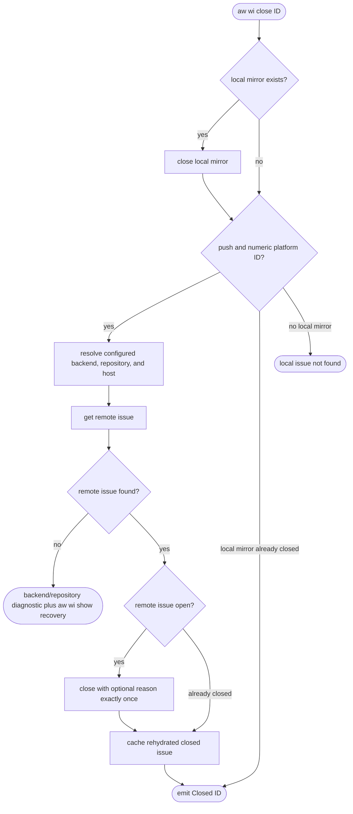

# WI close remote rehydration

## Logic
<!-- type: logic lang: mermaid -->



## Unit Test

```mermaid
---
id: wi-close-remote-rehydration-tests
requirements:
  configured_remote:
    id: R1
    text: "A numeric remote-only ID resolves through the configured backend and explicit --repo before local state is required."
    kind: functional
    risk: high
    verify: "cargo test -p agentic-workflow --test cli_tests wi_close_remote_ -- --nocapture"
  exactly_once:
    id: R2
    text: "An open remote receives one close and one optional reason; retrying an already closed remote does not repeat either mutation and refreshes the closed cache."
    kind: regression
    risk: high
    verify: "cargo test -p agentic-workflow --test cli_tests wi_close_remote_numeric_rehydrates_reason_and_closes_once -- --nocapture"
  actionable_missing:
    id: R3
    text: "A missing remote reports the backend, repository, and an executable aw wi show recovery command without mutation."
    kind: error
    risk: high
    verify: "cargo test -p agentic-workflow --test cli_tests wi_close_missing_remote_reports_backend_repo_and_recovery_command -- --nocapture"
  local_preserved:
    id: R4
    text: "Existing local-only close behavior remains successful."
    kind: regression
    risk: medium
    verify: "cargo test -p agentic-workflow --test cli_tests wi_close_local_issue_behavior_is_preserved -- --nocapture"
elements:
  wi_close_remote_numeric_rehydrates_reason_and_closes_once:
    kind: test
    type: "rs/#[tokio::test]"
  wi_close_missing_remote_reports_backend_repo_and_recovery_command:
    kind: test
    type: "rs/#[tokio::test]"
  wi_close_local_issue_behavior_is_preserved:
    kind: test
    type: "rs/#[test]"
relations:
  - { from: wi_close_remote_numeric_rehydrates_reason_and_closes_once, verifies: configured_remote }
  - { from: wi_close_remote_numeric_rehydrates_reason_and_closes_once, verifies: exactly_once }
  - { from: wi_close_missing_remote_reports_backend_repo_and_recovery_command, verifies: actionable_missing }
  - { from: wi_close_local_issue_behavior_is_preserved, verifies: local_preserved }
---
requirementDiagram
  requirement R1 {
    id: R1
    text: "configured remote numeric close"
    risk: high
    verifymethod: test
  }
  requirement R2 {
    id: R2
    text: "remote mutations exactly once"
    risk: high
    verifymethod: test
  }
  requirement R3 {
    id: R3
    text: "missing remote is actionable"
    risk: high
    verifymethod: test
  }
  requirement R4 {
    id: R4
    text: "local close is preserved"
    risk: medium
    verifymethod: test
  }
  element wi_close_remote_numeric_rehydrates_reason_and_closes_once {
    type: "rs/#[tokio::test]"
  }
  element wi_close_missing_remote_reports_backend_repo_and_recovery_command {
    type: "rs/#[tokio::test]"
  }
  element wi_close_local_issue_behavior_is_preserved {
    type: "rs/#[test]"
  }
```

<!-- type: unit-test lang: mermaid -->



## E2E Test
<!-- type: e2e-test lang: yaml -->

```yaml
e2e_tests:
  - id: wi-close-remote-real-cli
    capability_id: work-item-planning
    claim_id: wi-close-remote-rehydration
    command: cargo test -p agentic-workflow --test cli_tests wi_close_remote_ -- --nocapture
    assertions:
      - "the repo-built aw binary resolves a tracker-only numeric issue through the configured GitHub backend"
      - "--repo selects every remote read and mutation"
      - "the optional reason and close mutation each occur exactly once across a retry"
      - "a missing remote names its backend and repository and emits an executable recovery command"
      - "a local-only issue still moves from open to closed"
    isolation: "A temp-HOME gh adapter targets a loopback-only HTTP fixture; no live tracker issue is read or mutated."
    duplicate_evidence: "Issue #1583 reproduces the same defect and does not create a second implementation root."
```
