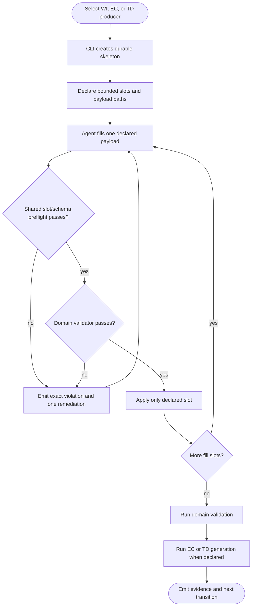

<!-- HANDWRITE-BEGIN gap="missing-generator:logic:aw-artifact-skeleton-fill-protocol" tracker="#1499" reason="Cross-domain artifact adapters and transition evidence require an explicit shared protocol design." -->

# Shared Artifact Skeleton-Fill Protocol

## E2E Test
<!-- type: e2e-test lang: yaml -->

```yaml
e2e_tests:
  - id: wi-artifact-producer-cli-fixture
    capability_id: aw-core-client-model-workitem-first-artifact-lifecycle
    claim_id: shared-artifact-producer-contract
    command: cargo test -p agentic-workflow --test artifact_producer_cli_test wi_create_emits_cli_owned_skeleton_and_bounded_markdown_slot -- --nocapture
    assertions:
      - "aw wi create creates the durable work-item and payload skeletons before dispatch"
      - "stdout carries aw.artifact-producer.v1 and a bounded markdown_fragment slot"
      - "the slot names its schema, payload path, apply command, validation, evidence, and next transition"
    isolation: "A unique temp workspace uses the fixture-only local issue backend; no tracker state is read or mutated."
  - id: ec-artifact-producer-cli-fixture
    capability_id: aw-core-client-model-workitem-first-artifact-lifecycle
    claim_id: shared-artifact-producer-contract
    command: cargo test -p agentic-workflow --test artifact_producer_cli_test ec_draft_emits_cli_owned_skeleton_and_structured_slots -- --nocapture
    assertions:
      - "aw ec draft creates the durable EC and JSON payload skeletons"
      - "every EC fill slot is json_schema and names its exact apply command"
      - "EC validation advances through independent semantic review before generation"
    isolation: "A unique temp project owns every generated EC and payload path."
  - id: td-artifact-producer-cli-fixture
    capability_id: aw-core-client-model-workitem-first-artifact-lifecycle
    claim_id: shared-artifact-producer-contract
    command: cargo test -p agentic-workflow --test artifact_producer_cli_test td_create_emits_cli_owned_skeleton_structured_slots_and_ownership -- --nocapture
    assertions:
      - "aw td create creates the durable TD skeleton and one JSON payload for the current queued section"
      - "the TD contract exposes validation, generation, evidence, and a runnable next transition"
      - "CODEGEN-BEGIN/END and HANDWRITE-BEGIN/END ownership outputs are explicit"
      - "HANDWRITE requires gap, tracker, and reason fields"
    isolation: "A unique temp git repository and temp local issue store contain every lifecycle mutation."
```

## Schema
<!-- type: schema lang: yaml -->

```yaml
$schema: "https://json-schema.org/draft/2020-12/schema"
$id: aw-artifact-producer-v1
type: object
additionalProperties: false
required: [schema_version, identity, skeleton, fill_slots, validation, generation, evidence, next, ownership_outputs]
properties:
  schema_version: { const: aw.artifact-producer.v1 }
  identity:
    type: object
    required: [producer, id, artifact_path]
    properties:
      producer: { enum: [work_item, external_contract, tech_design] }
      id: { type: string, minLength: 1 }
      artifact_path: { type: string, minLength: 1 }
  skeleton:
    type: object
    required: [path, initialized]
    properties:
      path: { type: string, minLength: 1 }
      initialized: { type: boolean }
  fill_slots:
    type: array
    items:
      type: object
      required: [id, format, schema, payload_path, apply]
      properties:
        id: { type: string, minLength: 1 }
        format: { enum: [markdown_fragment, json_schema] }
        schema: { type: string, minLength: 1 }
        payload_path: { type: string, minLength: 1 }
        apply: { $ref: '#/$defs/command' }
  validation: { $ref: '#/$defs/command' }
  generation:
    oneOf:
      - type: "null"
      - { $ref: '#/$defs/command' }
  evidence:
    type: array
    items: { type: string }
  next: { $ref: '#/$defs/command' }
  ownership_outputs:
    type: array
    items:
      type: object
      required: [marker, owner, required_fields]
      properties:
        marker: { type: string }
        owner: { const: tech_design }
        required_fields:
          type: array
          items: { type: string }
$defs:
  command:
    type: object
    required: [command]
    properties:
      command: { type: string, pattern: '^aw ' }
```

## Logic
<!-- type: logic lang: mermaid -->



## Unit Test

```mermaid
---
id: aw-artifact-producer-unit-test
coverage_kind: unit
evidence:
  command: "cargo test -p agentic-workflow --lib cli::artifact_producer::tests:: -- --nocapture"
---
requirementDiagram
  requirement common_shape {
    id: UT1
    text: "WI, EC, and TD serialize the same protocol fields"
    risk: high
    verifymethod: test
  }
  requirement deterministic_roundtrip {
    id: UT2
    text: "all producer contracts serialize and deserialize deterministically"
    risk: medium
    verifymethod: test
  }
  requirement bounded_errors {
    id: UT3
    text: "unknown slots and malformed schemas name exactly one remediation"
    risk: high
    verifymethod: test
  }
  requirement td_ownership {
    id: UT4
    text: "TD declares CODEGEN and HANDWRITE marker outputs"
    risk: high
    verifymethod: test
  }
  requirement command_roundtrip {
    id: UT5
    text: "all emitted WI, EC, and TD contract commands pass the live CLI parser"
    risk: high
    verifymethod: test
  }
  requirement applied_transition {
    id: UT6
    text: "after a fill is applied, next advances to domain validation"
    risk: high
    verifymethod: test
  }
```

<!-- type: unit-test lang: mermaid -->



## Changes
<!-- type: changes lang: yaml -->

```yaml
changes:
  - path: apps/agentic-workflow/src/cli/artifact_producer.rs
    action: create
    section: logic
    impl_mode: codegen
    description: Define the common producer contract, domain adapters, shared preflight, deterministic serialization, and ownership outputs.
  - path: apps/agentic-workflow/src/cli/issues.rs
    action: modify
    section: scenarios
    impl_mode: codegen
    description: Initialize the WI payload with the skeleton, emit the common contract, and reject headings outside declared slots before update.
  - path: apps/agentic-workflow/src/cli/ec.rs
    action: modify
    section: scenarios
    impl_mode: hand-written
    description: Project EC draft/fill through the common contract and wrap typed schema errors with one executable remediation.
  - path: apps/agentic-workflow/src/cli/td.rs
    action: modify
    section: scenarios
    impl_mode: codegen
    description: Project TD queues through the common contract, preflight every JSON payload, and declare CODEGEN/HANDWRITE outputs.
  - path: apps/agentic-workflow/src/cli/mod.rs
    action: modify
    section: source
    impl_mode: codegen
    description: Register the internal artifact producer module without adding a public CLI namespace.
  - path: apps/agentic-workflow/tests/artifact_producer_cli_test.rs
    action: create
    section: e2e-test
    impl_mode: hand-written
    description: Drive the compiled WI, EC, and TD CLI producers in isolated workspaces and assert their observable contract, skeletons, slots, transitions, and TD ownership outputs.
```

<!-- HANDWRITE-END -->
