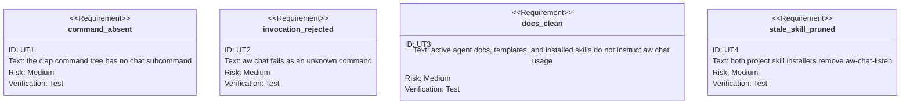

<!-- HANDWRITE-BEGIN gap="missing-generator:schema:aw-chat-removal" tracker="#1503" reason="Bounded deletion contract for a retired support transport." -->

# AW Chat Removal

## Scenarios
<!-- type: scenarios lang: yaml -->

```yaml
id: aw-chat-removal-scenarios
scenarios:
  - id: S1
    title: help omits the retired transport
    given:
      - "the current aw command tree"
    when:
      - "an agent renders aw --help"
    then:
      - "chat is not listed as a subcommand"
  - id: S2
    title: old invocations fail as unknown
    given:
      - "an old caller invokes aw chat"
    when:
      - "clap parses the command"
    then:
      - "the invocation fails as an unrecognized subcommand"
      - "no shared channel or compatibility alias is opened"
  - id: S3
    title: projected assets prune the listener skill
    given:
      - "a target project still contains aw-chat-listen in either supported skill tree"
    when:
      - "AW refreshes project assets"
    then:
      - "the retired skill is deleted"
      - "the current skill inventory does not reinstall it"
  - id: S4
    title: future subagents start from a clean contract
    given:
      - "subagent design remains deferred"
    then:
      - "AW exposes no temporary replacement transport"
      - "future subagent protocols owe no compatibility to aw chat storage or message formats"
```

## CLI
<!-- type: cli lang: yaml -->

```yaml
commands:
  - name: aw
    removed_subcommands:
      - name: chat
        removed_children: [post, list, read, members, listen]
        compatibility_alias: none
        replacement: none
    retained_agent_surface:
      - wi
      - capability
      - td
      - ec
      - health
      - conf
```

## Unit Test
<!-- type: unit-test lang: mermaid -->



## Changes
<!-- type: changes lang: yaml -->

```yaml
changes:
  - path: apps/agentic-workflow/src/cli/commands.rs
    action: modify
    section: cli
    impl_mode: codegen
    description: Remove Chat from top-level parsing and dispatch.
  - path: apps/agentic-workflow/src/cli/chat.rs
    action: delete
    section: cli
    impl_mode: codegen
    description: Delete the shared JSONL channel command and its post, list, read, members, and listen runtime.
  - path: apps/agentic-workflow/src/cli/chat_members.rs
    action: delete
    section: cli
    impl_mode: codegen
    description: Delete chat-only identity, member-discovery, message-schema, and storage helpers.
  - path: apps/agentic-workflow/templates/cli/mainthread/skills/aw-chat-listen
    action: delete
    section: cli
    impl_mode: hand-written
    description: Delete the retired listener skill producer.
  - path: apps/agentic-workflow/src/cli/init.rs
    action: modify
    section: unit-test
    impl_mode: codegen
    description: Stop projecting the listener and prune stale copies from both supported skill trees.
  - path: apps/agentic-workflow/src/cli/doc_mirror.rs
    action: modify
    section: cli
    impl_mode: codegen
    description: Remove chat from the support-command documentation producer.
  - path: apps/agentic-workflow/tests/cli/tests/legacy_cli_removal_test.rs
    action: modify
    section: unit-test
    impl_mode: codegen
    description: Add chat to the permanent deleted-command and active-doc contracts.
  - path: apps/agentic-workflow/tech-design/surface/specs/aw-chat-removal.md
    action: create
    section: scenarios
    impl_mode: hand-written
    description: Record removal and the explicit absence of future subagent compatibility obligations.
  - action: annotate
    section: unit-test
    impl_mode: hand-written
    description: "Traceability edge for command rejection and stale-skill pruning."
```
<!-- HANDWRITE-END -->
