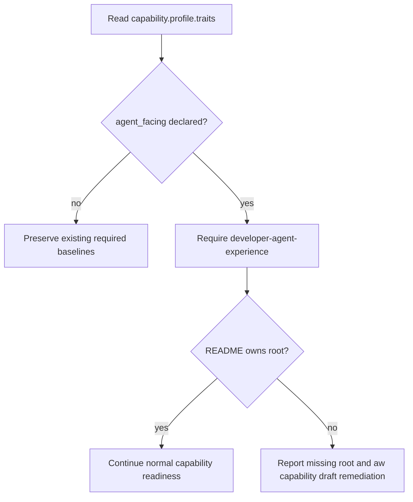
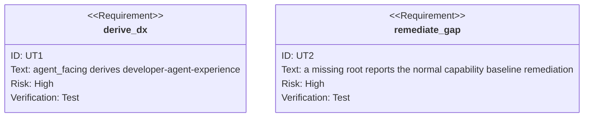

<!-- HANDWRITE-BEGIN gap="missing-generator:logic:dx-trait-derivation" tracker="#1481" reason="The trait choice preserves existing project scope while making future agent-facing adoption explicit and enforceable." -->

# Developer & Agent Experience Trait Derivation

## Schema
<!-- type: schema lang: yaml -->

```yaml
trait:
  id: agent_facing
  derives: [developer-agent-experience]
  enforces: "## DX convention: every service and CLI ships a Developer & Agent Experience capability"
selection:
  existing_agent_facing_projects: []
  rationale: "Promote the existing explicit trait; no current project profile is newly obligated, and service/CLI profile adoption remains project-scoped."
missing_baseline:
  report: "capability profile requires missing baseline capabilities: developer-agent-experience"
  remediation: "aw capability draft --project <project>"
```

## Logic
<!-- type: logic lang: mermaid -->



## Unit Test
<!-- type: unit-test lang: mermaid -->



## Changes
<!-- type: changes lang: yaml -->

```yaml
changes:
  - path: apps/agentic-workflow/src/cli/doc_mirror.rs
    action: modify
    section: schema
    impl_mode: hand-written
    description: Promote agent_facing, its baseline capability, and its DX convention anchor in the single trait registry.
  - path: apps/agentic-workflow/src/cli/capability.rs
    action: modify
    section: unit-test
    impl_mode: hand-written
    description: Prove the selected trait derives and reports the missing Developer & Agent Experience baseline.
  - path: CONTRIBUTING.md
    action: modify
    section: schema
    impl_mode: codegen
    description: Regenerate the trait table through aw meta sync; do not hand-edit its marker-owned rows.
```

<!-- HANDWRITE-END -->
