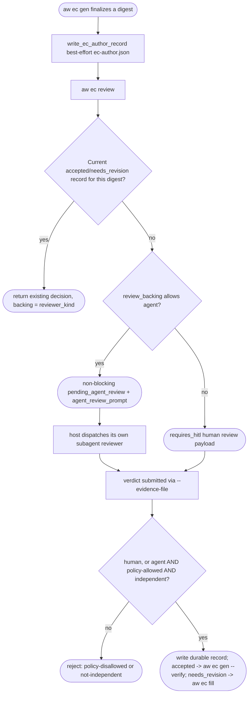

<!-- HANDWRITE-BEGIN gap="missing-generator:schema:aw-ec-agent-review-protocol" tracker="#1829" reason="Independent agent EC review composes host-dispatch, digest-bound author identity, and the existing human evidence schema; the protocol shape requires bounded hand-authoring." -->

# EC Independent Agent Review Protocol

## Scenarios
<!-- type: scenarios lang: yaml -->

```yaml
id: aw-ec-agent-review-protocol-scenarios
scenarios:
  - id: S1
    title: agent-accepted verdict satisfies the terminal gate with no human evidence
    given:
      - "the project's ec_review_backing policy is agent or either"
      - "an independent agent identity (not the recorded EC author) submits an accepted verdict via --evidence-file with reviewer_kind: agent"
    when:
      - "aw ec gen --verify or aw ec verify runs"
    then:
      - "the terminal EC gate is satisfied end-to-end with no human-backed evidence required"
  - id: S2
    title: independence is enforced by recorded author identity
    given:
      - "aw ec gen wrote a durable ec-author.json record binding the current EC source digest to an author identity"
      - "a reviewer submits reviewer_kind: agent with reviewed_by equal to that author identity"
    when:
      - "aw ec review validates the submitted evidence"
    then:
      - "validation is rejected with an explicit not-independent error"
      - "no durable review record is written"
  - id: S3
    title: policy default preserves pre-#1829 human-only behavior
    given:
      - "aw.toml has no ec_review_backing (or an unrecognized value)"
    when:
      - "reviewer_kind: agent evidence is submitted"
    then:
      - "the project's resolved review_backing normalizes to human"
      - "the agent evidence is rejected regardless of independence"
      - "reviewer_kind: human evidence is accepted exactly as before #1829"
  - id: S4
    title: aw ec review emits a structured agent envelope when policy allows it
    given:
      - "the project's ec_review_backing policy is agent or either"
      - "no current accepted or needs_revision review record exists for the current digest"
    when:
      - "aw ec review runs"
    then:
      - "the response is a non-blocking envelope (requires_hitl: false, status: pending_agent_review)"
      - "agent_review_prompt carries the six-dimension inspection checklist (capability_claim_coverage, required_dimensions, assertions_specific, oracle_independent, loopholes_checked, false_green_risk_checked) plus the independence requirement"
      - "next names the same aw ec review --project <p> --evidence-file <path> resume command used for human submission"
      - "the host is responsible for dispatching its own subagent reviewer against the prompt; aw does not choose or bundle a reviewer model"
  - id: S5
    title: agent needs_revision routes back to bounded fill
    given:
      - "an independent agent submits reviewer_kind: agent with decision: needs_revision, findings, and a target_path"
    when:
      - "aw ec review consumes the payload"
    then:
      - "the durable decision is needs_revision"
      - "next is aw ec fill for the target e2e-test section, identical to the human needs_revision path"
  - id: S6
    title: human audit can reopen an agent-accepted EC
    given:
      - "an independent agent's accepted verdict is the current durable review record"
      - "a human submits reviewer_kind: human with decision: needs_revision via --evidence-file as a post-completion audit"
    when:
      - "aw ec review consumes the human payload"
    then:
      - "the submission is accepted as valid evidence regardless of the prior agent-backed acceptance"
      - "the durable record becomes needs_revision, reopening the EC"
  - id: S7
    title: reporting distinguishes agent-backed from human-backed acceptance
    given:
      - "a project has a current accepted review record"
    when:
      - "aw health or EC reporting surfaces render the project's EC gate"
    then:
      - "the report includes the resolved review_backing policy and (once accepted) the accepted record's reviewer_kind, so agent-backed and human-backed acceptance are distinguishable"
```

## Schema
<!-- type: schema lang: yaml -->

```yaml
$schema: "https://json-schema.org/draft/2020-12/schema"
$id: aw-ec-author-record
type: object
additionalProperties: false
required:
  - version
  - project
  - source_digest
  - author
  - recorded_at
properties:
  version: { type: integer, const: 1 }
  project: { type: string, minLength: 1 }
  source_digest: { type: string, minLength: 1 }
  author: { type: string, minLength: 1 }
  recorded_at: { type: string }
```

Verdict submissions reuse the `aw-ec-semantic-review-record` schema defined
in `aw-ec-only-semantic-approval.md#schema` (`reviewer_kind: { enum: [human,
agent] }`); this protocol adds no new submission schema, only the durable
author-identity record above and the non-blocking dispatch envelope below.

```yaml
$schema: "https://json-schema.org/draft/2020-12/schema"
$id: aw-ec-agent-review-envelope
type: object
description: >
  The non-blocking `aw ec review` response shape when review_backing allows
  agent evidence and no current accepted/needs_revision record exists.
  Fields shown are the subset this protocol adds to the existing
  EcReviewSummary/envelope; unrelated existing fields are unchanged.
properties:
  requires_hitl: { type: boolean, const: false }
  status: { type: string, const: pending_agent_review }
  backing: { type: "null" }
  agent_review_prompt:
    type: string
    description: >
      The structured inspection-checklist prompt for a host-dispatched
      subagent reviewer, covering the six #1504 dimensions plus the
      independence requirement, and naming the --evidence-file resume
      command.
  next:
    type: object
    properties:
      command: { type: string }
```

## Logic
<!-- type: logic lang: mermaid -->



Composition notes:

- **#1828 deferred mode**: this protocol's agent path is inline and
  non-blocking at the point `aw ec review` is invoked — it never sets
  `requires_hitl: true` for the agent branch. Deferred/batched timing (when
  a project chooses to run its review loop) is entirely #1828's concern;
  this protocol only defines what happens once `aw ec review` actually
  runs, independent of when that is. See `aw-ec-deferred-review-queue.md`
  for the pending-review queue surface, `aw health` advisory-vs-blocker
  classification, and post-hoc finalize/reopen semantics for a project that
  additionally opts into `ec_review_mode: deferred`; the two policies
  (`ec_review_backing` and `ec_review_mode`) are orthogonal and a deferred,
  agent-eligible project still prefers this protocol's `pending_agent_review`
  envelope over the deferred queue whenever a reviewer can run immediately.
- **Human audit reopen (S6)**: no new reopening mechanism exists. A human
  `--evidence-file` submission (`reviewer_kind: human`) is always valid
  input to the same `submit` -> `policycheck` -> `record` path regardless of
  whether the current record is agent- or human-backed, because the
  `human` branch of `policycheck` never consults independence or policy.

## Unit Test

```mermaid
---
id: aw-ec-agent-review-protocol-unit-test
coverage_kind: unit
evidence:
  command: "cargo test -p agentic-workflow --lib ec_review_ -- --nocapture"
---
requirementDiagram
  requirement agent_accepted_satisfies_gate {
    id: UT1
    text: "an independent agent-accepted verdict clears the terminal EC gate with no human evidence"
    risk: high
    verifymethod: test
  }
  requirement same_author_rejected {
    id: UT2
    text: "an agent review whose reviewed_by matches the recorded ec-author.json author is rejected as not independent"
    risk: high
    verifymethod: test
  }
  requirement default_policy_human_only {
    id: UT3
    text: "absent ec_review_backing, agent evidence is rejected and human evidence behaves exactly as before #1829"
    risk: high
    verifymethod: test
  }
  requirement agent_needs_revision_bounded {
    id: UT4
    text: "an agent needs_revision verdict routes to the same bounded aw ec fill target as the human path"
    risk: medium
    verifymethod: test
  }
  requirement human_audit_reopens_agent_accepted {
    id: UT5
    text: "a human --evidence-file submission remains valid evidence even when the current accepted record is agent-backed, reopening the EC"
    risk: medium
    verifymethod: test
  }
```

<!-- type: unit-test lang: mermaid -->



## Changes
<!-- type: changes lang: yaml -->

```yaml
changes:
  - path: apps/agentic-workflow/src/cli/ec.rs
    action: modify
    section: logic
    impl_mode: hand-written
    description: |
      Add EcAuthorRecord (ec-author.json) written at aw ec gen time,
      EcProjectContext.review_backing resolved from Project.ec_review_backing,
      ec_review_backing_allows/ec_reviewer_is_independent gate checks in
      validate_ec_review_payload and ec_review_record_findings, the
      non-blocking pending_agent_review envelope and agent_ec_review_prompt
      in run_review, EcReviewSummary.backing/agent_review_prompt fields, and
      the project_ec_review_backing reporting helper.
  - path: apps/agentic-workflow/src/models/project.rs
    action: modify
    section: schema
    impl_mode: codegen
    description: Add Project.ec_review_backing (Option<String>) so aw.toml can opt a project into agent or either review-backing policy.
  - path: apps/agentic-workflow/src/services/project_registry.rs
    action: modify
    section: logic
    impl_mode: codegen
    description: Parse and merge ec_review_backing from project-local aw.toml into the resolved Project model.
  - path: apps/agentic-workflow/src/cli/project.rs
    action: modify
    section: logic
    impl_mode: codegen
    description: Surface each project's resolved review_backing policy and (once accepted) the accepted record's backing kind on the EC health axis and gate report, so agent-backed and human-backed acceptance are distinguishable in aw health.
  - path: apps/agentic-workflow/src/cli/cb.rs
    action: modify
    section: logic
    impl_mode: codegen
    description: Generalize the terminal EC gate's semantic-review-required remediation text to name human- or agent-backed evidence per the project's review_backing policy.
  - path: apps/agentic-workflow/tech-design/surface/specs/aw-ec-agent-review-protocol.md
    action: create
    section: scenarios
    impl_mode: hand-written
    description: Define this protocol.
  - action: annotate
    section: unit-test
    impl_mode: hand-written
    description: Traceability edge for agent-acceptance, independence-rejection, default-policy, bounded-revision, and human-audit-reopen tests.
```
<!-- HANDWRITE-END -->
