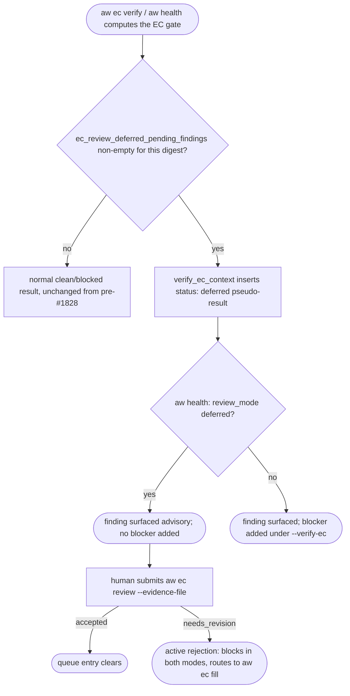

<!-- HANDWRITE-BEGIN gap="missing-generator:schema:aw-ec-deferred-review-queue" tracker="#1828" reason="Deferred-review queue visibility composes host-agnostic report/health surfacing with the existing human evidence schema; the queue shape requires bounded hand-authoring." -->

# EC Deferred Review Queue

## Scenarios
<!-- type: scenarios lang: yaml -->

```yaml
id: aw-ec-deferred-review-queue-scenarios
scenarios:
  - id: S1
    title: a deferred pending review is queryable in aw ec reporting
    given:
      - "the project's ec_review_mode policy is deferred"
      - "no accepted, needs_revision, or other explicit review decision exists for the current EC source digest"
    when:
      - "aw ec verify (or aw ec gen --verify) runs"
    then:
      - "the command succeeds (clean: true) with no HITL question"
      - "the results list carries a non-counted status: deferred entry for the review case, with a stderr_tail explaining the pending review and its digest"
  - id: S2
    title: aw health surfaces the same pending review as advisory, not a blocker
    given:
      - "a project has a deferred, still-unreviewed EC"
    when:
      - "aw health --project <project> (with or without --verify-ec) runs"
    then:
      - "the EC gate axis reports review_mode: deferred and pending_review: <finding text>"
      - "the finding is present in ec.findings"
      - "no production blocker is added for this finding, even under --verify-ec"
  - id: S3
    title: blocking mode (default) keeps the pending review a hard --verify-ec blocker
    given:
      - "a project has no ec_review_mode configured (or explicitly blocking)"
      - "the same missing-review condition as S1/S2"
    when:
      - "aw health --project <project> --verify-ec runs"
    then:
      - "the EC gate axis reports review_mode: blocking and the same pending_review finding"
      - "a production blocker is added naming the pending review"
      - "aw health --project <project> without --verify-ec still surfaces the finding but does not itself add a blocker (unrelated to #1828: EC hard-blocking has always been --verify-ec opt-in)"
  - id: S4
    title: post-hoc human review finalizes identically to blocking mode
    given:
      - "a deferred pending review is queued (S1)"
      - "a human submits an accepted verdict via aw ec review --project <p> --evidence-file <path>, digest-bound to the current EC source"
    when:
      - "the submission is validated"
    then:
      - "acceptance uses the same aw-ec-semantic-review-record schema and validation path as blocking mode (no separate deferred acceptance shape)"
      - "the queue entry clears: a subsequent aw ec verify / aw health no longer reports a pending_review finding or a deferred status entry for this digest"
  - id: S5
    title: post-hoc needs_revision reopens through the normal bounded fill path
    given:
      - "a deferred pending review is queued (S1)"
      - "a human submits reviewer_kind: human, decision: needs_revision, findings, and a target_path via --evidence-file"
    when:
      - "the submission is validated"
    then:
      - "the durable decision becomes needs_revision"
      - "next names an executable aw ec fill command for the target e2e-test section, identical in form to the blocking-mode needs_revision path"
      - "the EC no longer counts as merely deferred-pending: it is now an active rejection, and ec_review_gate_findings blocks in both deferred and blocking mode until the fill is re-reviewed (R6)"
  - id: S6
    title: an active rejection or structural content finding is never demoted to the deferred queue
    given:
      - "the project's ec_review_mode policy is deferred"
      - "either an explicit needs_revision decision already exists for the current digest, or the EC has a structural content finding (missing typed dimension, unmapped capability claim, or false-green-risk command)"
    when:
      - "aw ec verify or a terminal gate check runs"
    then:
      - "the gate blocks exactly as in blocking mode"
      - "no deferred_pending_human queue entry is recorded for this finding — only the not-yet-reviewed case is deferrable"
```

## Schema
<!-- type: schema lang: yaml -->

```yaml
$schema: "https://json-schema.org/draft/2020-12/schema"
$id: aw-ec-deferred-verify-result
type: object
description: >
  The non-counted pseudo-result verify_ec_context inserts for a deferred,
  still-unreviewed EC. Never contributes to executed_count/passed_count/
  failed_count, so it can never flip a verify summary's `clean` to false.
properties:
  case_id: { type: string, const: ec-semantic-review }
  status: { type: string, const: deferred }
  failure_kind: { type: "null" }
  stderr_tail:
    type: string
    description: Names the pending review and that it is queued for post-completion batch review.
```

Deferred-mode acceptance and needs_revision submissions reuse the
`aw-ec-semantic-review-record` schema defined in
`aw-ec-only-semantic-approval.md#schema` unchanged (S4/S5): this spec adds no
new submission schema, only the two reporting/health projection shapes above
and below.

```yaml
$schema: "https://json-schema.org/draft/2020-12/schema"
$id: aw-ec-health-gate-report-deferred-fields
type: object
description: >
  The two fields this spec adds to the existing ProjectEcGateReport JSON
  shape rendered by project_ec_gate_summary / the aw health EC axis.
  Unrelated existing fields are unchanged.
properties:
  review_mode:
    type: ["string", "null"]
    enum: [blocking, deferred, null]
    description: The project's resolved ec_review_mode policy.
  pending_review:
    type: ["string", "null"]
    description: >
      The current deferred-pending finding text when one exists (regardless
      of review_mode); null once no deferrable outstanding review remains.
```

## Logic
<!-- type: logic lang: mermaid -->



Composition notes:

- **Composes with `aw-ec-only-semantic-approval.md`**: this spec only defines
  what happens to the not-yet-reviewed case once a project opts into
  `ec_review_mode: deferred` (S6/S7 there). The evidence schema, false-green
  detection, and acceptance/`needs_revision` validation are entirely that
  spec's concern and are reused unchanged.
- **Composes with `aw-ec-agent-review-protocol.md`**: deferred timing and
  agent-backed evidence are orthogonal policies (`ec_review_mode` vs
  `ec_review_backing`). A deferred, agent-eligible project's `aw ec review`
  still prefers the `pending_agent_review` envelope over
  `deferred_pending_human` when both apply, because a dispatchable agent
  reviewer can resolve the review immediately rather than deferring it; the
  deferred queue exists for the case where no reviewer (human or agent) has
  run yet.
- **R6 (never demoted)**: `ec_review_outstanding_is_deferrable` is the sole
  gate — it is `false` whenever the outstanding set includes an explicit
  `needs_revision` decision or any `ec_semantic_review_findings` structural
  content finding, so those always block in every mode.

## Unit Test

```mermaid
---
id: aw-ec-deferred-review-queue-unit-test
coverage_kind: unit
evidence:
  command: "cargo test -p agentic-workflow --lib ec_review_ pending_ec_review -- --nocapture"
---
requirementDiagram
  requirement deferred_mode_bypasses_gate {
    id: UT1
    text: "deferred mode with a not-yet-reviewed EC returns empty gate findings and a deferred-pending queue entry; blocking mode (default) is unchanged"
    risk: high
    verifymethod: test
  }
  requirement active_rejection_never_deferred {
    id: UT2
    text: "an explicit needs_revision decision is never demoted to the deferred queue; it blocks in both modes"
    risk: high
    verifymethod: test
  }
  requirement verify_context_deferred_status_entry {
    id: UT3
    text: "verify_ec_context inserts a non-counted status: deferred pseudo-result for a deferred-pending review, keeping clean: true"
    risk: high
    verifymethod: test
  }
  requirement health_advisory_vs_blocker {
    id: UT4
    text: "aw health classifies a pending review as advisory in deferred mode and a hard --verify-ec blocker in blocking mode"
    risk: high
    verifymethod: test
  }
  requirement post_hoc_finalize_clears_queue {
    id: UT5
    text: "a post-hoc accepted aw ec review submission clears both the gate findings and the deferred-pending queue entry"
    risk: medium
    verifymethod: test
  }
```

<!-- type: unit-test lang: mermaid -->



## Changes
<!-- type: changes lang: yaml -->

```yaml
changes:
  - path: apps/agentic-workflow/src/cli/ec.rs
    action: modify
    section: logic
    impl_mode: hand-written
    description: |
      Add EcProjectContext.review_mode (resolved from Project.ec_review_mode
      via resolve_ec_project_context, normalized by normalize_review_mode),
      ec_review_outstanding_findings / ec_review_outstanding_is_deferrable /
      ec_review_deferred_pending_findings (the deferred-queue split of the
      original ec_review_gate_findings), the deferred pseudo-result in
      verify_ec_context, run_review's deferred_pending_human envelope, and
      the project_ec_review_mode / project_pending_ec_review reporting
      helpers.
  - path: apps/agentic-workflow/src/cli/project.rs
    action: modify
    section: logic
    impl_mode: codegen
    description: |
      Add ProjectEcGateReport.review_mode / pending_review fields and the
      apply_pending_ec_review_classification helper (advisory in deferred
      mode, hard --verify-ec blocker in blocking mode) so aw health
      surfaces the queue without hard-gating it by default.
  - path: apps/agentic-workflow/src/cli/cb.rs
    action: modify
    section: logic
    impl_mode: codegen
    description: "Label a status: deferred terminal-gate result as \"(deferred (pending human review))\" in the ec_gate.cases success-envelope rendering."
  - path: apps/agentic-workflow/src/models/project.rs
    action: modify
    section: schema
    impl_mode: codegen
    description: Add Project.ec_review_mode (Option<String>) so aw.toml can opt a project into deferred (non-blocking) review timing.
  - path: apps/agentic-workflow/src/services/project_registry.rs
    action: modify
    section: logic
    impl_mode: hand-written
    description: Describe ec_review_mode parsing and merge behavior without claiming whole-file ownership; the project-registry source snapshot is the sole CODEGEN owner.
  - path: apps/agentic-workflow/src/services/project_discovery.rs
    action: modify
    section: logic
    impl_mode: codegen
    description: Initialize the new Project.ec_review_mode field to None for discovered projects.
  - path: apps/agentic-workflow/tech-design/surface/specs/aw-ec-deferred-review-queue.md
    action: create
    section: scenarios
    impl_mode: hand-written
    description: Define this queue surface.
  - action: annotate
    section: unit-test
    impl_mode: hand-written
    description: Traceability edge for deferred-bypass, active-rejection, verify-status-entry, health-classification, and post-hoc finalize tests.
```
<!-- HANDWRITE-END -->
