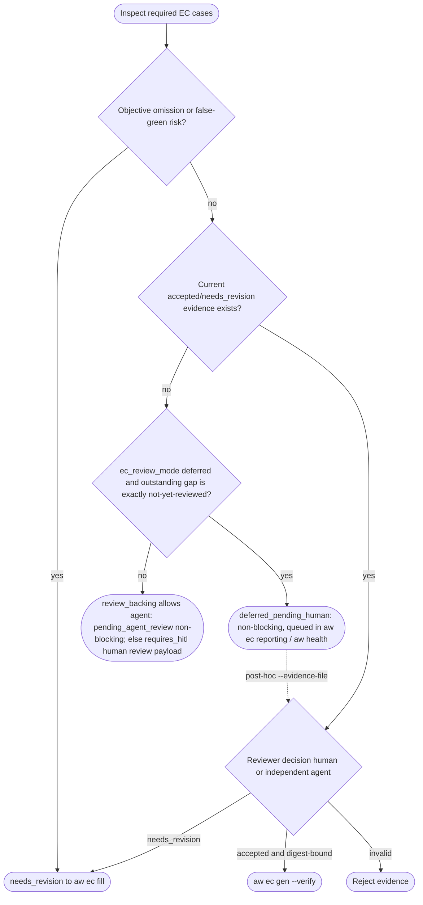

<!-- HANDWRITE-BEGIN gap="missing-generator:schema:aw-ec-only-semantic-approval" tracker="#1504" reason="Human semantic evidence and false-green inspection require an explicit external-contract schema." -->

# EC-Only Semantic Approval

## Scenarios
<!-- type: scenarios lang: yaml -->

```yaml
id: aw-ec-only-semantic-approval-scenarios
scenarios:
  - id: S1
    title: missing review evidence blocks production EC
    given:
      - "the current EC inventory has a required_for_production case"
      - "no accepted review exists for its source digest"
    when:
      - "aw ec gen --verify or aw ec verify runs"
    then:
      - "the gate fails with semantic_review_required"
      - "next points to aw ec review"
      - "the workflow requires HITL"
  - id: S2
    title: objective omissions cannot be human-approved
    given:
      - "a required EC omits a typed dimension or capability claim"
      - "or its command is empty, unconditional, or uses aw ec itself as the oracle"
    when:
      - "aw ec review runs"
    then:
      - "deterministic findings return needs_revision"
      - "next points to the bounded EC fill target when available"
  - id: S3
    title: human needs_revision returns to fill
    given:
      - "a human review payload contains findings and a project EC markdown target"
    when:
      - "aw ec review consumes the payload"
    then:
      - "the durable decision is needs_revision"
      - "next is aw ec fill for the target e2e-test section"
  - id: S4
    title: accepted evidence unlocks only the reviewed digest
    given:
      - "reviewer_kind is human"
      - "reviewed_by and summary are non-empty"
      - "every semantic checklist item is true"
      - "findings are empty"
    when:
      - "aw ec review accepts the payload"
    then:
      - "the durable record is bound to the exact EC source digest"
      - "next is aw ec gen --verify"
      - "any later digest change makes the evidence stale"
  - id: S5
    title: non-independent or policy-disallowed agent evidence is rejected
    given:
      - "reviewer_kind is agent"
      - "either the project's ec_review_backing policy does not allow agent evidence (default: human-only), or reviewed_by matches the identity recorded as this EC digest's author (ec-author.json, written at aw ec gen time)"
    then:
      - "production acceptance fails with an explicit independence or policy error"
      - "a human reviewer_kind is always accepted regardless of policy, so a human audit can still reopen (needs_revision) an EC whose current accepted record is agent-backed"
      - "see aw-ec-agent-review-protocol.md for the independent agent reviewer envelope, dispatch contract, and verdict schema"
  - id: S6
    title: deferred review mode advances the loop without blocking on missing human review
    given:
      - "the project's ec_review_mode policy is deferred"
      - "no accepted, needs_revision, or other explicit review decision exists for the current source digest (the outstanding evidence gap is exactly \"review hasn't happened yet\", not an active rejection or a structural EC content finding)"
    when:
      - "aw ec gen --verify, aw ec verify, aw wi run, or aw capability run reaches this EC's terminal gate"
    then:
      - "the gate does not block: the workflow can reach completion.workflow_complete=true with no HITL question"
      - "the outstanding review is recorded as an explicit deferred_pending_human queue entry (not silently dropped), visible in aw ec reporting and aw health"
      - "aw ec review still returns a non-blocking deferred_pending_human envelope naming the same aw ec review --evidence-file resume command a post-completion human reviewer uses to finalize"
      - "see aw-ec-deferred-review-queue.md for the pending-review queue surface, advisory-vs-blocker health classification, and post-hoc finalize/reopen semantics"
  - id: S7
    title: an explicit needs_revision decision or structural content finding always blocks, even in deferred mode
    given:
      - "the project's ec_review_mode policy is deferred"
      - "either a human/agent reviewer has already recorded an explicit needs_revision decision for the current digest, or the EC has a structural content finding (missing typed dimension, unmapped capability claim, or false-green-risk command)"
    when:
      - "aw ec gen --verify, aw ec verify, or a terminal gate check runs"
    then:
      - "the gate blocks exactly as in blocking mode: deferred mode changes only when review must happen for a not-yet-reviewed EC, never what content is acceptable or who may review it"
```

## Schema
<!-- type: schema lang: yaml -->

```yaml
$schema: "https://json-schema.org/draft/2020-12/schema"
$id: aw-ec-semantic-review-record
type: object
additionalProperties: false
required:
  - version
  - project
  - source_digest
  - decision
  - reviewer_kind
  - reviewed_by
  - summary
  - checklist
  - findings
properties:
  version: { type: integer, const: 1 }
  project: { type: string, minLength: 1 }
  source_digest: { type: string, minLength: 1 }
  decision: { type: string, enum: [pending, accepted, needs_revision] }
  reviewer_kind: { type: string, enum: [human, agent] }
  reviewed_by: { type: string }
  reviewed_at: { type: string }
  summary: { type: string }
  checklist:
    type: object
    additionalProperties: false
    required:
      - capability_claim_coverage
      - required_dimensions
      - assertions_specific
      - oracle_independent
      - loopholes_checked
      - false_green_risk_checked
    properties:
      capability_claim_coverage: { type: boolean }
      required_dimensions: { type: boolean }
      assertions_specific: { type: boolean }
      oracle_independent: { type: boolean }
      loopholes_checked: { type: boolean }
      false_green_risk_checked: { type: boolean }
  findings:
    type: array
    items: { type: string, minLength: 1 }
  target_path: { type: string }
```

## Logic
<!-- type: logic lang: mermaid -->



## Unit Test

```mermaid
---
id: aw-ec-only-semantic-approval-unit-test
coverage_kind: unit
evidence:
  command: "cargo test -p agentic-workflow --lib ec_review_ -- --nocapture"
---
requirementDiagram
  requirement omission_detected {
    id: UT1
    text: "dimension and claim omissions are rejected before human acceptance"
    risk: high
    verifymethod: test
  }
  requirement false_green_detected {
    id: UT2
    text: "unconditional and self-oracle commands produce needs_revision"
    risk: high
    verifymethod: test
  }
  requirement evidence_independent {
    id: UT3
    text: "same-agent (author-matching), policy-disallowed agent, stale, or incomplete review evidence is rejected; independent agent-backed evidence is accepted when review_backing allows it, and a human audit can still reopen an agent-accepted EC"
    risk: high
    verifymethod: test
  }
  requirement missing_routes_hitl {
    id: UT4
    text: "missing accepted evidence blocks verify and routes to aw ec review"
    risk: high
    verifymethod: test
  }
  requirement revision_bounded {
    id: UT5
    text: "needs_revision routes to one project-local EC fill target"
    risk: medium
    verifymethod: test
  }
  requirement deferred_mode_non_blocking {
    id: UT6
    text: "ec_review_mode deferred bypasses a not-yet-reviewed gate (clean/no HITL) while recording a deferred_pending_human queue entry; blocking mode (default, absent config) is unchanged; an explicit needs_revision decision or structural content finding still blocks in deferred mode; post-hoc aw ec review acceptance finalizes and clears the queue entry identically to blocking mode"
    risk: high
    verifymethod: test
  }
```

<!-- type: unit-test lang: mermaid -->



## Changes
<!-- type: changes lang: yaml -->

```yaml
changes:
  - path: apps/agentic-workflow/src/cli/ec.rs
    action: modify
    section: logic
    impl_mode: codegen
    description: |
      Implement deterministic semantic findings, human evidence validation,
      digest binding, and gen/verify gates. #1829: generalize evidence
      validation to admit independent agent-backed evidence per project
      `ec_review_backing` policy, enforced via a digest-bound
      `ec-author.json` identity record; see
      aw-ec-agent-review-protocol.md for the agent envelope/dispatch
      contract. #1828: split the gate-findings computation into
      `ec_review_outstanding_findings` (full missing/stale/rejected set,
      unchanged), `ec_review_outstanding_is_deferrable` (true only for the
      not-yet-reviewed case, never an explicit `needs_revision` or a
      structural content finding), and
      `ec_review_deferred_pending_findings` (the deferrable subset,
      surfaced as a queue entry). `ec_review_gate_findings` composes these
      per the project's `ec_review_mode` (`Project::ec_review_mode` via
      `resolve_ec_project_context`/`EcProjectContext.review_mode`,
      normalized by `normalize_review_mode`); in `deferred` mode a
      deferrable outstanding review returns empty gate findings.
      `verify_ec_context` inserts a non-counted `status: "deferred"`
      pseudo-result for a deferred-pending review so it stays visible
      without flipping `clean`. `run_review` gains a matching
      `deferred_pending_human` envelope (`requires_hitl: false`, `next`
      naming the same `--evidence-file` resume command as blocking mode)
      so post-hoc finalize/reopen (S6/S7) reuses the existing
      acceptance/`needs_revision` paths unchanged (R4/R6). New pub helpers
      `project_ec_review_mode`/`project_pending_ec_review` resolve a
      project's policy and current queue entry for reporting; see
      aw-ec-deferred-review-queue.md for the queue surface.
  - path: apps/agentic-workflow/tech-design/surface/specs/aw-ec-agent-review-protocol.md
    action: create
    section: scenarios
    impl_mode: hand-written
    description: Define the independent agent EC review envelope, verdict schema, host dispatch contract, and its composition with deferred review and human audit reopen.
  - path: apps/agentic-workflow/tech-design/surface/specs/aw-ec-deferred-review-queue.md
    action: create
    section: scenarios
    impl_mode: hand-written
    description: Define the deferred review-mode pending-review queue surface, aw health advisory-vs-blocker classification, and post-hoc finalize/reopen semantics.
  - path: apps/agentic-workflow/src/cli/project.rs
    action: modify
    section: logic
    impl_mode: codegen
    description: |
      #1828: `ProjectEcGateReport` gains `review_mode`/`pending_review`
      fields (from `ec.rs`'s new reporting helpers); a new
      `apply_pending_ec_review_classification` helper classifies an
      outstanding pending review as advisory (deferred mode) vs a hard
      `--verify-ec` blocker (blocking mode, default), so `aw health`
      surfaces the deferred queue without hard-gating it.
  - path: apps/agentic-workflow/src/cli/cb.rs
    action: modify
    section: logic
    impl_mode: codegen
    description: |
      Convert terminal missing-review failures into an explicit HITL action
      and aw ec review next command. #1828: the terminal EC-gate success
      envelope's `ec_gate.cases` rendering labels a `status: "deferred"`
      result as `"<case_id> (deferred (pending human review))"`, so the
      terminal gate commits/closes without blocking while the pending
      review stays visible in the same envelope.
  - path: apps/agentic-workflow/src/cli/chain.rs
    action: modify
    section: logic
    impl_mode: codegen
    description: Mark ec review as the only mutating semantic approval lifecycle entry.
  - path: apps/agentic-workflow/src/cli/llm.rs
    action: modify
    section: scenarios
    impl_mode: codegen
    description: Teach agents the EC-only semantic approval loop and linear WI/TD paths.
  - path: apps/agentic-workflow/src/models/project.rs
    action: modify
    section: schema
    impl_mode: codegen
    description: "#1828: add Project.ec_review_mode (Option<String>) so aw.toml can opt a project into deferred (non-blocking) review timing; default absent = blocking."
  - path: apps/agentic-workflow/src/services/project_registry.rs
    action: modify
    section: logic
    impl_mode: codegen
    description: "#1828: parse and merge ec_review_mode from project-local aw.toml into the resolved Project model."
  - path: apps/agentic-workflow/src/services/project_discovery.rs
    action: modify
    section: logic
    impl_mode: codegen
    description: "#1828: initialize the new Project.ec_review_mode field to None for discovered projects (discovery never invents review-timing policy)."
  - path: apps/agentic-workflow/tech-design/surface/specs/aw-ec-only-semantic-approval.md
    action: modify
    section: scenarios
    impl_mode: hand-written
    description: Define the sole semantic approval lifecycle and its evidence contract. #1828 adds the deferred-mode non-blocking scenarios (S6/S7) and Logic branching.
  - action: annotate
    section: unit-test
    impl_mode: hand-written
    description: Traceability edge for omission, false-green, independence, HITL, bounded-revision, and #1828 deferred-mode non-blocking tests.
```
<!-- HANDWRITE-END -->
