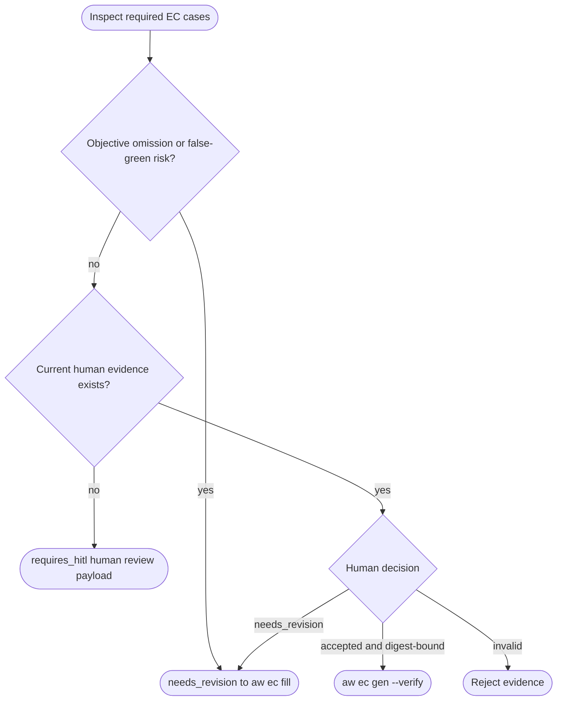

<!-- HANDWRITE-BEGIN gap="missing-generator:schema:aw-ec-only-semantic-approval" tracker="#1504" reason="Human semantic evidence and false-green inspection require an explicit external-contract schema." -->

# EC-Only Semantic Approval

## Scenarios
<!-- type: scenarios lang: yaml -->

```yaml
id: aw-ec-only-semantic-approval-scenarios
scenarios:
  - id: S1
    title: missing review evidence blocks production EC
    given:
      - "the current EC inventory has a required_for_production case"
      - "no accepted review exists for its source digest"
    when:
      - "aw ec gen --verify or aw ec verify runs"
    then:
      - "the gate fails with semantic_review_required"
      - "next points to aw ec review"
      - "the workflow requires HITL"
  - id: S2
    title: objective omissions cannot be human-approved
    given:
      - "a required EC omits a typed dimension or capability claim"
      - "or its command is empty, unconditional, or uses aw ec itself as the oracle"
    when:
      - "aw ec review runs"
    then:
      - "deterministic findings return needs_revision"
      - "next points to the bounded EC fill target when available"
  - id: S3
    title: human needs_revision returns to fill
    given:
      - "a human review payload contains findings and a project EC markdown target"
    when:
      - "aw ec review consumes the payload"
    then:
      - "the durable decision is needs_revision"
      - "next is aw ec fill for the target e2e-test section"
  - id: S4
    title: accepted evidence unlocks only the reviewed digest
    given:
      - "reviewer_kind is human"
      - "reviewed_by and summary are non-empty"
      - "every semantic checklist item is true"
      - "findings are empty"
    when:
      - "aw ec review accepts the payload"
    then:
      - "the durable record is bound to the exact EC source digest"
      - "next is aw ec gen --verify"
      - "any later digest change makes the evidence stale"
  - id: S5
    title: same-agent evidence is rejected
    given:
      - "reviewer_kind is not human"
    then:
      - "production acceptance fails"
      - "the review remains a human-backed HITL boundary until subagents are designed"
```

## Schema
<!-- type: schema lang: yaml -->

```yaml
$schema: "https://json-schema.org/draft/2020-12/schema"
$id: aw-ec-semantic-review-record
type: object
additionalProperties: false
required:
  - version
  - project
  - source_digest
  - decision
  - reviewer_kind
  - reviewed_by
  - summary
  - checklist
  - findings
properties:
  version: { type: integer, const: 1 }
  project: { type: string, minLength: 1 }
  source_digest: { type: string, minLength: 1 }
  decision: { type: string, enum: [pending, accepted, needs_revision] }
  reviewer_kind: { type: string, const: human }
  reviewed_by: { type: string }
  reviewed_at: { type: string }
  summary: { type: string }
  checklist:
    type: object
    additionalProperties: false
    required:
      - capability_claim_coverage
      - required_dimensions
      - assertions_specific
      - oracle_independent
      - loopholes_checked
      - false_green_risk_checked
    properties:
      capability_claim_coverage: { type: boolean }
      required_dimensions: { type: boolean }
      assertions_specific: { type: boolean }
      oracle_independent: { type: boolean }
      loopholes_checked: { type: boolean }
      false_green_risk_checked: { type: boolean }
  findings:
    type: array
    items: { type: string, minLength: 1 }
  target_path: { type: string }
```

## Logic
<!-- type: logic lang: mermaid -->



## Unit Test

```mermaid
---
id: aw-ec-only-semantic-approval-unit-test
coverage_kind: unit
evidence:
  command: "cargo test -p agentic-workflow --lib ec_review_ -- --nocapture"
---
requirementDiagram
  requirement omission_detected {
    id: UT1
    text: "dimension and claim omissions are rejected before human acceptance"
    risk: high
    verifymethod: test
  }
  requirement false_green_detected {
    id: UT2
    text: "unconditional and self-oracle commands produce needs_revision"
    risk: high
    verifymethod: test
  }
  requirement evidence_independent {
    id: UT3
    text: "same-agent, stale, or incomplete review evidence is rejected"
    risk: high
    verifymethod: test
  }
  requirement missing_routes_hitl {
    id: UT4
    text: "missing accepted evidence blocks verify and routes to aw ec review"
    risk: high
    verifymethod: test
  }
  requirement revision_bounded {
    id: UT5
    text: "needs_revision routes to one project-local EC fill target"
    risk: medium
    verifymethod: test
  }
```

<!-- type: unit-test lang: mermaid -->



## Changes
<!-- type: changes lang: yaml -->

```yaml
changes:
  - path: apps/agentic-workflow/src/cli/ec.rs
    action: modify
    section: logic
    impl_mode: codegen
    description: Implement deterministic semantic findings, human evidence validation, digest binding, and gen/verify gates.
  - path: apps/agentic-workflow/src/cli/cb.rs
    action: modify
    section: logic
    impl_mode: codegen
    description: Convert terminal missing-review failures into an explicit HITL action and aw ec review next command.
  - path: apps/agentic-workflow/src/cli/chain.rs
    action: modify
    section: logic
    impl_mode: codegen
    description: Mark ec review as the only mutating semantic approval lifecycle entry.
  - path: apps/agentic-workflow/src/cli/llm.rs
    action: modify
    section: scenarios
    impl_mode: codegen
    description: Teach agents the EC-only semantic approval loop and linear WI/TD paths.
  - path: apps/agentic-workflow/tech-design/surface/specs/aw-ec-only-semantic-approval.md
    action: create
    section: scenarios
    impl_mode: hand-written
    description: Define the sole semantic approval lifecycle and its evidence contract.
  - action: annotate
    section: unit-test
    impl_mode: hand-written
    description: Traceability edge for omission, false-green, independence, HITL, and bounded-revision tests.
```
<!-- HANDWRITE-END -->
