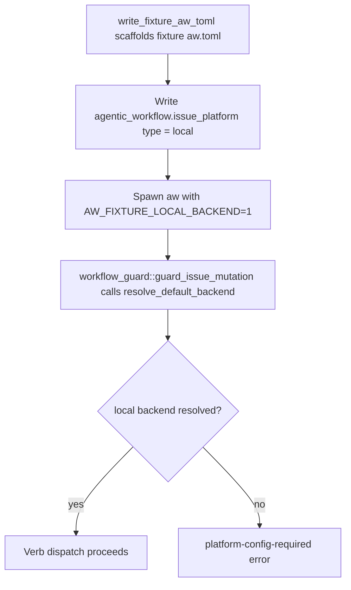

<!-- HANDWRITE-BEGIN gap="missing-generator:logic:fixture-platform-config-decision" tracker="#1921" reason="The scaffolding fix and the retired-capability gap-synthesis fix are both narrow, hand-verified behavior corrections in already-hand-written control flow (workflow_guard dispatch and choose_next_action); no generator primitive exists for either yet." -->

# Fixture Platform Config Decision (#1921)

## Schema
<!-- type: schema lang: yaml -->

```yaml
root_cause:
  requirement: "every mutating td/wi verb calls workflow_guard::guard_issue_mutation, which calls issues::resolve_default_backend(project_root) unconditionally"
  trigger: "resolve_default_backend requires [agentic_workflow.repo_platform] (or the legacy issue_platform key) to name a real tracked backend; fixture aw.toml files never declared it"
  affected_tests:
    - chain_liveness_test::chain_liveness_claim_never_lands_on_deadlock_phase
    - chain_liveness_test::chain_liveness_code_check_retry_recovers_stranded_terminal_within_tick_budget
    - chain_liveness_test::chain_liveness_code_check_terminates_within_tick_budget
    - fixture_loop_test::fixture_loop_drives_cb_genned_wi_to_terminal_done
    - fixture_loop_test::fixture_loop_drives_wi_run_to_workflow_complete
    - fixture_loop_test::fixture_loop_reports_first_broken_hop_on_induced_phase_breakage
    - self_hosting_runner_policy_cli_test::self_hosting_health_reports_policy_and_never_points_back_to_root_runner
decision:
  r1_choice: "fixtures declare a valid local platform block"
  rationale: "The mandatory repo_platform/issue_platform check is correct behavior for real projects (a lifecycle that mutates tracker state must know which tracker it is mutating); loosening the check itself would weaken that guarantee project-wide. The #1348 AW_FIXTURE_LOCAL_BACKEND=1 escape hatch already exists exactly for local/in-process fixture backends, so fixtures adopt it instead of the check gaining a fixture-only bypass."
  shape: |
    aw.toml gains [agentic_workflow.issue_platform] type = "local"
    every spawned `aw` subprocess in the fixture harness sets AW_FIXTURE_LOCAL_BACKEND=1
  escape_hatch: "issues::AW_FIXTURE_LOCAL_BACKEND_ENV (\"AW_FIXTURE_LOCAL_BACKEND\"), consulted by issues::resolve_default_backend"
secondary_fix:
  symptom: "fixture_loop_drives_wi_run_to_workflow_complete failed at a later hop: aw capability migrate emitted a non-JSON aw wi plan next command"
  root_cause: "aw capability migrate synthesizes a default (impl: planned, verification: planned) work-root row for any capability lacking an explicit work-root table, without checking Status: retired, so a Retired capability's synthesized placeholder gap looked open and choose_next_action routed it to CreateWi"
  fix: "choose_next_action's gap-scanning loop skips CapabilityStatus::Retired capabilities, matching the existing Retired skip one loop earlier in the same function"
regression_guard:
  test: fixture_loop_test::write_fixture_aw_toml_resolves_local_backend_under_fixture_env
  asserts: "a freshly write_fixture_aw_toml-scaffolded fixture project resolves the local backend via resolve_default_backend under AW_FIXTURE_LOCAL_BACKEND=1"
```

## Logic
<!-- type: logic lang: mermaid -->



## Unit Test

```mermaid
---
id: aw-fixture-platform-config-unit
coverage_kind: unit
evidence:
  command: cargo test -p agentic-workflow --test cli_tests write_fixture_aw_toml_resolves_local_backend_under_fixture_env -- --nocapture
---
requirementDiagram
  requirement scaffold_resolves_local {
    id: UT1
    text: "write_fixture_aw_toml's scaffolded aw.toml resolves the local backend under AW_FIXTURE_LOCAL_BACKEND=1"
    risk: high
    verifymethod: test
  }
  requirement chain_liveness_green {
    id: UT2
    text: "all three chain_liveness_test cases pass on a clean tree"
    risk: high
    verifymethod: test
  }
  requirement fixture_loop_green {
    id: UT3
    text: "all fixture_loop_test cases, including the wi run to workflow_complete hop through a Retired capability, pass on a clean tree"
    risk: high
    verifymethod: test
  }
  requirement self_hosting_green {
    id: UT4
    text: "self_hosting_health_reports_policy_and_never_points_back_to_root_runner passes on a clean tree"
    risk: medium
    verifymethod: test
  }
```

<!-- type: unit-test lang: mermaid -->



## Changes
<!-- type: changes lang: yaml -->

```yaml
changes:
  - path: apps/agentic-workflow/tests/cli/tests/chain_liveness_test.rs
    action: modify
    section: logic
    impl_mode: hand-written
    description: Scaffold fixture aw.toml with a local issue_platform block and thread AW_FIXTURE_LOCAL_BACKEND=1 through every spawned aw invocation.
  - path: apps/agentic-workflow/tests/cli/tests/fixture_loop_test.rs
    action: modify
    section: logic
    impl_mode: hand-written
    description: Merge the fixture aw.toml scaffolding helpers into one local-platform-declaring write_fixture_aw_toml, thread extra_envs through follow_envelopes, migrate wi run hops to goal wi, and add the R4 regression-guard unit test.
  - path: apps/agentic-workflow/src/cli/capability.rs
    action: modify
    section: logic
    impl_mode: hand-written
    description: Skip CapabilityStatus::Retired capabilities in choose_next_action's gap-scanning loop so a migrate-synthesized placeholder work-root on a retired capability never routes to WI creation.
```

<!-- HANDWRITE-END -->
