<!-- HANDWRITE-BEGIN gap="missing-generator:schema:aw-goal-condition-loop" tracker="#1897" reason="Bounded ad-hoc verifiable-condition loop verb family; state model and gate semantics are hand-authored contract, not a generated CRUD surface." -->

# AW Goal Condition Loop

## Unified Namespace (#1899)
<!-- type: doc lang: markdown -->

`aw goal` is aw's single loop verb. It has a closed four-leaf root-type
enum, not just the ad-hoc form this spec originally covered; the runner
re-homing map, envelope-parity contract, verb retirement, and read-time
migration for the two lifecycle leaves live in
`aw-goal-unified-loop-verb.md`. This spec keeps ownership of the `adhoc`
leaf's state model and gate semantics (Scenarios/CLI/Unit Test/Changes
below); this section documents only the namespace-level contract every
leaf shares.

One-verifier mental model: every `aw goal` invocation names a root and a
verifier. Lifecycle roots use the EC/terminal/rollup verifier chain
already owned by `aw wi`/`aw td`/`aw ec`; the `adhoc` root uses one or more
machine-runnable gate commands recorded with `aw goal set`. No leaf is
ever "done" without its own verifier's terminal signal.

Skill dispatch table (the `/aw:goal` skill's decision tree, evaluated in
order — first match wins):

| # | Match condition | Leaf | CLI form |
|---|---|---|---|
| 1 | Names a specific issue/WI id | `wi` | `aw goal wi <id>` |
| 2 | Names a capability id, or asks for a product promise / production readiness for a project | `capability` | `aw goal capability [<cap-id>] --project <p>` |
| 3 | Asks to finish/clear/drain ALL open issues/backlog of a project | `backlog` | `aw goal backlog --project <p>` |
| 4 | States a condition with a derivable, machine-runnable check | `adhoc` | `aw goal set --gate "<cmd>" <intent>` -> `aw goal check` |
| 5 | None of 1-4 match unambiguously | -- | ask ONE clarifying question offering the four kinds; never guess |

The leaf set is closed: new phrasing patterns extend the decision tree's
match rules, never the leaf set. A genuinely new behavior is a CLI product
change (a new `aw goal` subcommand), not a skill edit.

## Scenarios
<!-- type: scenarios lang: yaml -->

```yaml
id: aw-goal-condition-loop-scenarios
scenarios:
  - id: S1
    title: set requires prose intent and at least one executable gate
    given:
      - "an agent invokes aw goal set"
    when:
      - "no gate command is passed"
    then:
      - "the command is rejected with remediation guidance naming --gate"
      - "no workspace state file is written"
  - id: S2
    title: set records workspace-scoped state
    given:
      - "an agent invokes aw goal set with prose intent and one or more --gate commands"
    when:
      - "the command succeeds"
    then:
      - "state is written under /tmp/aw/workspaces/<workspace>/goals/<id>.json"
      - "no repo-root file is created"
      - "the emitted envelope's next.command is aw goal check <id>"
  - id: S3
    title: check on an all-green goal clears state and reports done
    given:
      - "a recorded goal whose gate commands all exit zero"
    when:
      - "an agent invokes aw goal check <id>"
    then:
      - "the state file is removed"
      - "the envelope status is done with completion.workflow_complete = true"
  - id: S4
    title: check on a red gate reports the failure and loops
    given:
      - "a recorded goal with at least one gate command that exits nonzero"
    when:
      - "an agent invokes aw goal check <id>"
    then:
      - "the state file is retained with checks_run incremented"
      - "the envelope reports the failing gate's command and output tail"
      - "the envelope's next.command is aw goal check <id>"
  - id: S5
    title: budget or expiry exhaustion gives up without discarding intent
    given:
      - "a recorded goal whose --budget-checks/--budget-minutes is exhausted, or whose created_at is at least 24h old"
    when:
      - "an agent invokes aw goal check <id>"
    then:
      - "the state file is removed"
      - "the envelope status is gave_up"
      - "the recorded prose intent is still present in the gave_up report"
  - id: S6
    title: goals are isolated per workspace
    given:
      - "two distinct workspace roots each with their own recorded goal"
    when:
      - "either workspace's goal is listed, shown, checked, or cleared"
    then:
      - "only that workspace's own goal state is affected"
  - id: S7
    title: the thin /aw:goal skill replaces the retired goal-loop skill
    given:
      - "a target project refreshes projected assets"
    when:
      - "AW installs or reinstalls the skill tree"
    then:
      - "the aw-goal skill is present in both .claude/skills and .agents/skills"
      - "any goal-loop directory found on disk is pruned"
      - ".claude/goal-loop/ is no longer a gitignore entry"
```

## CLI
<!-- type: cli lang: yaml -->

```yaml
commands:
  - name: aw
    subcommands:
      - name: goal
        class: utility
        mutates_lifecycle: false
        children:
          - name: set
            args:
              - name: intent
                kind: positional
                multiple: true
              - name: --gate
                kind: flag
                value_name: COMMAND
                repeatable: true
                required_count: ">=1"
              - name: --budget-checks
                kind: flag
                value_name: N
                optional: true
              - name: --budget-minutes
                kind: flag
                value_name: N
                optional: true
          - name: check
            args:
              - name: id
                kind: positional
                optional: true
          - name: show
            args:
              - name: id
                kind: positional
                optional: true
          - name: list
          - name: clear
            args:
              - name: id
                kind: positional
                optional: true
    state:
      scope: workspace
      path: /tmp/aw/workspaces/<workspace>/goals/<goal_id>.json
      never: repo-root file
    envelope:
      schema_version: aw.cli.v1
      terminal_statuses: [done, gave_up]
      non_terminal_status: blocked
```

## Unit Test

```mermaid
---
id: aw-goal-condition-loop-unit-test
coverage_kind: unit
evidence:
  command: "cargo test -p agentic-workflow --lib cli::goal:: -- --nocapture"
---
requirementDiagram
  requirement state_round_trips {
    id: UT1
    text: "goal state round-trips through set and load"
    risk: medium
    verifymethod: test
  }
  requirement all_green_clears_and_done {
    id: UT2
    text: "check on all-green gates clears state and reports done"
    risk: high
    verifymethod: test
  }
  requirement red_gate_keeps_state_and_blocks {
    id: UT3
    text: "check on a red gate keeps state, increments checks_run, reports blocked"
    risk: high
    verifymethod: test
  }
  requirement budget_exhaustion_gives_up {
    id: UT4
    text: "check on exhausted budget gives up and clears state without dropping intent"
    risk: high
    verifymethod: test
  }
  requirement expiry_gives_up {
    id: UT5
    text: "check on a goal past the 24h expiry ceiling gives up and clears state"
    risk: medium
    verifymethod: test
  }
  requirement workspace_isolation {
    id: UT6
    text: "goal state in one workspace root is invisible to another"
    risk: medium
    verifymethod: test
  }
  requirement resolve_id_ambiguity {
    id: UT7
    text: "resolve_goal_id requires an explicit id with multiple goals, defaults with exactly one"
    risk: low
    verifymethod: test
  }
  requirement chain_valid_envelopes {
    id: UT8
    text: "every goal.* leaf is classified in VERB_LIFECYCLE_REGISTRY and the check-loop EMIT_REGISTRY sample is chain-valid"
    risk: medium
    verifymethod: test
  }
  requirement skill_projection_and_prune {
    id: UT9
    text: "aw-goal skill installs on both trees; goal-loop is pruned from both trees"
    risk: medium
    verifymethod: test
  }
```

<!-- type: unit-test lang: mermaid -->



## Changes
<!-- type: changes lang: yaml -->

```yaml
changes:
  - path: apps/agentic-workflow/src/cli/goal.rs
    action: create
    section: cli
    impl_mode: codegen
    description: New `aw goal` verb family (`set`/`check`/`show`/`list`/`clear`); workspace-scoped JSON state, bounded per-gate subprocess execution, budget/expiry handling, aw.cli.v1 envelopes.
  - path: apps/agentic-workflow/src/shared/workspace.rs
    action: modify
    section: cli
    impl_mode: codegen
    description: Add GOALS_DIR/goals_path/goal_state_path so goal state lives under the shared workspace-runtime root.
  - path: apps/agentic-workflow/src/cli/mod.rs
    action: modify
    section: cli
    impl_mode: codegen
    description: Register the new goal module.
  - path: apps/agentic-workflow/src/cli/commands.rs
    action: modify
    section: cli
    impl_mode: codegen
    description: Add the Goal(goal::GoalArgs) top-level command variant and its dispatch arm.
  - path: apps/agentic-workflow/src/cli/chain.rs
    action: modify
    section: cli
    impl_mode: codegen
    description: Register goal.set/check/show/list/clear as Utility-class, non-lifecycle-mutating verbs, and add an EMIT_REGISTRY sample for the check-loop's self-referencing next.command.
  - path: apps/agentic-workflow/src/cli/doc_mirror.rs
    action: modify
    section: cli
    impl_mode: codegen
    description: Add goal to SUPPORT_TABLE_VERBS so the generated root-doc Support CLI table picks it up.
  - path: apps/agentic-workflow/templates/cli/mainthread/skills/aw-goal/SKILL.md
    action: create
    section: cli
    impl_mode: hand-written
    description: Thin dispatcher skill — derive the narrowest gate command, run aw goal set, work, loop on aw goal check until terminal; no Stop hooks.
  - path: apps/agentic-workflow/src/cli/init.rs
    action: modify
    section: unit-test
    impl_mode: codegen
    description: Project the aw-goal skill on both installers; add goal-loop to deprecated_skill_names so it prunes from both trees on every install.
  - path: .claude/skills/goal-loop
    action: delete
    section: cli
    impl_mode: hand-written
    description: Delete the retired generic Stop-hook skill this WI replaces.
  - path: apps/agentic-workflow/templates/cli/mainthread/CLAUDE.md.tmpl
    action: modify
    section: cli
    impl_mode: hand-written
    description: Boundary prose — aw goal is for bounded work outside the WI lifecycle; aw-managed work keeps using aw wi run/aw capability run.
  - path: apps/agentic-workflow/tech-design/surface/specs/aw-goal-condition-loop.md
    action: create
    section: scenarios
    impl_mode: hand-written
    description: Record the verb family, state model, gate semantics, and skill projection/retirement contract.
  - action: annotate
    section: unit-test
    impl_mode: hand-written
    description: "Traceability edge for the CAPABILITIES.md aw-goal-verifiable-condition-loop work root."
  - path: apps/agentic-workflow/tech-design/surface/specs/aw-goal-condition-loop.md
    action: modify
    section: scenarios
    impl_mode: hand-written
    description: "#1899: add the Unified Namespace section (one-verifier mental model, skill dispatch table) documenting that the closed four-leaf root-type enum now shares this namespace; lifecycle-leaf detail moved to the new aw-goal-unified-loop-verb.md."
  - path: apps/agentic-workflow/tech-design/surface/specs/aw-goal-unified-loop-verb.md
    action: create
    section: scenarios
    impl_mode: hand-written
    description: "#1899: runner re-homing map, envelope-parity contract, verb retirement + read-time migration, self-hosting parity for the wi/capability/backlog goal leaves."
```
<!-- HANDWRITE-END -->
